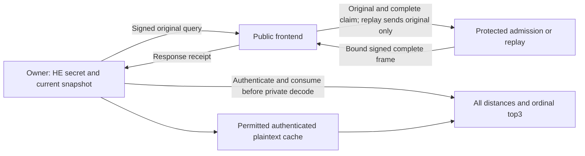

# Research system and paper plan

Current implementation baseline: **2026-10-05**, remotely verified commit
`9d1dffa9143d031373bad6df1d44a2cfb35200ef`, tag
`checkpoint/native-shared-query-native-clocks-2026-10-05`. The
[current decision plan](research-system-decision-plan-20261005.md) narrows this
detailed implementation plan, adds dynamic-index closest controls and one
conditional authenticated row-overlay experiment. Its review adds no HE or
timing observation and activates no new execution budget. The original
post-role review and every intervening component remain in Git and their
checkpoint archives. This is the current build plan; it updates the
[roadmap](paper-system-roadmap-20261004.md) and makes the next components
concrete; the [detailed execution plan](system-contribution-execution-plan-20261004.md)
and [progress ledger](research-contribution-progress-20261004.json) retain
historical registrations. The [current review receipt](research-system-focus-review-20261005.json)
pins the retained evidence, primary-source checks and unchanged implementation.
The pinned planning review adds no HE key, timing cohort, test invocation or
proof. Subsequent bounded implementation gates are recorded below.

> Subsequent owner component: [R1 adapter and public gate](native-shared-query-owner-component-20261004.md)
> pass 78 new cases plus 158 compatibility cases. The native private path is
> implemented but actual HE execution and independent process custody remain
> pending. R2 coordinator and exact execution freeze are next; no Q77 cohort
> has been consumed.

> R2 public plumbing now passes its [20-case shared-link/supervisor gate](native-shared-query-coordinator-component-20261004.md).
> That gate retains 256 distinct public cases. The
> [subsequent shared relay and owner trace](native-shared-query-owner-trace-20261005.md)
> pass 28 and 36 additional public cases, for 320 distinct retained cases;
> only those new suites were executed. The cohort coordinator and exact
> execution addendum remain next. These are unit evidence, not independent
> cryptographic experiments or a completed HE custody/latency cohort.

> The [cohort source/accounting subgate](native-shared-query-cohort-source-20261005.md)
> now passes 23 new public cases. The preceding 320 cases remain retained,
> rather than rerun: 343 distinct cases across gates. Exact signed enrollment
> recovery and mock attempt accounting are implemented; nine cases remain in
> this component's registered 32-case ceiling. The subsequent
> [cohort upload relay](native-shared-query-cohort-relay-20261005.md) passes six
> more cases, for 349 distinct retained cases and three remaining in the cap.
> The executable owner runner is still absent. No fresh HE/private/timing
> cohort has run.

> The subsequent [native-clock/telemetry gate](native-shared-query-runtime-20261005.md)
> passes three additional public cases, for 352 distinct retained cases.
> The parent 32-case coordinator cap is exhausted. `complete_cost_owner_lab.py`
> now supplies measured role and telemetry worker services; its owner cohort
> run action is still absent. Actual native/private HE and timing remain pending.

## The result to pursue

Build one exact owner-data search system on the homemade native BGV backend.
The scientific question is whether **the placement of common-Q representation
construction and complete admission changes the useful execution**, once
preparation, both network links, state, device acquisition and updates are paid.
The intended result is a specific execution design and a reproducible account
of when it is worthwhile, supported by a complete admission-to-release
argument. This remains a candidate contribution, not established originality.

The owner may retain every plaintext vector and query. The primary cloud
evaluator is malicious; the proposed protected verifier is trusted for
execution integrity and freshness, and holds no HE decryption key. The output
is every exact Hamming distance and top3 ordered by `(distance, row ordinal)`,
returning the bound UInt64 IDs. Approximate retrieval, encrypted top-k-only
output and query-confidential plaintext execution are separate contracts.

Do not make a separate originality claim for each optimization. Feature-major
packing, query expansion, delayed maintenance, RNS/NTT arithmetic, GPU fusion,
TEE verification, authenticated updates and generic cost-aware assignment are
established ingredients. Homemade implementations remain a company priority.

## What has changed in the evidence

| Evidence | Supported result | Remaining consequence |
| --- | --- | --- |
| Retained five-sample 32k panel: BGV 117.298 ms; BFV 892.813 ms; Paillier lookup CUDA 2,599.103 ms; hybrid 1,418.960 ms | BGV is an attractive engineering foundation for that recorded workload. | This is an earlier graph/profile and swap-qualified local panel, excluding complete protected admission/network. Recompute no secure-service speedup from these ratios. |
| Returning plaintext cache 4.384 ms in that panel | Client retention is a strong competitor. | Measure authenticated acquisition, updates and background acquisition with actual overlap. A cache prohibition would contradict the deployment. |
| Selected source gate: one key, six searches, 114,752 distances and 50,626,560 coefficients | Bounded correctness of the selected owner-origin graph. | Successful decryption does not approve security parameters, all possible native executions or a public-key origin law. |
| Q76 bounded prototype, controls and static handoff | Replay, exact aggregate and mutable cache controls exist; independent metadata checking and twelve scoped Lean lemmas support the design. | Concrete native/semantic refinement, private release and actual remote authority remain open. Test counts are not independent cryptographic experiments. |
| New local role handoff: 158 final distinct tests, six retained small case/mode paths, two real bad-result rejects | Native producer/admission, signed receipt and owner callback compose in bounded public tests. | Tests use local threads and a public callback. Owner HE decoding, separate worker processes, setup/update trace and complete timings are unfinished. |
| Subsequent owner adapter: 78 new public cases, 236 final combined cases | Fixed key/context custody, consumed-receipt private callback, complete score/tail validation and ordinal selection compose with the public control path. | Private arithmetic is stubbed in this gate. Actual HE output correctness, independently spawned workers and paid private preparation/lifetimes still need R2/R3. |
| Shared network/supervisor: 20 additional public cases | Aggregate directional pacing, bounded TCP delivery and clean process supervision work in the retained public fixtures. | 256 distinct cases are retained across components; only the last 20 were rerun in that invocation. Real HE custody, the central relay and complete owner trace remain unexecuted. |
| Subsequent shared relay/owner trace: 64 additional public cases | Fixed charged routing, actual owner event intervals, prefetch overlap, honest updates and stale receipt/cache rejection compose in public fixtures. | 320 distinct cases are retained; no combined 320-case invocation. Encryption/private decoding/native scan are stubs. Whole cohort orchestration, paid provisioning and actual HE correctness/custody/timing remain pending. |
| Cohort public-source/accounting subgate: 23 additional cases | Deduplicated public inputs reconstruct the existing signed enrollment byte for byte; attempts are persisted before mock expensive work, without refunds or replacements. | 343 distinct cases are retained; only these 23 ran. This resolves a reproduction/artifact-budget prerequisite, not HE correctness, actual budget consumption or a novel cryptographic mechanism. |
| Subsequent cohort upload relay: six additional cases | Owner-bound initial/update packets, fixed destinations, consumed failures and one shared traffic lane work through a supervised public worker. | 349 distinct cases are retained across gates. The executable owner runner and actual HE cohort remain absent; three cases remain in the coordinator registration. |
| Native clocks and public telemetry: three additional cases | Configured direct/cached native-call proxies preserve public stub behavior; a clean supervisor-descended process records scoped kernel metadata and consumed resource failures. | 352 distinct cases are retained; the coordinator cap is exhausted. Actual native clocks, owner orchestration, guards/custody and complete HE timings remain unexecuted. |

At 32,768 rows the retained selected interfaces are: full internal witness
127,057,920 B, exact aggregate body 1,474,560 B, compact client frame 204,895 B,
public descriptor 263,206 B and cache acquisition 2,359,635 B. Prepared RNS
rows alone occupy 826,277,888 B; that is not full process peak memory.
The roughly 86-fold internal witness reduction changes the producer-to-checker
seam. It neither reduces the already compact client frame nor eliminates the
aggregate control's product recomputation. Charge each link and lifetime
separately. See the [resource ledger](native-shared-query-resource-ledger-20261004.md).

### How the earlier experiments inform this system

The [portfolio synthesis](research-synthesis-and-system-roadmap.md),
[creative priorities/results](creative-experiment-priorities.md) and
[claim cards](system-contribution-claim-cards-20261004.json) retain the individual
measurements, failure cases and changed contracts. Grouping them below is a
design synthesis, not a new combined benchmark or an exhaustive proof audit.

| Experiment family | What is useful now | What it rules out or makes conditional |
| --- | --- | --- |
| E01–E08: response layouts, prepared transforms, native/CUDA work and BGV | Reuse compact scores, resident representations, persistent workspaces and measured fusion. BGV avoids this shallow BFV scale-and-round path. | Bare kernel gains cannot establish verified service performance. Grant the same rewrites to every compatible control. |
| E09–E25: selection, exact filters, radix/layout, dictionaries and residuals | Preserve exact coverage and the distinction between all scores and top-k-only protocols. Index-specific compression is a possible data-dependent choice. | Literal answer polynomials and paid two-round refinement lose in their recorded scopes. Compressed client hints must compete with compressed full plaintext. |
| E26–E28: affine/CRT maps, rank repair and matrix arithmetic | Favorable low-rank data can greatly reduce CPU work; equal-capacity controls and update cliffs are retained. | GPU totals benefit less, and dense maps/unstructured data can lose. Matrix-source/key costs did not justify a native matrix-CUDA project. |
| E29–E40: one-use linear online execution, precision, verification and capacity | Keep the changed-preprocessing contract as a reference. Smaller fields and native verification can improve paid frontiers. | Fresh one-use state, unused tokens, adaptive correctness and authentication are essential. Public expansion of a reusable mask bank does not create independent private requests. |
| Later gadget, decoder and optimizer discriminators: E101/E110, Q57_H1/Q59_H2, Q74/Q75 | Keep their exact algebra, negative originality returns and strong known-composition controls. | Rebranding gadget propagation, expansion or generic cost assignment does not reopen a closed novelty claim. |
| Q76 and partial Q77 | We now have exact native replay/admission/aggregate, mutable cache, static metadata, owner adapter and public plumbing. | These are the foundation for one complete measurement, not another reason to start a broad idea search. |

Prefer the general-data BGV path for the main system. Data-specific maps and
one-use correlation paths are separate contract-qualified alternatives, not
fallback numbers to splice into its performance table. The literature and
negative results narrow the paper claim; they do not diminish the company value
of the homemade implementations.

### A quantitative reason to test the boundary, rather than assume it wins

At the registered link rates, the retained 32k interfaces imply these **model
serialization floors**, excluding propagation, framing, queues and computation:

| Retained interface | Declared link rate | Serialization floor |
| --- | ---: | ---: |
| Full 127,057,920 B internal witness | 1,250,000,000 B/s | 101.646 ms |
| Exact 1,474,560 B aggregate body | 1,250,000,000 B/s | 1.180 ms |
| Earlier 204,895 B compact client frame | 12,500,000 B/s | 16.392 ms |
| 263,206 B client descriptor | 12,500,000 B/s | 21.056 ms |
| 2,359,635 B authenticated cache acquisition | 12,500,000 B/s | 188.771 ms |

These are derived from bytes/rate, not new timing observations. The final Q77
protocol adds its actual receipt/framing bytes. Internal witness traffic alone
is substantial, and the entire plaintext cache is small at this scale.
This makes a positive outsourcing/verification result uncertain; it is not
evidence for forbidding retention or inventing a device limit.

For intuition only, a serial placement model, with `R` requests sharing one
preparation lifetime, has

`delegation delta = producer + admission + internal transfer + extra preparation/R - displaced protected work`.

Delegation helps in that model only if the delta is negative. Actual Q77 uses
the measured dependency graph, since parallel work, backpressure and shared
link contention invalidate simply adding medians. Likewise, a constant-cost
serial cache crossover is `queries > acquisition/(remote - local)`, when the
denominator is positive. This is a diagnostic, not a fitted policy, and must
not substitute old circuit timings for the selected protected path.

## Closest work and the exact gap to test

The [full contract matrix](closest-work-contract-matrix-20261004.md) contains
the detailed passages, corrections and provenance. The table below turns it
into build obligations. “Adaptation unknown” means no complete matched adapter
has been executed, rather than evidence that a predecessor is incapable or slow.

| Closest work | What is already accomplished | Strongest compatible comparison | Remaining possible distinction |
| --- | --- | --- | --- |
| [HERS](https://arxiv.org/abs/2003.12197v3), [SealPIR](https://eprint.iacr.org/2017/1142), [MulPIR](https://www.usenix.org/system/files/sec21-ali.pdf) | Packed encrypted search and communication/computation mechanisms. | Exact binary feature packing, once-per-query expansion and delayed relinearization on our same backend. Q74/Q75 contain the proposed algebra. | Complete paid admission and its operating conditions; no new layout or asymptotic expansion claim. |
| [Argos, PoPETs2025](https://petsymposium.org/popets/2025/popets-2025-0099.php) | Attested FHE execution and transcript verification before decryption; application input/database binding in the publisher paper. | Optimize protected replay as carefully as the producer. Allow it to generate the complete frame directly, without a redundant witness. | A concrete useful placement/state finding beyond protected full execution. Our local signer is not Argos or AWS attestation. |
| [vFHE, 2023 extended version](https://arxiv.org/html/2301.07041v2) | Malicious-server integrity and delegated batched multiplication with a polynomial check. | Commit the complete claim before an unpredictable challenge; supply actual-prime, maintenance, terminal and adaptive-lifetime obligations; pay prefix/suffix/rounds. | A full maintained-search execution result. Randomized adapter remains unimplemented, so deterministic comparisons cannot defeat this control. |
| [PEEV](https://doi.org/10.1109/ACCESS.2024.3424420), [WAHC2024 vFHE](https://cknabs.github.io/assets/pdf/vfhe.pdf) | Program-to-HE-to-verification pipelines, automated constraints and encrypted Hamming applications. | Complete common-integer/maintenance/output adapter, with author-version and backend costs explicit. | A demonstrated complete execution/assurance finding; homemade arithmetic is not a first verifiable-HE compiler. |
| [ILA v1](https://arxiv.org/html/2509.11559v1) | Quantitative semantics, functional correctness for valid typed inputs and transformation validation. | Grant the same honest-owner origin premise; instantiate actual primitives, common-Q digits and Q-to-P conversion. | Malicious intermediate admission-to-authorized-release refinement for the concrete system. Type checking or adding noise bounds alone is known. |
| [Silph](https://eprint.iacr.org/2023/060), [CirC](https://eprint.iacr.org/2020/1586), [FlowCert](https://www.contrib.andrew.cmu.edu/~bparno/papers/flowcert.pdf) | Conversion-aware assignment, shared compiler infrastructure and independent asynchronous schedule validation. | Generic exact assignment gets identical legal representations, duplicate state, observations, budgets and horizons. | A specific HE admission/custody invariant and measured execution consequence. Equal finite frontiers close a superior-generic-optimizer claim. |
| [Corrected Cascudo et al.](https://eprint.iacr.org/2025/286) | Ring-oriented verification and noise-aware maintenance relations. | Corrected common-integer/range obligations and every-accepted-witness bounds for our exact graph; approximate bounds need an adapter. | A complete exact native relation and a useful cost consequence, rather than a new relaxed decomposition primitive. |
| [BioZKFHE v1](https://arxiv.org/html/2607.22065v1), [Laminate corrected revision](https://eprint.iacr.org/2025/2285) | Verified encrypted similarity or blind verifiable computation, with distinct opening/feedback contracts. | Align committee/trust, metric, coverage, verdict visibility, field semantics and maintenance before numerical comparison. | A different explicit execution/trust point; stronger hardware trust cannot establish cryptographic dominance. |
| [Atlas v1](https://arxiv.org/pdf/2609.11841v1), [Compass OSDI2025](https://www.usenix.org/system/files/osdi25-zhu-jinhao.pdf), [Onyx v1](https://arxiv.org/pdf/2604.20401v1) | Complete verified or private ANN systems, including owner search and protected storage/compute design. | Preserve their query, approximation, access-pattern and hardware contracts in scope rows. Exact all-distance adaptation costs remain unknown. | A precise exact-search finding, not first private/verifiable/TEE search or first storage/compute co-design. |
| Allowed authenticated owner cache | Local exact search, retention, compact acquisition and mutable updates using established techniques. | Returning cache, fresh acquisition and background acquisition alongside a remote first query; no forced HE-index download. | Outsourcing must retain a realistic useful region after this control. A negative result is an allowed outcome. |

The strongest reference is the compatible composition of these methods, not
the slowest published baseline. Reading and adapting ideas is separate from
reproducing an author artifact. At that review the registry contained **123
source records** with pinned versions, hashes and cached PDF/text locations;
this does not mean 123 complete proof audits. No new paper is added by this
revision. Primary online metadata/HTML was checked again, while detailed
Argos claims use the retained publisher PDF/text because the web PDF fetch
exceeded its size limit. No author benchmark was rerun.

The subsequent synthesis rechecks seven cached primary PDF/text pairs and
refreshes the primary pages for HERS, Argos, vFHE, ILA, BioZKFHE, Silph,
FlowCert and corrected Cascudo metadata. That rereading preserved the 123 records.
The [current comparison handoff](closest-work-contract-matrix-20261004.md#current-public-system-handoff-2026-10-05)
records what each comparison must actually establish. The review is targeted;
it does not reproduce author artifacts or establish publication priority.

### Candidate claim and paper decision

The main candidate is **a complete exact-search execution in which the placement
of canonical HE representations and admission yields a useful, reproducible
operating region**. This is a hypothesis to establish. The new comparison must
explain an actual reversal or useful frontier that survives the strongest
compatible construction, rather than merely accelerating a weak baseline.

| Proposed result | What the paper would need | What closes the claim |
| --- | --- | --- |
| Useful placement of common-Q construction/admission | Complete owner-visible timings, equal control arithmetic and information, paid state/updates/links, plus a concrete invariant explaining the winning execution. | Equally optimized replay or the known composition obtains the same useful result without a substantive difference. |
| A mixed trusted/delegated boundary, if the measured bottleneck selects it | One registered split with a precise source relation, measured removal of trusted work or traffic, and the same split/reuse freedoms granted to controls. | An ordinary specialization of prior delegation contains the whole result, or complete cost does not improve. |
| An assurance contribution beyond the supporting model | A reviewed native/common-integer/maintenance-to-release theorem with a specific obligation that the strongest applicable prior model does not already discharge. | Instantiating existing semantic typing and attested execution is the entire difference. |
| A scoped negative systems finding | A robust explanation of why compact claims fail to improve complete search, or why cache/replay eliminates the outsourcing region under an explicit owner contract. | It is only one artifact's implementation deficiency or a known tradeoff without a new, generalizable finding. |

These are alternative evidence-dependent framings, not four promised
contributions. A useful system may combine a particular admission boundary,
mutable snapshot lifetime and private release argument, while crediting the
underlying ingredients. We should choose the main statement after R3/R4 and
retain company engineering even if no paper claim survives.

The targeted online reread confirms why the comparison must be strong:
Argos already provides hardware-backed FHE integrity with attestation secrets
outside ordinary CPU software; vFHE already delegates batched multiplication
to untrusted hardware and checks it with a polynomial challenge.
[Argos publisher record](https://petsymposium.org/popets/2025/popets-2025-0099.php),
[vFHE §§V-B/AppendixD](https://arxiv.org/html/2301.07041v2).
ILA already proves functional correctness for well-typed circuits under valid
models and trusted, type-matching input sources. BioZKFHE already binds verified
similarity results to complete snapshot coverage before committee-controlled
recovery; its evaluated proof domain excludes rotations and modulus switching.
[ILA §4/AppendixA](https://arxiv.org/html/2509.11559v1),
[BioZKFHE §§III/V-C](https://arxiv.org/html/2607.22065v1).
This targeted reread adds no new source record or author reproduction and cannot
clear originality by absence of a matching phrase.

### What would make the result a research contribution

The main statement must name a **specific execution boundary**, the invariant
that makes it admissible, its paid advantage and its losing region. A paper
claim can eventually take this form:

> Under [explicit owner, trust and state contract], [concrete admitted execution]
> changes [measured bottleneck] and improves [complete metric] over [strongest
> matched policy] in [held-out operating region], while preserving exact
> snapshot-bound output; [contrasting region] favors replay or the owner cache.

Fill these brackets from R3/R4, not from anticipated speedups. To earn a systems
main contribution, demonstrate the mechanism with an ablation and show why
the strongest applicable complete system does not already demonstrate that
same finding. Ordinary composition may implement a useful system without
earning a conference-paper claim. An unknown predecessor adapter is an open
comparison obligation, not evidence of originality.

Keep exactly three main research questions: does the complete-cost winner
differ from evaluator-only selection; does a concrete representation/state
boundary explain it; and does any useful outsourcing region survive allowed
cache/acquisition/prefetch? Answering all three negatively closes this proposed
positive systems claim. A negative paper would then need a separately reviewed,
generalizable result, rather than merely reporting that this prototype loses.

### Choose a paper result from evidence

There are three possible stories, not three additional experiment queues.
The first is the preferred systems result; the others need their own substantive
finding before selection. The existing cheap cache is a scientific control,
not a deployment obstacle to explain away.

| Candidate story | Evidence that would make it a contribution | Evidence that would close it |
| --- | --- | --- |
| Specific representation/admission placement | A held-out useful execution, a concrete displaced cost, an admission invariant, and a mechanism ablation. Distinguish it from equally optimized protected replay, delegated-product methods and ordinary conversion-aware assignment. | No paid advantage, or a known complete specialization already demonstrates the same finding. A new objective name, witness-size ratio or handwritten backend is insufficient. |
| State and acquisition determine a useful outsourcing region | A justified device/update/horizon trace where outsourcing wins after returning, fresh and racing cache controls; explain and predict its losing region too. | Cache wins throughout the justified scope. Fresh devices alone do not establish novelty, and a fabricated retention limit is inadmissible. |
| A substantive assurance or negative result | A reviewed non-routine theorem, counterexample or generalizable impossibility/tradeoff, with exact premises and a demonstrating artifact. | Only routine model instantiation, signatures/state composition, or a slow prototype. The current twelve model lemmas and exact-aggregate work containment do not meet this bar. |

For the preferred result, fill a single contribution card with: the named
execution change; the prior method it extends; the invariant that permits it;
the predicted displaced work/bytes/state; the held-out result and losing
region; and the closest-work objection it survives. Keep predictions distinct
from observations. An ordinary known composition may be excellent company
engineering; originality needs a separate result.

### What would turn the candidate into a paper contribution

The candidate is not “BGV is faster” or “a TEE verifies HE.” Start with the
concrete question: **which portions of canonical source construction should
run in the protected role, which may be delegated, and what state must survive
between requests and updates for that choice to pay off?** The signed original,
all intermediate sources and the complete output must belong to one checked
evaluation; a signature over an unchecked intermediate cannot establish that.

Record one proposed execution change in this form before its experiment:

| Item | Required content |
| --- | --- |
| Source relation | Name the exact producer/checker cut, its ancestors, common-Q integers, limb encodings, maintenance and terminal frame. State whether equality is deterministic or probabilistic. |
| Mechanism prediction | Identify the actual protected construction, duplicate work, internal traffic or retained state removed. Account for newly introduced checks, buffers, rounds and update invalidation. |
| Equal control | Give prepared replay and the strongest compatible delegated method the same source graph, packing, arithmetic, reuse and information. Name the prior technique being extended. |
| Empirical discriminator | Predict the winning and losing state/link regimes using calibration only. Freeze the choice and validate on held-out whole executions. Stage projections explain costs; they do not replace owner-visible measurements. |
| Mechanism ablation | Disable the selected reuse or move the selected cut while preserving the contract. Run an actual whole execution under its own bounded registration; a sum of old stage samples is not an ablation. |
| Paper decision | Retain a main claim only if a substantive execution finding survives the prior specialization, permitted cache, losing-region explanation and external review. A good backend without that finding remains a company artifact. |

This card makes a creative extension testable without opening another broad
grid. The first cohort selects the bottleneck; it cannot already establish a
mixed boundary that has not been implemented. A paper's final evidence must
include the selected mechanism intervention and actual protected deployment,
under separately frozen budgets. Do not consume those future runs as additional
unregistered Q77 observations.

## Architecture to finish

This is the target trust split. Current TCP transport is loopback only and the
protected role is a trusted local prototype. Its signature is not hardware
attestation and process-local client consumption is not crash-safe authority.

Reuse the existing native full-admission, replay and aggregate libraries;
the new adapters are `complete_cost_protocol.py`, `complete_cost_transport.py`
and `benchmarks/complete_cost_shared_query_lab.py`. Preserve company crypto
interfaces and Paillier/BFV/BGV/CUDA fallbacks. The experimental branch remains
`experiment/native-shared-query-service-20261004`.

## Finite implementation and evaluation queue

| Handoff | Concrete deliverable | Completion evidence and next action |
| --- | --- | --- |
| R0: public role handoff — complete within scope | Complete native predicate, durable local claimed signing, context-bound receipt, bounded transport and owner public callback. | 158 public tests, six small native paths and two bad native frames rejected; checkpoint and failed invocations retained. R1 public adapter gate now follows. |
| R1: owner adapter/public control gate — complete within scope | Bind supplied key/profile to owner context; fixed lazy packed private path after whole-frame authorization/consumption; complete decoded score/tail checks, ordinal selection and fail-closed key lifetime. | 78 new public-stub cases and 236 final combined cases pass. Actual private HE correctness and process custody remain R2/R3; no cohort consumed. Next R2. |
| R2: all registered public plumbing/worker subgates pass; owner orchestration/freeze next | Shared pacing/supervisor pass 20 cases; relay/owner trace pass 64; public source/accounting passes 23; upload relay passes six; clocks/telemetry pass three. Finish tenant/device/process preparation, paid provisioning, independent policy lifetimes, actual 32-row/group refresh, arrivals and telemetry as one dependency graph in the owner coordinator. | The 32-case coordinator public cap is exhausted; necessary orchestration integration requires a separate bounded registration. Actual native/private correctness and HE process custody are still unexecuted. Commit exact sources, dependencies, warmup/initial-state/device semantics, trace, deadlines, memory guard and component budgets before either HE key, real private arithmetic or large timing. No new grid. Next R3. |
| R3: Q77 calibration and held-out cohort | Selected N=16,384, d=512, t=1031, owner-canonical Q120 profile; counts 8,224/16,384/32,768; two independent HE keys and one public corpus. | Six calibration blocks/48 query observations per implementation, freeze policy/data hashes, then twelve held-out blocks/96 observations. Total cap remains 18/144, with 18 excluded warmups and 18 separate post-update checks. Next decision. |
| R4: decision and one justified refinement | Explain a paid placement reversal, state/link frontier and cache utility region, or close the failed hypothesis. Grant all controls equal arithmetic and information. | Keep the 20% remote-policy project gate separate from cache utility and originality. At most one changed-premise extension needs its own bounded registration. Next Q78 or scoped negative/engineering return. |
| R5: Q78 selected deployment/security | One actual AWS protected path; attested code/key binding, authenticated channel, current owner pin, nonrollback/revocation and private leakage assurance. | Conditional exact-search reduction and concrete implementation review; relevant frozen comparison rerun on actual deployment. Q77 local results remain labelled local. Next Q79. |
| R6: Q79 main claim and paper | Precise claim, closest-work adapters, evidence map, reproducible recovery artifact, paper and independent human review. | Choose supported systems, substantive formal/security, or prior-separated negative framing. If none survives, deliver company engineering without an original-paper claim. |

Q77's initial registration reserves 540 standalone query encryptions. The
latest coordinator draft closes the prefetch remote lifetime after successful
cache acquisition, before updates: at most 162 additional calls, or **702
total query encryptions**. This supersedes the earlier conservative 720-call
planning draft, which remains in Git/history. The exact execution addendum
must commit the lifetime and budget before any fresh HE work. This is an
accounting issue, not permission to enlarge the 18-block/144-observation cap.
Index-encryption cap remains 31,744, including whole affected-group refreshes.
The implementation registration is historical; do not quietly edit it after
seeing results. The owner coordinator and exact execution freeze are pending.

The new supervisor also exposes a state-accounting obligation: the initial
54 protected signing contexts cover three deterministic modes in 18 blocks.
An independently cold prefetch remote trajectory may need 18 additional
contexts; reusing existing workers changes its initial state and requires a
precise paid reuse law. Resolve worker contexts, refresh ciphertext reuse and
excluded warmup versus cold private preparation alongside the query budget.
Any amendment must be explicit and committed before consumption. The new
public plumbing gate changes none of these historical caps. Its 20 new cases
exhaust the initial 256 public-unit ceiling; further necessary integration tests
need a separately bounded registration, rather than silently exceeding it.

### R2 implementation specification and exact accounting handoff

Finish these components before any Q77 fresh HE key or private work. Register
additive files and a bounded integration gate before implementing and executing
that gate. The [registered relay/owner-trace component](native-shared-query-owner-trace-registration-20261005.json)
now passes its 64-case public gate: 431 earlier runtime files, 66 company files,
six isolated libraries and the owner private extension remain unchanged. Its
four additive sources bring the inventory to 435. The relay and owner trace
below exist; the cohort runner still does not. Further necessary public
integration needs a bounded registration before execution, since this
component's 64-case ceiling is exhausted. The subsequent
[coordinator registration](native-shared-query-owner-coordinator-registration-20261005.json)
has a 32-case ceiling; its first two additive sources passed 23 cases with
437 runtime sources. The subsequent six-case upload-relay subgate brings
the count to 438, preserving all 436 other earlier files byte for byte and
appending only to the archived test file. Its old function bodies are unchanged.
The subsequent three-case clock/telemetry gate adds the owner-lab worker entry,
bringing the inventory to 439. All 437 other preceding files and 27 archived
top-level function ASTs remain unchanged. This completes the parent public cap,
not R2's full owner execution.

| Deliverable | Proposed location | Required behavior / acceptance |
| --- | --- | --- |
| One charged public relay | `experiments/bfv_search_lab/complete_cost_relay.py` | Fixed trusted-local backend map and opaque descriptor/query/cache/update packets. One aggregate budget per client-link direction across search and background acquisition. Received data cannot select code, libraries or trust anchors. |
| Actual owner event trace | `experiments/bfv_search_lab/complete_cost_trace.py` | Owner keys stay at the owner. Capture arrivals, setup, acquisition, private preparation, completion and updates as dependent real events; no stage-sum latency or fictitious overlap. |
| Public source retention and attempt accounting — implemented/public gate passed | `experiments/bfv_search_lab/complete_cost_cohort.py` | Retain each fresh feature/query once. Recover exact existing signed enrollment from group/key references; consume limits before attempts. This is public reproduction/accounting, not honest-encryption proof or anti-rollback authority. |
| Multi-phase cohort upload relay — implemented/public gate passed | `experiments/bfv_search_lab/complete_cost_cohort_relay.py` | Fixed initial/update destinations, owner-bound lifetime/phase/length/digest, shared setup/search/cache/update bandwidth and consumed failed phases; no peer-selected paths or unsigned refresh. Six appended public cases pass; actual HE and whole coordinator remain pending. |
| Native clocks and public telemetry — implemented/public gate passed | `benchmarks/complete_cost_owner_lab.py` | Instrument direct and factory-cached native calls; keep their computational projection separate from verification wait. Read bounded kernel metadata in a clean worker using trusted PID/birth bindings. Guard failures are cooperative and persisted; actual HE integration is pending. |
| Cohort orchestration — still pending in that entry | `benchmarks/complete_cost_owner_lab.py` | Start the clean supervisor before HE key generation. Public workers descend from it and receive pinned public specifications. Independent policy trajectories cannot inherit an accidentally warmed cache/private handle. Finish the actual owner run action; worker services alone do not provide it. |
| Updates and release | Existing authenticated owner/cache APIs called by the new trace | Fresh affected-group encryption, complete snapshot/ID binding, genuine native refresh, compact cache patch and current consumed receipt before private decode. Retain failed attempts and owned-child cleanup. |
| Integration and exact freeze | Separately registered tests and execution-addendum JSON | Bounded public fixtures first; actual HE correctness belongs to R3. Commit dependencies, sources/libraries, event order, initial states, hardware, deadlines, memory guard and retention before keys. |

Prefer independently executed policy trajectories over replaying stage samples
as executions. The **latest proposed accounting draft**, registered as a
proposal before this component's code, is:

| Item | Historical initial maximum | Draft maximum for a racing prefetch remote component that closes before update |
| --- | ---: | ---: |
| Fresh HE key attempts | 2 | 2 |
| Blocks / measured observations per implementation | 18 / 144 | 18 / 144 |
| Remote query encryptions | 540 | 702 = 540 standalone + 18 × (1 remote warmup + at most 8 measured remote attempts) |
| Protected-worker standard signing contexts | 54 | 72 = 4 independently spawned trajectories × 18 |
| Index feature encryptions | 31,744 | 31,744 = 4,096 initial + 3 standalone modes × 18 × 512 refreshed features |

This is a **planning proposal, not an execution registration or consumed
budget**. It pays repeated owner update work instead of assigning one
precomputed update to independently timed owner executions. Prefetch must
permanently close and join its remote component after acquisition and before
the update; its post-update check is cache-only. A failed acquisition
cannot silently become a new remote fallback. Any amendment must preserve the
historical JSON and be explicitly committed before consumption; keys, sizes,
blocks and measured observations do not increase. The historical 540-query
and 54-signer caps are unchanged until that execution addendum is committed.
The earlier four-refresh 40,960-feature draft is not authorized for execution.

Returning plaintext controls should avoid unnecessary HE setup and private
preparation. Fresh cache acquisition must really authenticate and publish the
current data. Prefetch must race a real remote answer against an independently
acquired current cache, emit the first valid complete answer, and charge late
or discarded work, bytes and cleanup separately. Do not let the remote owner's
descriptor lock serialize cache publication and manufacture a weak control.
Excluded remote warmup must not acquire the supposedly absent measured cache.

The source archive makes the finite retention budget feasible without losing
fresh inputs: eight initial groups plus 54 fresh update groups, or 62 unique
512-feature groups. Retain public query bytes, evaluation keys, signed recovery
records and the selected witness too. Retire only verified complete scratch
enrollments; partial failures stay retained/consumed. The 8GiB bound applies
to all additional artifacts, not just the blob store. Plan for one active full
enrollment scratch at a time and verify total bytes, RSS and lifetime peaks.

Native-stage instrumentation is implemented and its public-stub gate passes.
Its actual native execution remains untested until the frozen cohort. The current frontend's
`produce-forward` wall interval includes protected verification and round-trip
waiting. Do not use it as evaluator-only latency. Pin the exact actual native
call intervals or computational projection used by the selector, its included
representation/witness/terminal work, and its distinction from an independently
executed unverified evaluator. The primary metric still ends at actual owner
completion; projected stage costs do not replace any whole execution.
The new projection excludes Python framing/allocation, preparation and cleanup;
it is not a separately executed unverified baseline. Returned calls do not imply
admission success. Record native shutdown costs separately because the worker's
final close follows its inventory. Check telemetry's failure/persistence fields
and observed >1s gaps; a configured period does not prove uninterrupted sampling
or a hard peak-memory limit.

The exact freeze must distinguish four clocks/states:

1. Tenant preparation: key/evaluation keys, feature encryption, authentication
   and upload. Two HE key contexts are genuinely independent. Reused public
   setup is labelled and paid separately.
2. Process preparation: fresh native preparation and signer setup, with actual
   residency/invalidation. A new process is not automatically a cold OS cache.
3. Device preparation: metadata, private native-handle preparation and allowed
   plaintext cache. Local retained-key custody does not measure secure key
   provisioning to a new physical device.
4. Warmup and arrivals: specify what the excluded first query warms. Retain
   cold preparation/first-answer timing separately; do not call the subsequent
   eight-query metric cold-service latency. Measured cache acquisition starts
   from its declared absent/retained state despite any separate code warmup.

Assign and charge supervisor/relay CPU and memory in addition to the existing
roles. Freeze topology and per-thread affinity. Concurrent transfers share the
lane and relay copies are paid. Keep a memory preflight, absolute deadlines,
<=1s telemetry and the 8GiB additional-artifact ceiling. Retain external load,
swap, timeouts and failures; qualify contaminated runs rather than replacing
them with a selectively faster run.

The current supervisor validates worker CPUs against its own current affinity
during startup. A permanent CPU3 mask would reject later starts on other CPUs.
Freeze either the wider startup mask or an actual captured-mask restoration
around each start followed by repinning, and pay/record those intervals. Trusted
registry/config updates must be atomic local writes. The owner must enforce
telemetry guards and total artifact limits; supplying the sampler is not that
whole integration.

### R3/R4 decision protocol

First blocks per key/size calibrate: six blocks/48 queries per implementation.
Freeze cost inputs, legal choices, selector code and policy before twelve
held-out blocks/96 queries. Aliases and cache policies are not independent
cryptosystems; retrospective per-instance minima are oracle diagnostics.

Report paired whole-trace delays, cold/setup/update/tail costs, both directions
of both links, duplicate work and peak live state. Show raw block results and
model sensitivity separately. Two keys on one correlated corpus cannot support
population confidence claims by treating 144 requests as independent samples.

Return one of: useful distinct boundary; useful known engineering; no useful
remote region; or unresolved correctness/measurement. Only the first selects
the default positive systems paper. R4 permits **at most one** triggered
refinement with a new finite registration and prior comparison, not an entire
menu. A surviving system still needs a separately frozen final deployment/
workload evaluation before broad claims. Q77 is a local selection study.

The first Q77 result is scoped to the three deterministic modes and permitted
owner controls. The current exact aggregate checker repeats prefix, products
and suffix; smaller witness traffic does not remove that computation. A broad
advantage over vFHE-style delegation requires the actual randomized complete
adapter, with bound claims, actual-prime/ring challenges, lifetime soundness
and paid rounds/maintenance. Until then its adapted performance is unknown.
If a positive deterministic result survives, this is a paper comparison
obligation, not a baseline to declare defeated or an optional weak comparison.

The primary metric ends when the owner has authenticated, consumed and decoded
the complete frame and produced the bound ordinal top3. Measure completion
minus arrival over the frozen trace, with equal key/size/query weights. Report
first-answer/tail delay, setup, updates, CPU work, both link directions and
owned/resident/scratch state separately. Do not add stage medians to invent an
overlapping end-to-end time. Retain failed/time-out/contaminated blocks; no
silent replacements or new keys. Use the granted idle window for the cohort,
record sibling/background activity and thermals, and leave user workloads alone.

## Scientific discriminators and creative extensions

| Hypothesis | Test with the existing cohort | Falsifier or one conditional extension |
| --- | --- | --- |
| H1: Delegating representation construction changes the complete paid winner. | Compare full admission, aggregate/recomputed admission and direct prepared replay, ending at actual client finish. | Replay always dominates: close this delegated-admission performance claim. An 86-fold witness reduction alone cannot rescue it. |
| H2: The common-Q boundary and retained state cause a reproducible reversal. | Attribute conversion/normalization, preparation, witness links and update invalidation on the same graph; compare evaluator-only and same-information complete-cost selection. | Generic assignment obtains the identical result: retain a concrete system finding only if it differs meaningfully from existing complete systems; close a new optimizer claim. |
| H3: Outsourcing earns its cost for an owner allowed to cache. | Returning/fresh/background cache policies with equal horizon information and paid acquisition/updates. | Cache wins every justified region: close the positive outsourcing headline. Do not invent a client restriction. |

The first creative extension, only if H1/H2 identifies the relevant bottleneck,
is **one mixed common-Q construction/admission boundary**: retain a protected
canonical prefix and delegate only an independently bound suffix, or the
reverse. Derive the precise public source relation before coding. The question
is whether it avoids real trusted construction or transfers without giving
the replay control the same saving for free. An ordinary min-cut is not new;
a useful complete execution and its invariant must be the result.

Choose one contiguous expansion/maintenance segment from measured cost
attribution, not a level/radix grid. Bind every admitted source back to the
signed original through checked or protected ancestors; require unique
common-Q digits and complete downstream branches/terminal output. An unchecked
cut root cannot become a trusted input merely by signing it. Predict the
displaced work/bytes, execute the whole path, and give controls the same cut.

If actual protected state/prefix cost instead dominates at a justified larger
corpus, test **one streamed authenticated multi-object snapshot**. Prove that
per-group bounds do not grow with group count, bind complete ordered coverage
and one genuine query prefix, and charge update invalidation. Grant replay and
cache the same streaming/prefix reuse. New scale must be registered before
consumption; the current two-group cohort cannot be relabelled as a scale test.

If query expansion/products dominate and a confidential-query trust contract
is acceptable, a **query-only protected linear evaluation** is a separate
candidate. Compare the existing linear-HE/Slalom/EMVP and protected-search
specializations; establish masking, noise and custody first. It is not a
silent optimization of the primary no-HE-secret contract. GPU full admission
or a proof backend is selected only by a paid bottleneck and its separately
valid checking/attestation or complete proof adapter. No failed earlier
reusable-adjoint, expansion or gadget originality claim is reopened here.

## Supporting security argument

For exact binary matching, the plaintext identity is
`s[i] = sum_j (1-2*q[j])*(1-2*x[i,j])`,
`distance[i] = (512-s[i])/2`. A valid score is centered in `[-512,512]`
with the correct parity; `t=1031` separates all these signed values.
Preserve every row, ordered ID and physical zero tail before selection.
This explains exactness; it is not a new matching formula or a security estimate.

Define an exact-search ideal functionality for the honest owner's current
snapshot/query, complete scores and ordinal top3, with abort allowed and
declared public dimensions, sizes, timing/update and application leakage.
The intended implication is:

`OwnerOrigin + valid plan + correct complete admission + current authority`

`=> authorized frame equals canonical evaluation => exact private output`.

Prove graph semantics, unique common-Q/RNS representation, every-source phase
bounds and terminal codec, then request/snapshot/frame binding and at-most-once
release under the named nonrollback authority. Couple authorized private
outputs to ideal search and simulate public rejection from public inputs.
State augmented HE/evaluation-key assumptions, signatures/hashes, sampler and
seed law, correctness/admission failure, actual TEE/freshness and private
leakage separately. Raw BGV IND-CPA does not imply CCA security. A trusted
admission predicate must prevent adversarial private work before any reaction.

Current scoped Lean results and public-role tests support components of this
agenda. They do not prove the C++ binary, concrete parameters, private timing,
rollback resistance or AWS deployment. Complete this argument alongside the
selected system; promote it to a formal main result only if it has a substantive
reviewed distinction beyond ILA plus established verifiable execution.

| Proof layer | Deliverable and explicit premise |
| --- | --- |
| Native relation | Show complete accepted inputs/frame equal the selected reference evaluation, including canonical shared integers in both actual primes. Twelve model lemmas do not establish the C++ refinement. |
| Exact plaintext semantics | Instantiate honest owner encoding, actual sampler/seed/evaluation-key law, every-source bounds and terminal Q-to-P codec; derive all scores/tails and ordinal output. No observed-noise substitution. |
| Stateful authorization | Bind request, snapshot, IDs, mode/code and nonce; consume before one fixed private callback. Prove crash/rollback behavior against the declared durable authority, not process-local memory alone. |
| Real protected deployment | Bind measured binary and response-signing key via AWS attestation and an authenticated channel; specify freshness, revocation and protected signer custody. A local signature is not this premise. |
| Conditional confidentiality | Define permitted transcript/timing/update leakage, couple authorized outputs to ideal search and public rejects to the public gate. Account separately for augmented HE/evaluation-key security, signature/hash failures, correctness/admission failures, trusted state/TEE and private side channels. This is a reduction agenda, not a finished theorem. |

## Paper and progress handoff

A provisional paper should answer: which exact execution is new to the
demonstrated system, why its invariant is needed, when it wins against the
strongest compatible controls, and where it loses. Required figures are a
complete latency/work/bytes/state breakdown, cold/returning/update behavior,
held-out placement comparison, permitted-cache frontier and claim/assumption
map. Include negative results and contamination qualifications. Venue choice
follows the result; no conference acceptance is assumed.

After each handoff, append evidence to the existing ledger, preserve sources
and failures, checkpoint, and read the next dependency. There are **zero
broad preliminary gates and zero immediate Q76 milestones left**. Q77 is
partly implemented; Q77 evaluation, Q78 deployment/security and Q79
originality/paper are the three remaining packages. R1's bounded public adapter,
shared public plumbing and relay/owner trace gates are complete within scope.
The next executable action is R2 cohort coordinator and exact
execution freeze, followed by R3's finite paid
evaluation; do not open another broad exploratory benchmark grid.
