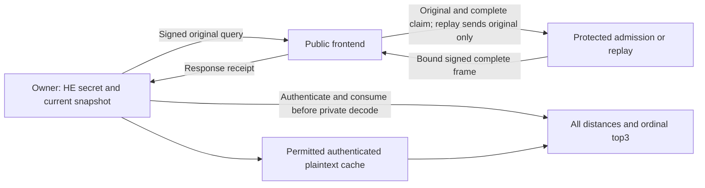

# Research system plan after the local role handoff

This revision starts from remotely verified commit
`51ed323557396c92e362e83c2e922985176f31f9`, tag
`checkpoint/native-shared-query-local-roles-2026-10-04`. It updates the
[roadmap](paper-system-roadmap-20261004.md) and makes the next components
concrete; the [detailed execution plan](system-contribution-execution-plan-20261004.md)
and [progress ledger](research-contribution-progress-20261004.json) retain
their caps. This planning review adds no HE key, timing cohort or proof.

> Subsequent owner component: [R1 adapter and public gate](native-shared-query-owner-component-20261004.md)
> pass 78 new cases plus 158 compatibility cases. The native private path is
> implemented but actual HE execution and independent process custody remain
> pending. R2 coordinator and exact execution freeze are next; no Q77 cohort
> has been consumed.

## The result to pursue

Build one exact owner-data search system on the homemade native BGV backend.
The scientific question is whether **the placement of common-Q representation
construction and complete admission changes the useful execution**, once
preparation, both network links, state, device acquisition and updates are paid.
The intended result is a specific execution design and a reproducible account
of when it is worthwhile, supported by a complete admission-to-release
argument. This remains a candidate contribution, not established originality.

The owner may retain every plaintext vector and query. The primary cloud
evaluator is malicious; the proposed protected verifier is trusted for
execution integrity and freshness, and holds no HE decryption key. The output
is every exact Hamming distance and top3 ordered by `(distance, row ordinal)`,
returning the bound UInt64 IDs. Approximate retrieval, encrypted top-k-only
output and query-confidential plaintext execution are separate contracts.

Do not make a separate originality claim for each optimization. Feature-major
packing, query expansion, delayed maintenance, RNS/NTT arithmetic, GPU fusion,
TEE verification, authenticated updates and generic cost-aware assignment are
established ingredients. Homemade implementations remain a company priority.

## What has changed in the evidence

| Evidence | Supported result | Remaining consequence |
| --- | --- | --- |
| Retained five-sample 32k panel: BGV 117.298 ms; BFV 892.813 ms; Paillier lookup CUDA 2,599.103 ms; hybrid 1,418.960 ms | BGV is an attractive engineering foundation for that recorded workload. | This is an earlier graph/profile and swap-qualified local panel, excluding complete protected admission/network. Recompute no secure-service speedup from these ratios. |
| Returning plaintext cache 4.384 ms in that panel | Client retention is a strong competitor. | Measure authenticated acquisition, updates and background acquisition with actual overlap. A cache prohibition would contradict the deployment. |
| Selected source gate: one key, six searches, 114,752 distances and 50,626,560 coefficients | Bounded correctness of the selected owner-origin graph. | Successful decryption does not approve security parameters, all possible native executions or a public-key origin law. |
| Q76 bounded prototype, controls and static handoff | Replay, exact aggregate and mutable cache controls exist; independent metadata checking and twelve scoped Lean lemmas support the design. | Concrete native/semantic refinement, private release and actual remote authority remain open. Test counts are not independent cryptographic experiments. |
| New local role handoff: 158 final distinct tests, six retained small case/mode paths, two real bad-result rejects | Native producer/admission, signed receipt and owner callback compose in bounded public tests. | Tests use local threads and a public callback. Owner HE decoding, separate worker processes, setup/update trace and complete timings are unfinished. |
| Subsequent owner adapter: 78 new public cases, 236 final combined cases | Fixed key/context custody, consumed-receipt private callback, complete score/tail validation and ordinal selection compose with the public control path. | Private arithmetic is stubbed in this gate. Actual HE output correctness, independently spawned workers and paid private preparation/lifetimes still need R2/R3. |

At 32,768 rows the retained selected interfaces are: full internal witness
127,057,920 B, exact aggregate body 1,474,560 B, compact client frame 204,895 B,
public descriptor 263,206 B and cache acquisition 2,359,635 B. Prepared RNS
rows alone occupy 826,277,888 B; that is not full process peak memory.
The roughly 86-fold internal witness reduction changes the producer-to-checker
seam. It neither reduces the already compact client frame nor eliminates the
aggregate control's product recomputation. Charge each link and lifetime
separately. See the [resource ledger](native-shared-query-resource-ledger-20261004.md).

## Closest work and the exact gap to test

The [full contract matrix](closest-work-contract-matrix-20261004.md) contains
the detailed passages, corrections and provenance. The table below turns it
into build obligations. “Adaptation unknown” means no complete matched adapter
has been executed, rather than evidence that a predecessor is incapable or slow.

| Closest work | What is already accomplished | Strongest compatible comparison | Remaining possible distinction |
| --- | --- | --- | --- |
| [HERS](https://arxiv.org/abs/2003.12197v3), [SealPIR](https://eprint.iacr.org/2017/1142), [MulPIR](https://www.usenix.org/system/files/sec21-ali.pdf) | Packed encrypted search and communication/computation mechanisms. | Exact binary feature packing, once-per-query expansion and delayed relinearization on our same backend. Q74/Q75 contain the proposed algebra. | Complete paid admission and its operating conditions; no new layout or asymptotic expansion claim. |
| [Argos, PoPETs2025](https://petsymposium.org/popets/2025/popets-2025-0099.php) | Attested FHE execution and transcript verification before decryption; application input/database binding in the publisher paper. | Optimize protected replay as carefully as the producer. Allow it to generate the complete frame directly, without a redundant witness. | A concrete useful placement/state finding beyond protected full execution. Our local signer is not Argos or AWS attestation. |
| [vFHE, 2023 extended version](https://arxiv.org/html/2301.07041v2) | Malicious-server integrity and delegated batched multiplication with a polynomial check. | Commit the complete claim before an unpredictable challenge; supply actual-prime, maintenance, terminal and adaptive-lifetime obligations; pay prefix/suffix/rounds. | A full maintained-search execution result. Randomized adapter remains unimplemented, so deterministic comparisons cannot defeat this control. |
| [PEEV](https://doi.org/10.1109/ACCESS.2024.3424420), [WAHC2024 vFHE](https://cknabs.github.io/assets/pdf/vfhe.pdf) | Program-to-HE-to-verification pipelines, automated constraints and encrypted Hamming applications. | Complete common-integer/maintenance/output adapter, with author-version and backend costs explicit. | A demonstrated complete execution/assurance finding; homemade arithmetic is not a first verifiable-HE compiler. |
| [ILA v1](https://arxiv.org/html/2509.11559v1) | Quantitative semantics, functional correctness for valid typed inputs and transformation validation. | Grant the same honest-owner origin premise; instantiate actual primitives, common-Q digits and Q-to-P conversion. | Malicious intermediate admission-to-authorized-release refinement for the concrete system. Type checking or adding noise bounds alone is known. |
| [Silph](https://eprint.iacr.org/2023/060), [CirC](https://eprint.iacr.org/2020/1586), [FlowCert](https://www.contrib.andrew.cmu.edu/~bparno/papers/flowcert.pdf) | Conversion-aware assignment, shared compiler infrastructure and independent asynchronous schedule validation. | Generic exact assignment gets identical legal representations, duplicate state, observations, budgets and horizons. | A specific HE admission/custody invariant and measured execution consequence. Equal finite frontiers close a superior-generic-optimizer claim. |
| [Corrected Cascudo et al.](https://eprint.iacr.org/2025/286) | Ring-oriented verification and noise-aware maintenance relations. | Corrected common-integer/range obligations and every-accepted-witness bounds for our exact graph; approximate bounds need an adapter. | A complete exact native relation and a useful cost consequence, rather than a new relaxed decomposition primitive. |
| [BioZKFHE v1](https://arxiv.org/html/2607.22065v1), [Laminate corrected revision](https://eprint.iacr.org/2025/2285) | Verified encrypted similarity or blind verifiable computation, with distinct opening/feedback contracts. | Align committee/trust, metric, coverage, verdict visibility, field semantics and maintenance before numerical comparison. | A different explicit execution/trust point; stronger hardware trust cannot establish cryptographic dominance. |
| [Atlas v1](https://arxiv.org/pdf/2609.11841v1), [Compass OSDI2025](https://www.usenix.org/system/files/osdi25-zhu-jinhao.pdf), [Onyx v1](https://arxiv.org/pdf/2604.20401v1) | Complete verified or private ANN systems, including owner search and protected storage/compute design. | Preserve their query, approximation, access-pattern and hardware contracts in scope rows. Exact all-distance adaptation costs remain unknown. | A precise exact-search finding, not first private/verifiable/TEE search or first storage/compute co-design. |
| Allowed authenticated owner cache | Local exact search, retention, compact acquisition and mutable updates using established techniques. | Returning cache, fresh acquisition and background acquisition alongside a remote first query; no forced HE-index download. | Outsourcing must retain a realistic useful region after this control. A negative result is an allowed outcome. |

The strongest reference is the compatible composition of these methods, not
the slowest published baseline. Reading and adapting ideas is separate from
reproducing an author artifact. The literature registry remains at **123
source records** with pinned versions, hashes and cached PDF/text locations;
this does not mean 123 complete proof audits. No new paper is added by this
revision. Primary online metadata/HTML was checked again, while detailed
Argos claims use the retained publisher PDF/text because the web PDF fetch
exceeded its size limit. No author benchmark was rerun.

### Candidate claim and paper decision

The main candidate is **a complete exact-search execution in which the placement
of canonical HE representations and admission yields a useful, reproducible
operating region**. This is a hypothesis to establish. The new comparison must
explain an actual reversal or useful frontier that survives the strongest
compatible construction, rather than merely accelerating a weak baseline.

| Proposed result | What the paper would need | What closes the claim |
| --- | --- | --- |
| Useful placement of common-Q construction/admission | Complete owner-visible timings, equal control arithmetic and information, paid state/updates/links, plus a concrete invariant explaining the winning execution. | Equally optimized replay or the known composition obtains the same useful result without a substantive difference. |
| A mixed trusted/delegated boundary, if the measured bottleneck selects it | One registered split with a precise source relation, measured removal of trusted work or traffic, and the same split/reuse freedoms granted to controls. | An ordinary specialization of prior delegation contains the whole result, or complete cost does not improve. |
| An assurance contribution beyond the supporting model | A reviewed native/common-integer/maintenance-to-release theorem with a specific obligation that the strongest applicable prior model does not already discharge. | Instantiating existing semantic typing and attested execution is the entire difference. |
| A scoped negative systems finding | A robust explanation of why compact claims fail to improve complete search, or why cache/replay eliminates the outsourcing region under an explicit owner contract. | It is only one artifact's implementation deficiency or a known tradeoff without a new, generalizable finding. |

These are alternative evidence-dependent framings, not four promised
contributions. A useful system may combine a particular admission boundary,
mutable snapshot lifetime and private release argument, while crediting the
underlying ingredients. We should choose the main statement after R3/R4 and
retain company engineering even if no paper claim survives.

The targeted online reread confirms why the comparison must be strong:
Argos already provides hardware-backed FHE integrity with attestation secrets
outside ordinary CPU software; vFHE already delegates batched multiplication
to untrusted hardware and checks it with a polynomial challenge.
[Argos publisher record](https://petsymposium.org/popets/2025/popets-2025-0099.php),
[vFHE §§V-B/AppendixD](https://arxiv.org/html/2301.07041v2).
ILA already proves functional correctness for well-typed circuits under valid
models and trusted, type-matching input sources. BioZKFHE already binds verified
similarity results to complete snapshot coverage before committee-controlled
recovery; its evaluated proof domain excludes rotations and modulus switching.
[ILA §4/AppendixA](https://arxiv.org/html/2509.11559v1),
[BioZKFHE §§III/V-C](https://arxiv.org/html/2607.22065v1).
This targeted reread adds no new source record or author reproduction and cannot
clear originality by absence of a matching phrase.

## Architecture to finish

This is the target trust split. Current TCP transport is loopback only and the
protected role is a trusted local prototype. Its signature is not hardware
attestation and process-local client consumption is not crash-safe authority.

Reuse the existing native full-admission, replay and aggregate libraries;
the new adapters are `complete_cost_protocol.py`, `complete_cost_transport.py`
and `benchmarks/complete_cost_shared_query_lab.py`. Preserve company crypto
interfaces and Paillier/BFV/BGV/CUDA fallbacks. The experimental branch remains
`experiment/native-shared-query-service-20261004`.

## Finite implementation and evaluation queue

| Handoff | Concrete deliverable | Completion evidence and next action |
| --- | --- | --- |
| R0: public role handoff — complete within scope | Complete native predicate, durable local claimed signing, context-bound receipt, bounded transport and owner public callback. | 158 public tests, six small native paths and two bad native frames rejected; checkpoint and failed invocations retained. R1 public adapter gate now follows. |
| R1: owner adapter/public control gate — complete within scope | Bind supplied key/profile to owner context; fixed lazy packed private path after whole-frame authorization/consumption; complete decoded score/tail checks, ordinal selection and fail-closed key lifetime. | 78 new public-stub cases and 236 final combined cases pass. Actual private HE correctness and process custody remain R2/R3; no cohort consumed. Next R2. |
| R2: whole coordinator and execution freeze — next | Independently spawn public roles without inherited HE secrets; implement acquisition/prefetch, setup, private/native preparation and lifetimes, 32-row refresh/invalidation, arrivals, completion and telemetry as one dependency graph. Record link contention and actual overlap. | Commit exact sources, dependencies, warmup/initial-state/device semantics, trace, deadlines, memory guard and encryption budgets before either HE key, real private arithmetic or large timing. No new grid. Next R3. |
| R3: Q77 calibration and held-out cohort | Selected N=16,384, d=512, t=1031, owner-canonical Q120 profile; counts 8,224/16,384/32,768; two independent HE keys and one public corpus. | Six calibration blocks/48 query observations per implementation, freeze policy/data hashes, then twelve held-out blocks/96 observations. Total cap remains 18/144, with 18 excluded warmups and 18 separate post-update checks. Next decision. |
| R4: decision and one justified refinement | Explain a paid placement reversal, state/link frontier and cache utility region, or close the failed hypothesis. Grant all controls equal arithmetic and information. | Keep the 20% remote-policy project gate separate from cache utility and originality. At most one changed-premise extension needs its own bounded registration. Next Q78 or scoped negative/engineering return. |
| R5: Q78 selected deployment/security | One actual AWS protected path; attested code/key binding, authenticated channel, current owner pin, nonrollback/revocation and private leakage assurance. | Conditional exact-search reduction and concrete implementation review; relevant frozen comparison rerun on actual deployment. Q77 local results remain labelled local. Next Q79. |
| R6: Q79 main claim and paper | Precise claim, closest-work adapters, evidence map, reproducible recovery artifact, paper and independent human review. | Choose supported systems, substantive formal/security, or prior-separated negative framing. If none survives, deliver company engineering without an original-paper claim. |

Q77's initial registration reserves 540 standalone query encryptions. Cache
background acquisition may add up to 180 remote-component calls; the exact
execution addendum must resolve the possible **720 total query-encryption**
budget and actual ciphertext reuse law before any fresh HE work. This is an
accounting issue, not permission to enlarge the 18-block/144-observation cap.
Index-encryption cap remains 31,744, including whole affected-group refreshes.
The implementation registration is historical; do not quietly edit it after
seeing results. The owner coordinator and exact execution freeze are pending.

The primary metric ends when the owner has authenticated, consumed and decoded
the complete frame and produced the bound ordinal top3. Measure completion
minus arrival over the frozen trace, with equal key/size/query weights. Report
first-answer/tail delay, setup, updates, CPU work, both link directions and
owned/resident/scratch state separately. Do not add stage medians to invent an
overlapping end-to-end time. Retain failed/time-out/contaminated blocks; no
silent replacements or new keys. Use the granted idle window for the cohort,
record sibling/background activity and thermals, and leave user workloads alone.

## Scientific discriminators and creative extensions

| Hypothesis | Test with the existing cohort | Falsifier or one conditional extension |
| --- | --- | --- |
| H1: Delegating representation construction changes the complete paid winner. | Compare full admission, aggregate/recomputed admission and direct prepared replay, ending at actual client finish. | Replay always dominates: close this delegated-admission performance claim. An 86-fold witness reduction alone cannot rescue it. |
| H2: The common-Q boundary and retained state cause a reproducible reversal. | Attribute conversion/normalization, preparation, witness links and update invalidation on the same graph; compare evaluator-only and same-information complete-cost selection. | Generic assignment obtains the identical result: retain a concrete system finding only if it differs meaningfully from existing complete systems; close a new optimizer claim. |
| H3: Outsourcing earns its cost for an owner allowed to cache. | Returning/fresh/background cache policies with equal horizon information and paid acquisition/updates. | Cache wins every justified region: close the positive outsourcing headline. Do not invent a client restriction. |

The first creative extension, only if H1/H2 identifies the relevant bottleneck,
is **one mixed common-Q construction/admission boundary**: retain a protected
canonical prefix and delegate only an independently bound suffix, or the
reverse. Derive the precise public source relation before coding. The question
is whether it avoids real trusted construction or transfers without giving
the replay control the same saving for free. An ordinary min-cut is not new;
a useful complete execution and its invariant must be the result.

If actual protected state/prefix cost instead dominates at a justified larger
corpus, test **one streamed authenticated multi-object snapshot**. Prove that
per-group bounds do not grow with group count, bind complete ordered coverage
and one genuine query prefix, and charge update invalidation. Grant replay and
cache the same streaming/prefix reuse. New scale must be registered before
consumption; the current two-group cohort cannot be relabelled as a scale test.

If query expansion/products dominate and a confidential-query trust contract
is acceptable, a **query-only protected linear evaluation** is a separate
candidate. Compare the existing linear-HE/Slalom/EMVP and protected-search
specializations; establish masking, noise and custody first. It is not a
silent optimization of the primary no-HE-secret contract. GPU full admission
or a proof backend is selected only by a paid bottleneck and its separately
valid checking/attestation or complete proof adapter. No failed earlier
reusable-adjoint, expansion or gadget originality claim is reopened here.

## Supporting security argument

Define an exact-search ideal functionality for the honest owner's current
snapshot/query, complete scores and ordinal top3, with abort allowed and
declared public dimensions, sizes, timing/update and application leakage.
The intended implication is:

`OwnerOrigin + valid plan + correct complete admission + current authority`

`=> authorized frame equals canonical evaluation => exact private output`.

Prove graph semantics, unique common-Q/RNS representation, every-source phase
bounds and terminal codec, then request/snapshot/frame binding and at-most-once
release under the named nonrollback authority. Couple authorized private
outputs to ideal search and simulate public rejection from public inputs.
State augmented HE/evaluation-key assumptions, signatures/hashes, sampler and
seed law, correctness/admission failure, actual TEE/freshness and private
leakage separately. Raw BGV IND-CPA does not imply CCA security. A trusted
admission predicate must prevent adversarial private work before any reaction.

Current scoped Lean results and public-role tests support components of this
agenda. They do not prove the C++ binary, concrete parameters, private timing,
rollback resistance or AWS deployment. Complete this argument alongside the
selected system; promote it to a formal main result only if it has a substantive
reviewed distinction beyond ILA plus established verifiable execution.

## Paper and progress handoff

A provisional paper should answer: which exact execution is new to the
demonstrated system, why its invariant is needed, when it wins against the
strongest compatible controls, and where it loses. Required figures are a
complete latency/work/bytes/state breakdown, cold/returning/update behavior,
held-out placement comparison, permitted-cache frontier and claim/assumption
map. Include negative results and contamination qualifications. Venue choice
follows the result; no conference acceptance is assumed.

After each handoff, append evidence to the existing ledger, preserve sources
and failures, checkpoint, and read the next dependency. There are **zero
broad preliminary gates and zero immediate Q76 milestones left**. Q77 is
partly implemented; Q77 evaluation, Q78 deployment/security and Q79
originality/paper are the three remaining packages. R1's bounded public adapter
gate is now complete. The next executable action is R2 coordinator and exact
execution freeze, followed by R3's finite paid
evaluation; do not open another broad exploratory benchmark grid.
