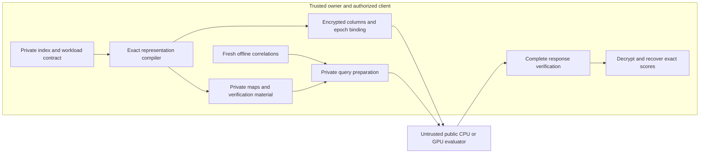

# Research plan: exact private search across representation, verification and lifetime

2026-09-30. This is the current execution plan, following the
[closest-work comparison](closest-work-comparison-20260930.md). It supersedes
the next-step ordering in the [E01–E40 synthesis](research-synthesis-and-system-roadmap.md),
while preserving its evidence and proof caveats. Execution has begun: E41's
finite oracle/planner, E42/E47 screens and a frozen-map E43 repair prototype
are implemented, with preliminary retained measurements. The remaining
mechanisms are proposals. Consult the [execution log](publication-progress.md)
and result documents before treating a package as complete. The machine-readable handoff is
[publication-work-packages.json](publication-work-packages.json).

Protected starting point: `02e06c0f5636def284ed6864b3e208538fcb10a6`,
`checkpoint/verification-frontier-2026-09-30`, on
`experiment/creative-search-algebra`. Production branches and company
Paillier/BFV fallbacks stay independent. Our deliverable arithmetic and
protocol implementation remain homemade; external artifacts are strong
baselines and differential references.

## 1. The question and the possible contribution

**Can an exact private representation be chosen so that encrypted search is
efficient over an index's lifetime, rather than merely fast in one server
kernel?** Specifically, can we jointly choose what is represented, how its
responses occupy ciphertexts, how the complete response is verified, and how
updates invalidate preprocessing, under explicit client-memory and leakage
budgets?

The proposed contribution is a representation algorithm and its analysis,
instantiated in an end-to-end private search system. It is not a proposal for
a new encryption primitive. The algorithm may ultimately use BGV, a code-based
linear protocol, or different backends in separately declared profiles.

The most promising new mechanism is **controlled sharing of exact private
query directions**: sharing can reduce work/state but couple previously
independent blocks, increase correction support, or expand the state that an
update invalidates. Representation, packing, verification and update choices
therefore need to be made together. We must first demonstrate that this is
more than ordinary low-rank factorization followed by an existing packer.

A second concrete protocol experiment follows from the new vLHE reading:
could a verified private linear query over the *public ciphertext coefficients*
replace our owner-produced encrypted mask answers? E47 below makes that
composition precise enough to test cheaply. It may lose on field width and
matrix expansion; it deserves an early test because it targets the trusted
preprocessing bottleneck directly.

Three contributions would make a coherent paper, if established:

1. A precise joint optimization problem and an algorithm with an exact result
   for a useful restricted class, or a demonstrably strong approximation or
   heuristic with exact small-instance controls.
2. A representation/update protocol with exact score and coverage guarantees,
   explicit leakage, and a reviewed conditional security argument for the
   complete transcript.
3. A homemade implementation showing a reproducible benefit over the closest
   compatible methods after client work, setup, unused preprocessing, memory,
   network traffic and updates are charged.

The first contribution must survive the literature and baseline gates before
we invest heavily in the last. A publishable outcome is not guaranteed.

## 2. Freeze a useful functionality before optimizing

Use one primary contract, and compare alternatives in separate panels.

| Dimension | Primary research contract | Separate extension / control |
|---|---|---|
| Parties | Trusted data owner and authorized online client; one malicious compute server | An attested offline factory, or multiple non-colluding helpers, changes trust and is declared separately |
| Data | Binary vectors with stable owner-assigned IDs and an authenticated index epoch | Quantized real embeddings are a different metric; do not call their Hamming search exact in the original space |
| Output | Every exact Hamming score, with stable top-k computed locally; initially k=3 | Only-top-k disclosure needs a different functionality and protocol |
| Query schedule | Adaptive queries after enrollment; current query chosen before exposure to its mask | Fixed-before-enrollment E32 remains a separate restricted control |
| Server privacy | Hide index values and query values subject to an explicit leakage function | A plaintext server database or exposed approximate geometry is a different contract |
| Integrity | Each accepted answer corresponds to every row of the authorized epoch and request | Detecting only a fraction of dishonest calls is weaker and labeled |
| Client state | Persistent, ephemeral, token and peak resident budgets stated separately | Full plaintext/affine caches and download-then-local search are mandatory controls |
| Preprocessing | Trusted owner-generated correlations are allowed and fully charged | No-preprocessing and key-only-client competitors remain independent candidates |
| Availability | Server may abort; no availability guarantee | Retry, crash and rollback behavior still must preserve privacy and one-use state |

The owner and authorized client are in the same confidentiality domain for
this first paper. Full-score access itself can reveal an index: distances to
zero and each unit vector recover binary coordinates. We therefore do not
claim database privacy against an authorized full-score client. Multi-tenant
authorization, client collusion and output-only access require new analysis.

Write the leakage function before the first new benchmark. Include row count,
dimension, public partition/capacity/rank profile, field and ring choices,
coordinate-equality schedule, ciphertext counts, request timing, epoch changes,
and any visible update locations or subsequent item retrieval. Data-dependent
plan selection can leak structure even if basis values stay encrypted/private.
Offer a padded public-profile control and charge its loss of efficiency.
No query-dependent routing in the primary full-scan experiment.

The owner/factory may retain private row coordinates offline. This is real
state. The target application must justify why that state is unavailable to
the online device; otherwise local plaintext search may be the better system.
Do not invent an artificially tiny client budget just to exclude that baseline.

## 3. What to preserve and what to stop treating as a research lead

| Existing evidence | Use in the plan |
|---|---|
| E01–E16, general homemade BGV/CUDA and packing | General-data fallback, paired CPU/GPU controls, and building blocks; not a new protocol claim |
| E22–E27, exact dictionaries/affine maps and CRT allocation | Candidate generation, row certificates, ordering controls, rank-boundary adversaries |
| E29–E31, reply columns and shared query spaces | The initial algorithmic substrate, with actual state and correction-degree costs |
| E35, independently fitted fields and final geometry | A real discrete threshold win to generalize; pay the complete search/setup cost |
| E37, native complete checks and exact bodies | Strong current controls; do not rediscover a C++ gain and call it an algebraic gain |
| E33/E34 and the authentication contract | Explicit unresolved protocol premises; preserve the failing mask-reuse and carry controls |
| E36/E38–E40 | Negative results, schema/field constraints, occupancy models, and contract rejection tests |

Do not prioritize another fixed-layout Lee-norm tightening pass, a query-only
compression pass, or moments-only top-k summary. Their present constructions
already fail the relevant full-cost or correctness tests. Reopen them only
with a changed mathematical mechanism and an explicit counterfactual control.
Do not turn a modeled small ring into a performance claim without a justified
parameter profile and complete encrypted run.

## 4. The proposed algorithmic core

The proposed integration has the following trust boundary. Existing modules
supply several pieces; the compiled/lifecycle system is not yet implemented.



E47 tests a different query/verification layer in place of the correlation
route. Both routes must bind the same owner-authorized representation.

### 4.1 Exact representation and the resources that must remain distinct

For a certified block, use an affine representation over a chosen field:

```text
x = a_g + u_x B_g                         (mod t)
H(q,x) = H(q,a_g) + u_x B_g(1 - 2q)       (mod t).
```

Certify every enrolled row. Choose a score range and query domain so modular
scores recover the integer answer uniquely. Refit over each field; reducing
a certificate from one field into another is invalid. Keep private discovery
groups separate from the final polynomial factors, as E35 already does.

For a plan P, retain at least:

```text
h(P) : independently masked query coordinates
F(P) : encrypted response-column count
W(P) : sum of public correction-polynomial degrees
R(P) : response ciphertext count
N,t,Q,eta : ring, plaintext, ciphertext and error parameters
S_client, S_owner, S_server : persistent/ephemeral/resident state
I(P,u) : state and unused correlations invalidated by update u
```

In the common/residual special case, `h=K+sum(r_g)`, `F=K+max(r_g)`,
and `W=K+S*max(r_g)`. These quantities need not move together. For the
current two-component, single-Q reply path, the exact coefficient-body size
is `ceil(2*R*N*bit_length(Q)/8)` bytes. Actual framed traffic and multi-limb
formats require their own counters.

The current absolute honest-circuit certificate is

```text
b = floor(t/2)
B_phase = (b + t*eta) * (1 + W*b) < Q/2.
```

This is an inherited sufficient correctness condition, not a security
estimate or a new theorem. The complete checker has an additional parameter
and lifetime budget. A smaller Q may increase checking work. Final CRT
root/capacity requirements can prevent an otherwise attractive small t.

### 4.2 A restricted grammar with an independently checkable optimum

Start with an index-only, fixed candidate partition tree. At each node allow:
raw coordinates; a certified affine leaf; a split into its children; a finite
catalog of shared/intersection directions; and bounded correction/exception
variants that already have an exact oracle. Use a finite catalog of reviewed
or explicitly research-only `(N,t,Q)` profiles and final CRT covers.

For each candidate, construct an immutable record containing row coverage,
private transforms, public schedule, `h/F/W/R`, exact serialization counts,
phase certificate, verification state/cost, update dependencies and backend
eligibility. A candidate is rejected before ranking if it changes the contract.

First enumerate every plan for tiny inputs. Then implement a Pareto dynamic
program over the restricted tree. A state must preserve boundary information
needed by a parent: column identities/alignment, shared-form IDs, occupied
capacity, parameter context and update dependencies. **Rank alone is not a
sufficient DP state.** Prune only states with equivalent boundary semantics
and dominated resource vectors. Retain distinct vectors until the user chooses
a cost objective.

The proposed theorem is optimality **within this finite grammar and exact
state representation**, proved by exhaustive leaf choices and complete child
combination. Pareto state count can be exponential. Do not claim polynomial
time, global partition optimality, or an approximation ratio without proving
it. A scalable beam/budgeted-search variant is a separate heuristic whose
optimality gap is measured on small instances and whose search cost is charged.

The inherited fixed-map capacity test
`sum_i ceil(M_i/(L*c)) <= S` is a useful feasibility primitive, not the new
contribution. Extend it only after specifying the mixed-degree/alignment
constraints exactly. Arbitrary column permutations may change CRT support
and verifier state; recompute both rather than assuming rank preservation
preserves costs.

### 4.3 Three creative mechanisms to test first

**E41 — Joint representation and capacity, rather than independent minimizers.**
Construct small examples where the lowest-rank representation loses after
packing or verification, and where the independently best packing loses after
state/lifetime costs. Compare the exact grammar optimum against rank-only,
field-only, packing-only, equal-form merging, global affine and the E35 finite
frontier. Then test larger real indices with the budgeted algorithm.
Success requires a strict feasible improvement at equal state/leakage/security
contract, with an ablation attributing it to a specific joint choice. If
ordinary merging plus layout search reproduces the win, this is a useful
engineering improvement, not the main paper algorithm.

**E42 — Representation versus the security-dimension floor of another backend.**
Test the same exact raw/global/local representations over BGV response columns
and code-based matrix evaluation. Shrinking a data rank does not necessarily
shrink an LPN/LSN encoding: dimensions and noise are constrained by security,
and many independently encoded small leaves may duplicate overhead. Compare
one padded global encoding, separate leaf encodings, and any justified joint
encoding. Count the actual EMVP block response, reconstruction, setup and
integrity; do not substitute a plaintext-sized answer. The hypothesis is a
measurable crossover in the best representation, not a new code construction.
Only develop a new encoding if a precise safe algebraic improvement survives
the author-protocol baseline. A code backend winning outright is a valid pivot.

**E43 — Sharing with a budget for update dependencies.**
Represent dependencies as a graph/hypergraph: rows and encrypted components
depend on bases, layouts, shared masked coordinates, fingerprints and epochs.
An update can invalidate their dependency closure. Hypothesis: limited sharing
plus reserved rank/capacity and small independently versioned correction
components beats maximal sharing over realistic update/query sequences.
Compare full rebuild, no sharing, frozen-base plus delta, ordinary periodic
compaction, and the proposed dependency-aware plan. Existing incremental
algebra and delta indexing are credited controls.

Begin with separate, independently masked components. Unused token fragments
for unchanged components might be preservable, but this is a protocol question:
their distributions, query bindings and joint authentication must remain valid.
Any fragment whose mask/correction has been exposed is consumed forever.
Shared coordinates may force a larger invalidation closure; never claim free
fragment reuse. The interesting result would be a safe invalidation rule and
an algorithm that chooses sharing based on the resulting complete lifetime cost.

### 4.4 Bounded exploratory alternatives

**E47 — Verified private evaluation of a ciphertext-linear operator.**
The server already sees the encrypted index columns. Regard their complete
coefficient vectors and required negacyclic shifts as a public matrix
`A_C` over `F_Q`. The client privately computes the *actual centered lifts*
`alpha(w)` of its CRT query forms, and asks a vLHE layer for
`z = A_C * alpha(w) mod Q`. The entries of z reconstruct the prescribed inner
BGV ciphertext, which should be decrypted only after the outer protocol's
complete verification and owner-epoch binding succeed.

This is a proposed composition of known primitives, not a new encryption
claim. It potentially avoids preparing `Enc(M*r)` in our owner service for
each query; the outer protocol has its own preprocessing, state and private
computation, all of which must be counted. The outer matrix contains ciphertext
coefficients, not the owner's plaintext index, so its usual server-plaintext
matrix contract could be appropriate at this layer. That observation does not
by itself prove the composition secure.

First build a tiny exact oracle, including negative negacyclic shifts and
`F_t`-to-`F_Q` carry/lift controls. The outer operation must return full-Q
residues, not scores reduced modulo t. A literal matrix can have `2*R*N` rows
and W columns; quantify this expansion, result width, admissible-database
bound, outer parameter/security requirements, owner commitment and verifier
cost before claiming any improvement. Compare explicit and implicit shift
representations only where the outer protocol actually supports them. Its
query/output ciphertext sizes may erase the advantage entirely.

Advance only if a complete composition and a same-contract cost bound compete
with E29's tokens and a direct general-BGV circuit. Keep the old inner check
until an independently reviewed outer integrity argument justifies removing
it. This experiment belongs in P03's early backend screening, with P07 defining
its proof requirements, before implementing another token factory or GPU path.

| Proposed experiment | First inexpensive discriminating test | Advance / stop rule |
|---|---|---|
| **E44: heterogeneous final response geometry** | Exact CRT/coverage oracle for mixed capacity and degree choices, at fixed justified security parameters; compare the E40 fixed-map models | Advance only if a realizable plan reduces full reply/check/decode or index cost. Stop if apparent savings require insecure small rings, omitted fragments or ignored multi-context keys. |
| **E45: approximate arithmetic with exact certification** | For a proposed CKKS/MOSAIC-like path, bound every score error and omitted candidate; either prove error strictly below 1/2 for integer rounding, or give a complete exact-refinement certificate | Compare against cFHE and existing E10/E23 filtering. Advance only if all coverage, tie, proof and extra-round costs fit. High recall or observed small error is insufficient. |
| **E46: certified output-only top-k** | A complete small arithmetic-to-comparison/selection circuit or all-row coverage certificate, including stable IDs | Compete with full-score download at actual k, dimension and bandwidth. Pay conversion, comparisons, authentication and data retrieval. Keep a separate output/trust contract. |

PCG/VOLE correlation generation and matrix/noncommutative HE remain alternate
tracks in the earlier ledger. Revisit only when a complete small share-to-token
or cost inequality improves on the chosen baseline. No native/GPU backend is
justified by a promising isolated operation count.

## 5. Closest-baseline and novelty gates

The [comparison](closest-work-comparison-20260930.md) is the detailed source
of attribution. In particular, general EMVP, hidden linear checks, low-state
vLHE, HE packing compilers, and low-rank/precision co-design already exist.
The new algorithm must add something beyond those ingredients.

**Gate A — problem and baseline viability.** Reproduce our checkpoint anchors
and external author configurations. Determine whether outsourced computation
is useful under justified client budgets. Do not proceed to a large compiler
if a compressed full cache or a compatible existing protocol dominates it.

**Gate B — mechanism.** Produce one small exact counterexample to independent
optimization and a new algorithmic/protocol consequence. Run the strongest
simple control. If the result is only a parameter sweep, change the question.

**Gate C — practical effect.** Before large GPU work, require a full-cost gain
on at least two independent workload families, or a clearly justified and
substantial benefit for one important application. Pre-register a resource
objective and a practical target (initially 20% improvement in amortized cost
or a 2× reduction of the binding state/update resource, without unreported
online regression). These are project decision thresholds, not conference
acceptance rules. Report effect sizes and uncertainty even if they miss them.

**Gate D — defensible paper.** At least one precise originality claim survives
forward/backward citation review; the relevant security assumptions match the
implementation; same-contract baselines and adverse controls are included.
A rejected hypothesis is retained, not silently removed from the experiment log.

Useful outcome if a gate fails: keep the company performance improvement,
publish an honest artifact/report, and pivot to the demonstrated bottleneck.
Do not manufacture a new cryptographic primitive claim to justify prior effort.

## 6. Executable work packages

All statuses initially `planned`. Paths below are proposed unless explicitly
marked existing. Keep algorithm/reference code in `experiments/bfv_search_lab/`,
benchmarks in `benchmarks/`, and research reports in `docs/research/`. Package
integration is a later opt-in adapter, not a rewrite of company clients.

| ID / suggested role | Dependencies | Concrete work and deliverable | Acceptance / decision |
|---|---|---|---|
| **P00 — protocol/system lead** | None | `exact-search-contract.md`: parties, outputs, leakage, epoch authorization, state budgets, query schedule, security/parameter registry; copy baseline manifest hashes | Every candidate can be classified without unstated trust or metric changes; document why the online device cannot simply hold a full cache |
| **P01 — reproducibility lead** | P00 | `baseline-reproduction.md` and pinned adapters under `experiments/bfv_search_lab/references/`; run our anchors and EMVP/BNTM author modes, then vLHE/BioZKFHE/packing modes relevant to the selected claim | Exact inputs/outputs, artifact modes, parameters and full state/traffic recorded; native-contract and adapted-contract results separate; no borrowed speedup numbers |
| **P02 — algebra lead, E41** | P00 | `representation_contract.py`, `representation_oracle.py`, `test_representation_oracle.py`; tiny grammar enumeration and counterexamples to independent choices | Every plan certifies rows/IDs/CRT scores; exhaustive small queries and independent capacity checks; at least one meaningful nonseparable tradeoff before extending grammar |
| **P03 — protocol/algebra lead, E42/E47** | P00, P01, P02 | `backend_frontier.py`, `ciphertext_linear_oracle.py`, exact-field reference adapters and `backend-frontier-results.md`; rank/security-floor and nested-vLHE count oracles before native implementation | Include client decoding, code response dimensions, outer full-Q/carry/parameter costs and per-request integrity; abort speculative speedups if safe dimensions erase them |
| **P04 — algorithm lead, E41** | P02, P03 | `representation_planner.py`, `test_representation_planner.py`, `representation-planner-analysis.md`; exact Pareto DP and bounded-search variant | Equal exact optimum on exhaustive grammar fixtures; boundary-state proof, resource counts and measured search budget; simple controls included |
| **P05 — lifecycle/protocol lead, E43** | P02, P04; P07 before remote use | `representation_updates.py`, `test_representation_updates.py`, `representation-update-results.md`; dependency closure, reserve/delta options, token invalidation | Insert/delete/edit and 64→65 boundaries preserve full scores/IDs; no exposed-mask reuse; compare full rebuild and ordinary delta indexing over identical update traces |
| **P06 — benchmark lead** | P01, P04 | `representation_lifetime_lab.py`, `representation_lifetime_summary.py`; use existing native arithmetic/checker first | Full setup/pool/query/update cost; equal budgets; held-out runs, uncertainty and compressed-cache controls; pass Gate C before new GPU kernels |
| **P07 — security lead** | P00, P02; iterate with P03–P05 | `exact-search-security-game.md`, reduction sketch and independent attack/negative controls; review parameter choices | No forbidden decryption oracle in hybrids; leakage and aborts explicit; soundness lifetime, authentic setup and adaptive query premises match code |
| **P08 — systems lead** | P05, P07 | Authenticated owner/token service and durable journal using the existing E33 contract; optional local attested-factory prototype | Concurrent consume, crash/retry, stale epoch and rollback controls; actual producer work, provisioning and unused-token costs; simulated attestation labeled |
| **P09 — native/CUDA lead** | P06 passes Gate C; P07 defines verifier boundary | Implement only the surviving public evaluator/packing transformations; preserve GMP/native references and one complete response check | CPU/GPU end-to-end gain survives transfers, client/check cost and memory limits; measure latency separately from batch throughput |
| **P10 — exploratory algebra lead, E44–E46** | P00, P02; mechanism-specific prerequisites | One independently runnable exact oracle and full-cost bound per alternative, with a negative control | Promote only a changed mechanism that beats its matched control; do not let speculative branches delay a surviving central contribution |
| **P11 — evaluation/artifact lead** | P05–P09 as applicable | Frozen public benchmark matrix, figures, hashes, environment and reproduction script; adversarial cases and rejected plans retained | Same workload/contract comparisons; no unexplained baseline omissions or modeled numbers labeled measurements |
| **P12 — research lead** | P07, P11 | `paper-claims.md`: claim→theorem→experiment→closest-work table and manuscript outline | One coherent contribution; independent review of key proof/parameter assumptions; venue selection follows the actual result |

Critical path: **P00 → P01/P02 → P03/P04 → P06 → decision**. P07 starts with
the contract and develops alongside the mathematics, so an impossible proof
premise is found early. P05 is the strongest extension if static representation
already survives. P08/P09 are deliberately later: a TEE deployment or another
kernel speedup should not consume the novelty investigation. These roles are
handoff boundaries, not instructions to launch agents or send messages.

First bounded tranche: one or two researcher-weeks for P00/P01/P02 feasibility,
followed by a written go/pivot decision. This is a planning estimate, not a
runtime or completion promise. A difficult external build should be recorded
and isolated; it must not lead to silently dropping the strongest competitor.

## 7. Evaluation that can support the paper

### Workloads and counterexamples

Keep Mushroom/Semeion and the existing seeds for continuity, but they are too
small and specialized to establish a broad systems claim. Add independent
larger real binary/categorical workloads with provenance, license and exact
encoding recorded. A binary projection of an embedding is evaluated as a
binary metric, with original-metric recall separately labeled.

Target distinct enrolled records at approximately 1k, 8k, 32k, 128k and,
where feasible, 1M; report duplicate vectors separately. Use dimensions
128/256/512 plus the natural dimensions of each dataset.
Do not call repeated copies of one small dataset independent scale evidence.
Include uniform random data, controlled local rank, duplicate/nonduplicate
columns, many ties, unbalanced groups, random/permuted orderings, and ranks on
both sides of a power-of-two boundary. Index-only fitting may use all enrolled
rows; held-out queries and future updates cannot influence plan selection.

For updates, use random and bursty insert/edit/delete traces plus adversarial
rank increases. Sweep update/query ratio, active-set churn and token utilization.
Synthetic and observed application traces are separate categories. Include
empty/tiny groups, deletes of winners, stable-ID ties and full fallback cases.

### Baselines and fairness

1. Homemade Paillier CPU/CUDA, lookup variants, package BFV CPU/CUDA, and
   general BGV CPU/CUDA on compatible exact full-scan workloads.
2. Current reply-column GMP/native arithmetic with both the same-family native
   checker and the explicit polynomial alternative; E35/E37 frozen controls.
3. Raw/global/local factorization, rank-only split, equal-form merge,
   hierarchy, layout-only search, independent field search and simple delta
   indices; these isolate the proposed mechanism.
4. Strong compatible EMVP/BNTM adaptations and relevant packing reference.
   vLHE with server-plaintext data and approximate/MPC search belong in
   separate panels, with the contract difference visible.
5. Optimized local binary popcount, compressed full-data/affine cache, and
   download-once then local search. Include cache decompression and device
   memory limits; do not compare only with Python loops.

Use equally justified security targets, not merely equal N or Q. Parameter
sets belong to a reviewed allowlist with distributions, sample count, estimator
revision/assumptions and attack estimates recorded. A correctness-only profile
is still useful for algebraic experiments but cannot substantiate a secure
performance comparison. Preserve each paper's native parameter mode first.

### Count every stage and every byte category

Record response download, query upload and their sum, encrypted-index
provisioning, and public/evaluation setup keys as separate quantities. Also
record proof/attestation packets, one-use answer provisioning, authentication
framing, update traffic and retries. A verifier secret key is private state,
not a setup key sent to the server. Count native resident/peak memory separately
from compressed disk/wire encodings.

Time discovery, all rejected candidate fits, encryption, parameter/key setup,
index transfer/preparation, token production, query formation, server work,
transfer/codec, complete verification, decryption, score decoding and stable
selection. For updates, include map rebuild, re-encryption, re-authentication,
token invalidation/replacement and temporary peak memory. Distinguish offline
owner/factory work from online-device work and report both.

For K completed requests, a useful accounting objective is

```text
total epoch cost = discovery + setup/provisioning
                 + all prepared-token cost (including unused/invalidated)
                 + all update/repair cost
                 + sum of complete online request costs.
amortized cost = total epoch cost / K.
```

Publish latency, CPU/GPU work, bytes and memory as separate axes before using
any weighted score. Link models use directional bandwidth, RTT and packet
counts; real service timings additionally include overlap, scheduling and
queues. Never label a sum of medians a measured request latency. The old
nine-token experiments cannot be extrapolated to an unlimited service.

A faster online path wins over B only if its per-query savings repay its extra
setup, token and update costs within the actual index lifetime. Show that
break-even as a curve with token utilization and updates, not a single chosen
large query count. If every consumed token requires another expensive full
offline matvec, measure producer saturation as well as online throughput.

### Statistical and hardware protocol

Use at least three independent index splits/instances and repeated serial
sessions. For principal latency plots, target at least 100 distinct held-out
queries per instance and enlarge the sample if p95 remains unstable. Use
paired inputs, randomized/interleaved execution order, warmups excluded, and
separate cold-start runs. Bootstrap paired improvements at the independent
instance/session level; correlated stages or adjacent GPU samples are not
independent replicates. Report p50/p95 and uncertainty, not only best runs.

Pin CPU/GPU model, clocks/power settings, thread counts, compiler flags, library
and driver versions. Measure resident and streaming indices, one-request
latency and batches of 8/32/128, accounting for all host/device transfers.
Use Nsight after the algorithmic gate to explain remaining bottlenecks. Charge
batch formation/waiting separately from saturated throughput. No speedup is
inferred from GPUs running a different verification or state contract.

### Essential ablations and paper figures

| Figure / table | Question it must answer |
|---|---|
| Contract and source table | Which protocols solve the same problem, and which require additional adaptation? |
| Small exact optimum vs heuristics | What specifically does the new algorithm discover that separate rank/packing/state choices miss? |
| Complete latency breakdown and bandwidth sweep | Which party/stage benefits; does a server gain survive checking, client work and IO? |
| Client/owner/server state versus lifetime cost | Is outsourcing worthwhile against full-cache and low-state competitors? |
| Updates and token utilization | When does sharing help, and when does dependency-driven invalidation erase it? |
| Backend/rank/field crossover | Does the representation help independently of BGV, and where do security dimensions dominate? |
| Negative-control table | Where do random data, ties, poor occupancy, ordering and adversarial updates defeat the method? |
| Security assumptions and proof/code coverage | Which properties are proved, tested, assumed or still unreviewed? |

## 8. Security analysis agenda, without making it the current bottleneck

P07 should produce a reduction argument for the selected protocol, not an
attempt to prove security merely from successful tests. Reuse the existing
[correlation contract](authenticated-correlation-contract.md),
[adaptive-mask analysis](adaptive-field-frontier-results.md) and
[conditional checker bounds](verification-frontier-results.md).

Specify a real/ideal game for adaptive queries and updates, authorized epochs,
server-chosen replies, visible accept/abort events, subsequent requests, and
declared leakage. The ideal functionality computes all scores or aborts. A
plan compiler is a trusted owner operation; its metadata and timing belong to
the leakage function. Hidden maps must not be silently promoted to public
inputs in a proof or implementation.

Proposed proof obligations, in order:

1. Exact reconstruction, score range, all-row coverage and stable-ID semantics
   for every compiled plan and allowed update.
2. Honest adaptive correctness under an explicit deterministic or justified
   failure bound. Correctness and RLWE/LPN parameter hardness are separate.
3. Authentic binding of index, token, plan, context, query and epoch; trusted
   setup is either an explicit assumption or replaced by a proved mechanism.
4. A bounded-attempt first-false-accept argument for the **entire** prescribed
   response. Account for all components/contexts, challenge secrecy, adaptive
   failures and rekeying. Known polynomial or vector families receive credit.
5. Replace secret decryption of accepted replies with ideal scores until a
   false acceptance; rejected untrusted responses use no long-lived HE key
   in the current protocol. Specify what the server learns through retries,
   future queries and retrieval decisions.
6. Attempt an adaptive multi-message encryption hybrid for independently
   encrypted index columns and fresh answers, then a fresh-pad argument in
   the hybrid. Explain related plaintexts, reused public index, token selection,
   query-dependent histories and update dependencies. A uniform delta marginal
   is insufficient. A simulator needing an unauthorized decryption oracle
   invalidates the argument.

A possible bound will contain encryption/PRG advantages, setup/authentication
failure, and the complete-check lifetime error, with explicit hybrid factors.
Its exact form must be derived; writing a sum of these names is not a proof.
Correctness failure, denial of service and private side channels need separate
treatment. ReinsPIRe and small-state vPIR supply important real/ideal and
selective-failure comparisons; their assumptions cannot simply be transferred
to our different secret-key/token lifecycle.

Test malicious replacement, omitted/duplicated rows, altered coefficients,
cross-epoch splicing, bad fields/shapes, wrap/carry mistakes, publicized check
keys, reused masks, concurrent consume and rollback. Tests protect the
implementation; they do not establish the reduction or constant-time behavior.

Private-key arithmetic and secret verification state need an explicit timing
and memory-access review. A GPU public evaluator must not receive a secret
verification challenge or HE key. An attested factory is optional: it may hold
private coordinates/masks and produce offline work, with its compromise scope
declared. Attestation alone does not certify unchecked external GPU output.
Production integration remains gated on independent protocol/parameter/private
implementation review, separate from a publishable experimental result.

## 9. Paper shape, pivot rules and handoff

Working title, not a settled claim: **Exact Private Search under State and
Update Budgets**. Lead with one demonstrated algorithmic tension and a small
worked example, then the joint algorithm, its guarantees, protocol, and full
evaluation. Put historical BFV→BGV→CUDA engineering in the artifact/history;
it should not obscure the paper's single central contribution.

If the main result is a verified protocol/system with realistic assumptions,
security venues such as CCS, USENIX Security or IEEE S&P are plausible targets.
If the strongest result is a private query/representation optimizer, consider
a database venue; if it is a general compiler algorithm, compare against the
bar for PLDI. These are judgments about fit, not acceptance predictions or
verified calls/deadlines. A narrower privacy tradeoff result could fit PETS.
Choose the venue after the mechanism and proof scope are known.

If static compression is already matched by EMVP or existing compilers,
prioritize the update/dependency mechanism. If that also reduces to known
delta indexing with no net gain, stop enlarging the planner and evaluate the
bounded alternate hypotheses. If small public data are the only favorable
case and a local cache wins, narrow the claim or find a justified workload;
do not hide the cache result. An unsuccessful hypothesis is useful evidence
for choosing the next question.

Each handoff must contain: work-package ID; base commit; contract/profile;
literature dependencies; hypothesis and falsifier; exact inputs/seeds; source
paths; reproduction command; raw output/hash; result classification
(`proved`, `measured`, `model`, `counterexample`, `unresolved`); and next gate.
Mark a task complete only when its acceptance evidence is committed. Before
remote publication, inspect the diff and keep sensitive company data out of
artifacts. New proposed source files are not evidence of implementation.

Historical manifests remain immutable snapshots. The E36–E40 manifest also
hashes planning documents as they existed at the protected commit; later
planning edits are intentional, and historical verification should read that
commit. Never rewrite old measurements or hashes to make a new plan appear
to have been measured. This planning revision changes no encryption code,
tests, parameter allowlists, raw experiment results or production API.

Planning-revision validation on 2026-09-30 checked 137 local Markdown links,
15 cached primary-PDF hashes, four recorded artifact revision IDs, all 13
work-package dependencies, and the seven proposed experiment IDs. It verified
49 historical hash entries against the protected commit and checked the E37
headline ranges/body counts against the frozen CSVs. Only the four explicitly
updated historical planning/index documents differ from those snapshot hashes.
No cryptographic tests or external performance benchmarks were rerun for this
documentation-only revision.
