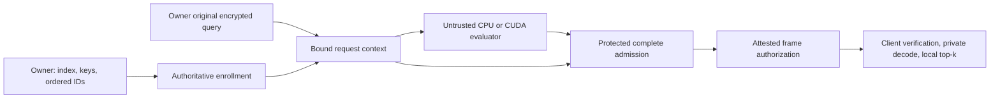

> Execution return, 2026-10-04: [Q74/Q75 results](shared-query-gates-20261004.md) and the [current ledger](research-contribution-progress-20261004.json) now complete the two bounded preliminary gates. Shared-query exact semantics passed; the Q120 derived/public-index variants failed their public bounds, and one paid Q180 rescue was screened. The strongest known composition contains the new algebra. The next selected build is owner canonical Q120 shared-query native admission versus equally prepared replay, with permitted cache/acquisition and all lifetime costs. No new service speedup, original main claim, security/parameter approval or production change is established. This supersedes earlier next-task/selection pointers for future work; the complete earlier document below is byte exact.

# Research plan: compile exact encrypted search for the complete cost of verification

2026-10-04. Current planning baseline:
`4bbd55056d14405b617ae0c251b1f2bacc71e74c`.
Branch: `experiment/research-contribution-plan-20261004`.
Read the [closest-work comparison](closest-work-contribution-design-20261004.md),
[evidence assessment](research-results-assessment-20261004.md), and
[execution ledger](research-contribution-progress-20261004.json).

**Recommendation:** keep homemade BGV as the HE foundation and preserve the
current no-seed30 native work as a fallback. Before another full implementation,
run two finite research gates on moving maintenance into shared query processing
and on choosing a relation by its complete verified cost. If they survive,
build one complete admitted service and evaluate its useful operating region.
The main contribution is still a hypothesis; there is no accepted new primitive,
measured secure-service speedup, or conference-readiness claim.

This plan changes the next-task order of the
[Q71 controller plan](gadget-cut-native-controller-plan-20261004.md).
It preserves that construction specification and every earlier result.
The old ledger's “next” field is a historical checkpoint; this ledger controls
new research execution. Every completed or stopped package returns here.

## 1. The problem and intended contribution

The owner uploads an encrypted binary index, submits encrypted queries, and
receives exact Hamming distances with stable record IDs, then selects top-k
locally. A malicious server must not turn its responses or the client's
accept/reject feedback into a private-key oracle. The selected architecture
allows a protected verifier; it initially certifies ciphertext computation
without possessing the HE decryption secret. The client may keep any plaintext
data. Local authenticated search is therefore a legitimate competing system.

The research target is a compiler/runtime that chooses **both the evaluator
and its admission relation**, subject to publicly checkable correctness/noise
bounds and a complete resource budget. A smaller witness can add arithmetic;
a faster evaluator can create costly verification boundaries; a reusable table
can make updates expensive. Optimize those costs together.

Three possible paper contributions, all conditional:

| Claim card | Concrete deliverable | Evidence needed / falsifier |
| --- | --- | --- |
|C1: compilation of a complete exact-BGV admission relation|A typed graph and certificate connecting owner inputs, bounded representations, both actual prime limbs, full output frame, and release.|Prove semantic/correctness invariants; independent whole-vector/frame checks. Stop if any free expanded query, limb, carry, output coordinate, or coverage choice remains.|
|C2: a useful verification-aware transformation/selection rule|Move reusable maintenance before the index-dependent contraction, and choose where bounded state replaces canonical source witnesses.|A precise difference from the strongest known combination, or a defensible new systems design result. Reject an algebraic claim if generic adaptation reproduces it.|
|C3: an original complete system frontier|One homemade native/CUDA service with explicit setup, updates, trusted state, IO, and lifetime costs.|Reproducible useful regimes and ablations against prepared replay, checked-product controls, known-method composition, and permitted caching. A stage-only ratio is insufficient.|

A systems paper can use known cryptography. Its original contribution must
still be identifiable beyond “we implemented these techniques” or “we used a GPU.”

## 2. Why change direction now?

The [assessment](research-results-assessment-20261004.md) explains the evidence.
BGV is fast and communication-efficient among our HE implementations, but
cache wins on the retained local 32k comparison. Recent no-seed30 work saves
about 16.5% of modeled server-to-verifier witness traffic near half fill while
adding about 41% pointwise work. Prepared replay needs no witness traffic.
We should not spend a long build assuming that the smaller tape necessarily wins.

The closest literature already covers bounded gadget preimages, noise-aware
verification relaxation, query expansion, delayed switching, TEE delegation,
and HE compilers. E101, E110, Q57/H1, and Q59/H2's negative originality decisions
remain closed. E07/E73's working mechanisms are credited controls. No renamed
sharing, ordinary DP, key identity, linear delta, or Fourier rerun reopens them.

The new priority is a **semantic graph change and full-cost comparison**, not
another radix sweep. The existing controller/kernel work remains reusable
infrastructure if that graph passes the gates.

## 3. First bounded hypothesis: move maintenance before the gallery join

Let N be the encryption-ring degree, d the binary dimension, D the next power
of two at least d, and G=ceil(records/N). Start with d=D=512, N=16,384.
Do not reduce the encryption ring or secret dimension.

Store one signed feature across record coefficients:

```text
a[r,j] = 1 - 2*x[r,j]
b[j]   = 1 - 2*q[j]
A[g,j](X) = sum_(r in group g) a[r,j] * X^(r - g*N)
```

Unused record coefficients are zero. For j >= d the public padding is zero.
The owner's encrypted packed query has plaintext

```text
B(X) = D^(-1) * sum_(j=0..d-1) b[j] * X^j  mod t .
```

D is invertible modulo odd t. A known coefficient-expansion tree obtains
ciphertexts whose plaintexts are the constants b[j]. Expand **once per query**,
not once per gallery group. Then compute

```text
U[g] = sum_(j=0..d-1) Tensor(Enc(b[j]), Enc(A[g,j]))  // 3 components
C[g] = Relinearize(U[g])                            // once per group
score[r] = d - 2*Hamming(q, x[r]) .
```

For t > 2*d, centered decoding gives Hamming=(d-score)/2 without ambiguity.
This is ordinary ring multiplication by a constant plaintext; no nonexistent
coefficientwise multiplication or t=1 mod 2N batching assumption is used.
Our t=1031 profile does not support that full SIMD-batching condition.

Feature-major storage/delayed relinearization (E07), compressed query expansion
(E73), and pre-normalization are known. The combined known control receives all
three. Different maintenance schedules may produce different ciphertext bytes
while producing identical exact plaintexts; correctness comparisons must not
demand byte equality across those semantic families.

### The specific additional relation question

Each expansion node produces two branches from **one input and its automorph**.
A checked source sigma(C1) determines C1 because sigma is invertible. This
differs from the gallery butterfly's unrelated two-input anchors.
Can common bounded integer gadget state carry through these shared query
branches and remove further canonical witness cuts, while its increased
switch noise is still safe **before** multiplying by the encrypted index?

Screen this with exact equations and full noise induction. Give generic
homomorphic-gadget and relaxed-relation controls the identical opportunity.
The possible gain is a complete graph/frontier result, not the propagation
identity itself. Both branch outputs, padding, key-A correction terms, and all
convolution cross terms must be charged and bound.

### A structural illustration, not an experimental result

For full groups and d=D, the existing coefficient-input butterfly has D*G
products/relinearizations and (D-1)*G rotations. A canonical witness inventory
with two terminal-Q components per group contains (2D+1)*G Q-polynomials.

The proposed known composition has D*G products, G relinearizations, and D-1
query-expansion rotations. If expanded queries are derived inside the checked
graph, its optimistic canonical inventory is D-1+3G Q-polynomials. The
known-method control receives this same count. Additional anchors required by
an executable adapter must be added.

One Q120 polynomial is 15*N=245,760 bytes in the current format:

| Full records | G | Existing canonical body MiB | Proposed canonical inventory MiB |
| --- | ---: | ---: | ---: |
|16,384|1|240.234375|120.468750|
|32,768|2|480.468750|121.171875|
|65,536|4|960.937500|122.578125|
|131,072|8|1,921.875000|125.390625|

These are **unexecuted conditional source inventories**, not native measurements,
security-approved profiles, final packet sizes, or originality evidence.
Headers, producer work, verifier arithmetic, index/query state, and setup remain.
At half fill, feature-major storage can double the encrypted index; use the
actual partial geometry rather than extrapolate this full-group table.

Retaining all expanded query components at N16k costs about 256 MiB in two
uint64 prime limbs before scratch/maps. Recomputing or streaming avoids part
of that state at a cost. Grant identical choices to the control. Query-upload
compression does not eliminate the verifier's expansion-binding obligation.

## 4. Correctness/noise is the first gate

Do not use observed decryption success, a private measured noise budget, or a
response-supplied bound to approve the new graph.

For a fresh query phase bound Fq, index bound Fi, and canonical switch bound S,
a conservative starting induction is:

```text
S = t * eta * N * ell * (2^radix_bits - 1)
F_expanded <= D*Fq + (D-1)*S
F_product_sum <= N*d*F_expanded*Fi
F_output <= F_product_sum + S_relin .
```

A derived gadget state uses its actual proved public digit envelope in place
of the canonical envelope. Bounds must hold for **every admitted witness**.
Use exact integers, actual Q and ordered primes, actual sampler supports,
and the existing common-Q/P no-wrap and nearest-lift terminal guard. Multiplying
expanded noise by a public-key encrypted index may make Q120 infeasible even
when the owner-encrypted index works. Report that distinction, not a silent
encryption-mode switch.

Start with the existing Q120/P=33,548,413/t=1031/eta21 contract and canonical
30-bit keys. Owner-encrypted and public-key index modes each get their own
matched canonical baseline. Owner encryption is legitimate here because the
client owns the data, but its smaller bound is not credited against a weaker
public-index comparator.

If Q120 fails, record the failing inequality. Permit at most one explicitly
registered larger-Q rescue profile only when a paid resource screen justifies
it. New keys, larger wire/RNS costs, P selection, and concrete security review
are part of that new profile; the present Q120 parser is not assumed compatible.
If neither mode has a useful admitted operating point, stop this candidate.

## 5. Second bounded hypothesis: choose the complete verification representation

On the admitted graph, compare two relations first: canonical sources and one
bounded-state policy. Compile each with the same public fusion, pairing,
common-expression sharing, streaming, and lifetime repairs. Use an independent
exhaustive oracle on tiny trees to test the planner within its declared grammar.
Do not claim global optimality outside that grammar.

Price a policy pi by the full resource vector:

```text
(setup work, keys, encrypted index, query/reply bytes, witness bytes,
 producer evaluation/extraction, verifier transforms/arithmetic,
 trusted terminal, resident/scratch memory, update invalidation, client work)
```

Deployment selection adds query reuse H, update frequency u, and link budgets.
For a sequential reference, use setup/H + u*update + complete query time.
For overlapped execution, price the actual critical-path DAG instead of
summing independently timed overlapping stages.

The scientific discriminator is whether optimizing evaluator cost alone picks
a different policy from optimizing this complete verified cost, and whether
the latter provides a useful **paid** tradeoff against the strongest controls.
A renamed cost function without an executable difference is insufficient.

If exact verifier arithmetic dominates, allow one conditional comparison of
verification islands: local replay versus exact NTT checks versus a structured
private randomized adjoint. Ordinary Freivalds/Slalom methods are controls.
No randomized mode enters the main service before an adaptive soundness and
hidden-challenge lifetime argument, full source binding, and charged preprocessing
exist. This conditional experiment is not an automatic extra backend grid.

## 6. Finite execution queue

There are **two preliminary research gates**, Q74 and Q75. After those, select
one full build or stop the candidate. Four subsequent packages finish the
system/evaluation/paper decision; they are not another open-ended idea search.

| Package | Work and bounded scope | Completion / stop decision |
| --- | --- | --- |
|Q74: layout, graph, and noise gate|Derive the known combined graph and additional query-branch relation. Check owner/public input bounds, all branches/tails, exact terminal guard, and full source inventory. Use two small ring geometries, canonical and one propagated policy, plus fixed source-profile structural screens; no timing.|Deliver a source-pinned registration, independent whole-ring oracle, inequalities, graph inventory, and failures. Advance only a noise-safe candidate with plausible complete resource benefit.|
|Q75: prior and full-cost discriminator|Adapt the strongest known combination and compare the same two admitted policies. Give it all generic rewrites and an equally prepared replay/cache cost card. Build one Pareto policy selector within a stated finite grammar; tiny exhaustive cross-checks. No new radix/algorithm grid.|Write claim cards identifying the invariant, prior difference, paid advantage, and falsifier. If generic adaptation contains the algebra, reject that claim; select a systems build only if a distinct complete design question remains useful.|
|Q76: one complete native prototype|Reuse Q71's homemade kernel/codec but complete internally compiled enrollment, authoritative request/controller, shared preparation, one matched tape producer, and full terminal frame. Start CPU native; isolated output libraries.|Pass full correctness, mutation, coverage, original-query, common-integer, release, replay/concurrency/restart tests. No timing or CUDA port before this gate. If Q74/75 stop, choose the already-specified canonical/no-seed30 engineering path only with an explicit supporting-result designation.|
|Q77: matched complete evaluation|Measure the selected prototype against canonical admission, strongest known composition, prepared replay, checked-product/trusted-suffix, and cache. One selected encryption mode/profile per primary panel, actual IO and peak state. CUDA only for a surviving measured bottleneck.|Return complete costs and useful/reversed/tied regimes. A smaller tape, unavailable artifact, or bare server speedup is not a pass.|
|Q78: system and assurance closure|Owner-authenticated tile updates, dependency invalidation, snapshot/epoch durability, private-release integration, attestation, parameter/sampler/side-channel analysis, and a formal composition argument for the selected graph.|Versioned complete service contract and artifact. Review any remaining security limitation explicitly; no production assurance from tests alone.|
|Q79: originality and paper gate|Repeat closest-system comparison with final implementation/claim scope. Prepare ablations, limitations, theorem statements, reproducibility package, and external research review.|Select a main systems contribution only with a precise original result and useful evidence. Otherwise publish supporting/negative engineering findings or formulate one newly justified question; do not keep all historical forks active.|

At each return, update the ledger with registration, source/build hashes,
counts by their actual unit, outcome, limitations, and next task. Preserve raw
failures and registration changes; stop dependent tasks when a prerequisite
fails. Q74 is next. Q71 controller completion is no longer the first scientific
task, but remains the concrete reusable implementation specification.

## 7. Architecture and implementation handoff



Enrollment binds actual parameters/primes, owner ciphertext origins, selected
key set, layout, record count/order, epoch, and one admitted plan. The caller
cannot supply a different arbitrary graph. The request freezes the owner's
original query. The complete packet grammar fixes every source slot, output
component, unused coordinate, and terminal operation before public arithmetic.

The protected component checks the full frame and grants one bound release.
The signer authorizes that exact frame under the enrolled epoch/request;
a signature alone is not proof of evaluation. The HE secret remains at the
client in the primary architecture. Alternative trusted-replay placement is a
separate measured row with all of its work and trust disclosed.

Use existing repository organization:

- Homemade reference/planner/relation prototypes stay in
  `experiments/bfv_search_lab/`; tests beside them and runners in `benchmarks/`.
- Reuse `feature_major_bgv.py`, `packed_query_expansion.py`,
  `noise_cut_planner.py`, `noise_cut_relation.py`, `noise_cut_fusion.py`,
  `native_noise_cut_kernel.py`, and `_gadget/noise_cut_kernel.cpp`
  where their actual interfaces apply. E73's toy subring limits do not
  automatically admit a full-size constant-feature expansion.
- New native/CUDA variants emit isolated libraries; preserve delivered binaries.
  Our PrimeNTT/GMP/RNS/CUDA remain the primary implementation. SEAL/author
  artifacts are optional labeled controls, not replacements.
- Stabilize the interface and review before migrating a selected component into
  `src/cuhepy/`. Preserve Paillier/BFV production fallbacks and main/staging.
- Data/manifests stay outside Git under `../research-data/`; small plans,
  registrations, receipts, tests, and reproducible commands remain tracked.

## 8. Complete evaluation contract

Always report the four distinct byte categories: query upload, client response,
encrypted index, and setup keys. Add **server-to-verifier witness traffic**,
trusted state, and internal accelerator transfers as separate categories.
Exact all-distance output remains primary. Content retrieval and a top-k-only
protocol are separate contracts and cannot be described as already measured.

Preregister a finite primary cohort after Q76: 8,224 as the retained partial-fill
control, one full group (16,384), and two groups (32,768), dimension512. One
selected admitted profile/mode and backend initially. Use two independent key
contexts; within each, pair the same corpus and held-out queries across methods.
Start with eight measured queries after one warmup and three fresh process
blocks, reporting shared-key/corpus dependence. These are planned caps, not
runs already performed. Larger or update-heavy cohorts require a surviving
specific finding and separate registration.

Measure encryption, expansion, evaluation, extraction, serialization, transport,
parsing, admission, terminal/signature, client decode/selection, and elapsed
critical path. Charge selected keys, fresh-client acquisition, setup, warm
state, memory/scratch, one fixed 32-row update, and actual invalidation.
Give cache owner acquisition and authenticated update the same completeness.

Use a declared idle window and paired/alternating order. Record CPU/GPU
activity, clocks/thermal state, swap, build/profile/key receipts, CUDA
synchronization, and monitor overhead. Preserve contaminated runs separately;
do not delete slow observations after seeing the result. Separate cold/warm,
kernel/stage/service, and model/measured tables. Repeat only when a failure,
change, or stated precision concern justifies it.

Core ablations: old layout; known combined layout with canonical sources;
same graph with bounded state; same relation with generic fusion; complete
admission versus equally rewritten replay; cached versus on-demand state.
Include an applicable prior ring-proof/TEE adapter as a reproduced result or
honest scoped unknown, not an artificially expensive scalar-only baseline.

A useful outcome may be a latency improvement, less trusted state at comparable
latency, cheaper updates at comparable throughput, or lower acquisition cost.
Preregister the chosen success metric and resource constraints at Q75; do not
pick a different headline after seeing measurements. Report the best compatible
known control and the cache even if they win.

## 9. Security analysis and reduction plan

This is a proof agenda, not a completed reduction or parameter certificate.

1. **Owner-origin and augmented HE game.** Specify actual secret/error/seed
   samplers, index/query origins, and related-secret evaluation keys. State
   the appropriate RLWE and any KDM/circular-security assumptions instead of
   silently deriving augmented-key security from plain IND-CPA.
2. **All-admitted-witness correctness.** Prove recomposition and deterministic
   noise induction for every allowed common integer representation. Prove full
   coefficient score semantics and the terminal Q-to-P/no-wrap condition.
   Empirical noise measurements cannot supply this invariant.
3. **Admission relation.** Define public acceptance from original enrolled
   inputs, immutable packet, ordered limbs, complete coverage, and exact
   terminal frame. Deterministic all-coordinate checks have no statistical
   equality error. A randomized variant needs its own adaptive first-false-
   acceptance argument, challenge lifetime, and union budget.
4. **Simulation/coupling.** On the good origin/guard event, every authorized
   frame decrypts to the ideal exact-search output. Show that rejection and
   authorization can be simulated without the HE secret, with explicit
   allowed leakage. Bind request/epoch/frame authentication and exactly-once
   release. Formalize composition with augmented HE confidentiality, signature
   unforgeability, hash binding, admission error if any, and TEE assumptions.
   This does not make raw BGV generically CCA secure.
5. **Deployment and private leakage.** State timing/length/access/update
   leakage and application-visible behavior. Analyze constant-time private
   code, actual attestation policy/channel, memory isolation, crash/fork/
   concurrency, freshness and rollback. A process mutex is not durable
   freshness; a public source hash is not hardware attestation.

FHE security notions and TEE trust are supporting foundations. External
cryptographic and systems review should precede any production assurance.
A theorem cannot cover implementation leakage or attestation that the artifact
has not implemented.

## 10. Paper structure and final decision

Draft a result-shaped paper only after selection:

1. Exact single-owner search and adversary/output contract; cache is allowed.
2. Why evaluator-only optimization misses verifier/IO/state/update costs.
3. Compiler graph, transformation, admission invariant, and limits.
4. Homemade native/CUDA runtime and protected release architecture.
5. Conditional correctness/security arguments with explicit assumptions.
6. Complete matched evaluation, acquisition/update regimes, strongest controls,
   ablations, and negative cases.
7. Closest-work distinction and reproducibility/limitations.

Do not claim “first verified FHE,” “first encrypted Hamming search,” “first
noise-aware verification,” or “a new gadget primitive.” The paper's main claim
must identify the specific result left after those known techniques are granted.
Venue choice follows that result; no venue's acceptance is promised.

There is no requirement to exhaust every possible cryptographic hypothesis.
Two preliminary gates resolve this selected opportunity. If it survives, move
to the full system; if it fails, keep the company implementation and supporting
results, record the failed premise, and reassess the paper honestly.
