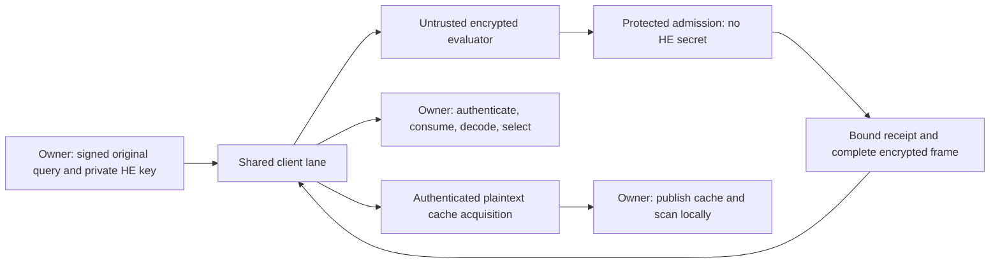

# Build decision and research contribution plan

2026-10-05. This is the current decision plan, based on preserved implementation
`9d1dffa9143d031373bad6df1d44a2cfb35200ef`. It narrows the
[detailed build plan](paper-system-build-plan-after-roles-20261004.md), rather
than reopening the experiment portfolio. The [progress ledger](research-contribution-progress-20261004.json)
controls task status; the [closest-work matrix](closest-work-contract-matrix-20261004.md)
records primary sources and contract differences. The
[review receipt](research-system-decision-review-20261005.json) distinguishes
retained measurements, derived calculations and proposals. No new HE run,
benchmark, author artifact or security approval was added by this review.

## The system and the result worth pursuing

Finish one exact-search service using our homemade BGV arithmetic. The owner
keeps the decryption key and may retain all plaintext. A malicious cloud
stores encrypted data and evaluates requests. A protected role authenticates
the authorized computation and complete result before the owner decrypts.
The output remains every exact Hamming distance, plus top3 ordered by
`(distance, original row ordinal)` with bound UInt64 IDs. Production Paillier,
BFV/BGV/CUDA assets and optional SEAL examples remain available.

The research target is a **specific useful execution of this service**:
which representation is built where, which intermediate claims require
checking, and which authenticated state can survive a query or update.
The paper must identify an execution change, explain its invariant, measure
the costs it displaces, and exhibit both its winning and losing regions.
Homemade arithmetic, a smaller packet, a TEE, or a cost-aware planner alone
does not establish originality.

The default candidate remains the construction/admission boundary. This review
adds a concrete candidate for update-heavy operation: an immutable packed base
with authenticated encrypted row overlays. It is a proposed experiment, not
an implemented system or an accepted novel algorithm. Select **one** creative
extension after the existing comparison identifies its bottleneck. Do not
execute a mixed boundary, row overlay and larger streaming system as three
new exploration queues.

## What the evidence actually says

The retained matched local panel used 32,768 vectors of 512 bits, one key/index
block per variant, five measured queries and excluded warmups:

| Variant | Local median ms | First reply B | One 32-row update s |
| --- | ---: | ---: | ---: |
| BGV CUDA, public-index graph | 117.298 | 204,895 | 7.2788 |
| BFV CUDA, prepared | 892.813 | 409,770 | 0.7243 |
| Paillier lookup CUDA | 2,599.103 | 16,908,071 | 0.0052 |
| Paillier lookup hybrid | 1,418.960 | 16,907,985 | 0.0055 |
| Returning authenticated raw cache | 4.384 | 0 per returning query | 0.0269 |

Those timings have the original swap/setup qualification, unequal unapproved
profiles, and exclude networking and complete protected verification. They
justify the engineering choice of BGV; they are not a measured secure-service
speedup. All 35 searches, 1,146,880 distances and five post-update checks agreed
within that panel. Its BGV update spent 7.1466 s rebuilding resident state.
This motivates an update experiment, but does not establish the bottleneck
of the new owner-canonical graph.

The selected native source graph has separate bounded correctness evidence:
one key, six searches and 114,752 distances. Q76's local prototype, replay,
aggregate, cache and static certificate gates are complete within their stated
scopes. Q77 retains 352 distinct public cases across separate invocations;
the latest invocation ran three public clock/telemetry cases. These are not
352 independent encrypted experiments. The owner run action is still absent;
Q77 has consumed **zero** HE keys, complete-cost blocks or timing observations.

At two groups/32,768 rows, the selected interfaces have 127,057,920 B of full
internal witness, 1,474,560 B of aggregate claim, an earlier 204,895 B client
frame, a 263,206 B descriptor and 2,359,635 B authenticated cache acquisition.
Query-expansion sources account for 125,583,360 B of that full witness. The
roughly 86-fold aggregate reduction is on the internal link. It leaves the
client frame unchanged and the deterministic checker still recomputes all
three aggregate coefficients. Prepared RNS rows alone take 826,277,888 B;
that is not full process RSS.

Retain useful native/RNS/CUDA fusion, prepared transforms, compact replies and
exact metadata/coverage controls. Retain the negative results too:
unstructured/unequal-capacity low-rank controls, charged two-round refinement,
literal answer polynomials, reusable masks, affine/operator-state containment,
and insufficient phase/limb shortcuts are not reopened by renaming them.
The [portfolio review](research-evidence-review-20261003.md) and individual
reports preserve their narrower scopes. The 272 revalidation receipts,
290 normalized observations and 297 historical/fresh pairs are different units.

## Closest work: the comparison we must survive

Credit a compatible composition of the strongest methods. Cross-paper timing
ratios cannot compare different trust, approximation, origin or output laws.

| Primary work | Established ingredient | Required matched control or distinction |
| --- | --- | --- |
| [HERS](https://arxiv.org/abs/2003.12197v3), [SealPIR](https://eprint.iacr.org/2017/1142), [MulPIR](https://www.usenix.org/system/files/sec21-ali.pdf) | Packed encrypted search, expansion and communication/computation tradeoffs. | Same exact graph, once-per-request expansion and delayed maintenance. Our existing algebra is contained. |
| [Argos](https://petsymposium.org/popets/2025/popets-2025-0099.php) | Hardware-backed FHE integrity and verification before decryption. | Equally optimized full protected execution; a local signature does not reproduce its hardware custody. |
| [vFHE](https://arxiv.org/html/2301.07041v2) | Malicious-server analysis and TEE-assisted product delegation with polynomial checking. | Actual aggregate/ring adapter, committed claim, fresh challenges, maintenance and lifetime soundness. Its randomized adapter remains unexecuted here. |
| [PEEV](https://doi.org/10.1109/ACCESS.2024.3424420), [WAHC vFHE](https://cknabs.github.io/assets/pdf/vfhe.pdf) | Program-to-HE-to-verification pipelines. | Complete common-Q, terminal and release adapter; no first verifiable compiler claim. |
| [ILA](https://arxiv.org/html/2509.11559v1) | Functional correctness from valid quantitative models and trusted typed inputs. | Concrete malicious-intermediate admission/native refinement. Grant it the same honest-owner origin premise. |
| [Silph](https://eprint.iacr.org/2023/060), [CirC](https://eprint.iacr.org/2020/1586), [FlowCert](https://www.contrib.andrew.cmu.edu/~bparno/papers/flowcert.pdf) | Conversion-aware assignment, multiple representations and schedule validation. | Same legal plans, retained state, information and objective. An exact generic solver should agree; that closes a superior generic optimizer claim. |
| [Corrected Cascudo](https://eprint.iacr.org/2025/286) | Ring verification including maintenance and range checks. | Apply the corrected relation to exact BGV with all common-integer and noise premises. |
| [BioZKFHE](https://arxiv.org/html/2607.22065v1), [corrected Laminate](https://eprint.iacr.org/2025/2285) | Verified encrypted matching or blind encrypted computation under different release/feedback contracts. | Align trust, field semantics, maintenance and visible verdicts before a numerical comparison. |
| [PPMI v3](https://arxiv.org/html/2506.17336v3), §4/Appendix A | Query decomposition, cached key representations and dynamic vector operations. | Compact uploads, affected-cache refresh and equal reuse freedoms. Exact malicious-server adaptation is open. |
| [PRAG v2](https://arxiv.org/html/2604.26525v2), §§IV–VI | Dynamic encrypted HNSW retrieval under a semi-honest CKKS contract. | Credit dynamic HE indexing; exact HNSW decisions do not certify every global Hamming distance. No imported runtime ratio. |
| [Lin et al., TPDS2021](https://iqua.ece.utoronto.ca/papers/wlin-tpds21.pdf), §§2–4 | Efficient updates for private similarity search with LSH/SSE and a two-server protocol. | Credit dynamic private search. Its semi-honest, noncolluding and candidate-selection premises differ from ours. |
| Allowed owner cache | Returning local search, compact authenticated acquisition, mutable patches and background acquisition. | Mandatory returning, fresh and racing controls. Forcing an HE descriptor or HE index download on plaintext search manufactures an advantage. |

Three new primary papers are archived in five versioned PDF/text pairs,
including PPMI v1/v3 and PRAG v1/v2. The registry now has 128 source records,
preserving all previous 123 records. Official version histories were checked;
the retained text differences do not change the inspected technical passages.
This targeted
reading does not audit every proof, reproduce an author implementation or
clear priority. The most serious new objection is PPMI: a system combining
expansion, cached representations and updates is already prior work. The
prospective distinction must be its exact authenticated execution and a
demonstrated consequence, not that combination's existence.

## Architecture and the immediate executable dependency

Execution update: the [owner trajectory and public assembly return](native-shared-query-owner-runner-20261005.md)
passes 66 public cases, including 24 new cases. It implements actual trajectory
control, an HE-independent cache path, in-flight races and compact update
assembly. Honest tenant provisioning and the complete cohort `run` action
remain absent, so R2 is unfinished and no HE/cohort slots are consumed. The
[progress ledger](research-contribution-progress-20261004.json) names that next
dependency. This update is not another measured result or originality decision.

Keep an owner process for private provisioning, fresh query creation, current
snapshot pins and authorized decoding. Spawn clean producer, protected and
transport workers with public inputs only. Share the shaped client lane across
remote search and cache acquisition; use a separate charged internal lane.
The current ordinary protected-process signer is a local prototype. Connect it
to real attestation only in the deployment package.

The target roles and their admission order are:



The local worker implementation does not yet establish real hardware protection.

Finish the owner coordinator in `benchmarks/complete_cost_owner_lab.py` or an
additive owner-run entry point using the existing modules below. Do not add
another instrumentation-only milestone in place of its run action.

| Subcomponent | Existing building block | Completion condition |
| --- | --- | --- |
| Public source and attempt ledger | `complete_cost_cohort.py` | Persist attempts before expensive work; retain actual generated query bytes and all signed snapshot inputs; no refunds, replacement keys or secret serialization. |
| Independent policy sessions | Owner, role and supervisor modules | Separate preparations/lifetimes for three remote modes and returning/fresh/racing cache. One key pair per tenant is reused within the declared cohort. |
| Genuine racing acquisition | Shared relay and cache client | Separate cache publication handle; first valid actual answer may win while losing work/traffic and cleanup remain paid. Stop and join remote use before the prefetch update. Acquisition failure is a recorded failure. |
| Honest refresh | Existing owner/context/cache APIs | Bind all HE views and cache to one revision; replace the affected 512-feature group and refresh actual native state; cache gets its compact 32-row patch. |
| Timing and resource enforcement | Native call clocks and public telemetry | Measure actual completion, CPU, both link directions, custody and live state; enforce deadlines/artifact/memory failures and retain contamination. |
| Exact execution freeze | Existing registration plus committed addendum | Pin executable sources, dependencies, libraries, event order, warmup/initial states, affinities and resolved budgets before HE/private/timing work. |

Additional public integration tests need a separate bounded registration because
the prior coordinator's 32-case cap is exhausted. That is an experiment-integrity
dependency, not a need for another user approval. Restore/report the supervisor's
captured startup affinity before starting workers on other CPUs; permanent CPU3
affinity otherwise makes those starts invalid. Preserve the cooperative nature
of telemetry guards and record gaps, failures and persistence errors honestly.

## Finite execution sequence and decisions

| Step | Deliverable | Decision and next step |
| --- | --- | --- |
| R2, current | One complete owner runner, meaningful public integration gate and exact pre-HE freeze. | On success execute R3. Fix correctness/measurement failures within recorded attempts; do not replace them with stage models. |
| R3, already reserved | Two keys × three sizes × three process blocks × eight queries: 18 blocks/144 measured queries per implementation; six calibration blocks/48 queries then twelve held-out blocks/96 queries. Warmups and update checks are separate. | Freeze policies after calibration. Return the actual useful frontier or failure; no additional size/radix/backend grid. |
| R4, one creative extension | One selected mechanism, public invariant/bound screen, implementation, strongest adaptation and actual whole-execution ablation under a new finite registration. | Require a useful held-out region and a concrete surviving prior-work distinction; otherwise close the proposed claim and preserve the artifact. |
| Q78, assurance/deployment | Actual attested code/key/channel, trusted currentness, crash/revocation behavior, private leakage/parameters and conditional security argument. | No deployed secure-service claim before these premises are established. |
| Q79, paper/artifact | One precise result, final workload/deployment evaluation, prior counterconstruction, external review, reproducible artifact and paper. | Engineering success is retained even if it does not earn a research main. |

No broad preliminary research gates remain. The three remaining packages are
Q77 evaluation/one extension, Q78 assurance/deployment and Q79 paper. R2 is
unfinished implementation, not completed measurement. The current local
corpus/two-key cohort is a selection study; it cannot establish population
confidence by treating its correlated queries as independent samples.

Use equally weighted paired block results and complete owner-visible
completion-minus-arrival as the primary metric. Separate setup, first answer,
updates, tail delay, work, traffic and peak live state. Actual overlap matters:
do not sum stage medians to fabricate complete latency. Keep every failed,
timed-out and contaminated block. Grant the generic selector the same legal
plans, calibration information and horizon; any retrospective minimum is an
oracle diagnostic. The 20% remote-policy project gate is separate from cache
utility and paper originality.

Historical Q77 caps are unchanged and unconsumed. The current prefetch proposal
is 702 fresh remote queries, 72 protected signer contexts and 31,744 feature
encryptions, with two HE keys. It requires the exact committed addendum before
consumption; this plan does not activate it. Keep the 8 GiB additional-artifact
ceiling, actual source retention, <=1 s telemetry and the granted idle-window
measurement discipline. Existing local BGV/CUDA numbers do not fill these slots.

## A concrete creative experiment: authenticated row overlays

**Trigger:** R3 confirms that paid snapshot refresh or update-to-next-answer
cost prevents a useful region, and a calibration-only prediction says this
design can improve it after its extra query traffic. The earlier 7.1466 s
rebuild is motivation, not satisfaction of that trigger. This experiment would
replace the previously proposed streamed-scale refinement in that circumstance;
it would not add a fourth preliminary queue or amend R3.

Leave the dense feature-major base immutable. For a bounded set of changed
row ordinals, upload fresh encryptions of a row-major overlay and an owner-bound
latest-row map. Answer the base plus the overlay using the **same original
encrypted query**, then overwrite precisely those base distances at the owner
after authorizing the complete composite result. No secret enters the checker,
no reusable query mask is introduced, and no old ciphertext is relabelled as a
fresh encryption. Repeated changes replace the overlay's current row; compact
it into a new base at a frozen, measured threshold.

### Exact coefficient layout to examine

Write `u[j]=1-2*q[j]`, `v[r,j]=1-2*x[r,j]`, and `beta=512`.
The existing original query plaintext is
`A(X)=beta^-1 * sum_j u[j]*X^j` modulo `t=1031`.
For an overlay row define
`B_r(X)=sum_j v[r,j]*X^(511-j)`.

Pack sixteen changed rows in one polynomial:

```text
B(X) = sum_(r=0..15) X^(1024*r) * B_r(X)
[X^(1024*r+511)] A(X)B(X) = beta^-1 * sum_j u[j]v[r,j]  (mod t)
```

Each row's product occupies degrees `1024*r .. 1024*r+1022`. Adjacent
products do not overlap, and the highest degree is 16,382, below `N=16,384`.
Thus plaintext negacyclic wrap does not occur. Multiplying the selected
coefficient by beta modulo t and centering recovers the signed score uniquely
in `[-512,512]`; distance is `(512-score)/2`. This is an elementary encoding
derivation, not a security proof or a new packing identity.

For exactly 32 changed rows this layout proposes two fresh ciphertexts instead
of 512 freshly encrypted feature columns in the direct group-rebuild protocol.
At 120 bits/coefficient, their seeded coefficient bodies are 491,520 B versus
125,829,120 B, excluding framing and metadata. The ratio is **256 in this body
calculation**, not a speedup over the strongest update method. There are two
additional aggregate ciphertext products/relinearizations, with no new query
expansion required by this plaintext relation. Native cost is unmeasured.

Using the current 25-bit terminal codec literally adds 204,800 response-body
bytes for the two overlays: the 32k base response body would grow from 204,800
to 409,600 B. It does not directly reduce client download. Other coefficients
encode auxiliary correlations rather than zero tails; the owner is authorized
to see them, but this needs an explicit new frame/decoder grammar. Do not feed
it through the current base-only tail predicate or claim free compression.

### The invariant, controls and bounded decision

The current snapshot must bind `(base root, ordered IDs, overlay root, latest
row map, key/profile, epoch)`. For every row there is exactly one authoritative
value: its latest overlay row if present, otherwise its base row. The complete
receipt must bind both evaluations to the same original request and frozen
current composite snapshot, before any owner private callback. A query never
authorizes an arbitrary old base independently of that signed recipe.

Prove support/no-wrap, modular score recovery, complete latest-row coverage,
canonical common-Q maintenance and terminal bounds. Fresh row inputs have a
different support/layout from the existing feature columns; a prior successful
decryption or certificate does not admit this graph. Derive its public phase
bounds first and stop if the selected profile fails. A new ring/modulus rescue
would require its own paid justification, not a hidden parameter search.

The strongest control receives compact row uploads and selective prepared-state
refresh, including a PPMI-style cached representation/transposition specialization
where valid. Do not compare only with the old full resident rebuild. If that
adapter changes keys/noise/origin, document and pay it rather than declaring
it impossible or free. The base implementation also receives unchanged-group
reuse. All cache controls get the same compact owner patch and horizon.

Before running, freeze one 32-row update geometry at the admitted profile,
one overlay cap/compaction law and one selected remote policy. A proposed
whole-execution study is two fresh large HE keys × two process blocks × eight
post-update queries, or 32 measured queries per variant, with separately stated
warmups and correctness checks. The actual variants and all expensive budgets
must be registered after the public invariant gate. This is a future proposal,
not 32 newly reserved or consumed Q77 observations.

The mechanism ablation rebuilds/copies the base preparation despite using the
same overlay query path; another matched control immediately compacts into the
best admitted feature representation. Charge actual update/encryption/upload,
query/private/release and cleanup costs. Retain repeated overwrite, omitted
row, swapped ID, stale map, mixed epoch, late substitution, guard overlap and
noncanonical/tail faults. Predict the crossover using calibration; confirm it
on held-out whole traces. A serial diagnostic is
`saved refresh > queries * extra per-query cost + extra overlay preparation`;
overlapping measured traces decide the actual result.

Its possible contribution is a useful **admitted heterogeneous snapshot
execution** and the invariant/crossover that makes it work. Guard-band packing,
log-structured overlays, authenticated maps and dynamic indexing are known.
If an ordinary strong specialization obtains the same result, close a new
algorithm claim. Do not reopen Q59's contained affine-delta claim under a new name.

### If a different bottleneck survives

If construction/admission rather than refresh dominates, select the previously
planned **one mixed common-Q cut** instead. Choose a contiguous expansion or
maintenance segment from measured attribution, bind its ancestors to the
original query and check every downstream source/coordinate. Predict removed
inverse/forward transforms, CRT/digit work and witness bytes together with
new checks/state. Give replay and delegation the same cut and run its actual
ablation. A generic min-cut or a signed unchecked root is not a contribution.

If protected state at a justified larger corpus is the only credible bottleneck,
one streamed snapshot remains an alternative, with registered new scale and
equal streaming/prefix reuse for replay/cache. No larger corpus, second
extension or proof backend is authorized merely by this list. The required
randomized vFHE adapter remains a paper comparison obligation for any broad
delegation advantage, regardless of which deterministic experiment wins.

## Supporting security argument and implementation assurance

Define an ideal functionality for an honest owner's current composite or
ordinary snapshot, exact full distances and ordinal top3, with abort and
explicit public shape/size/update/scheduling leakage. The target is:

`valid owner origin + valid graph + complete admission + current authority`

`=> authorized frame equals canonical evaluation => exact owner output`.

Build four proof layers: graph/native representation refinement; plaintext,
noise and Q-to-P correctness for every accepted source; snapshot/request/frame
binding with at-most-once authorization; and privacy of the authorized/public
feedback transcript. For an overlay add the latest-row selection/coverage
lemma. Twelve existing Lean model lemmas do not prove the C++ implementation.

The reduction must condition on uncompromised attested execution, nonrollback
authority and an explicit private-side-channel model. Then separate augmented
RLWE/evaluation-key assumptions, seeded sampling, signatures/hashes, correctness
and probabilistic admission failure. Derive the actual multi-key/adaptive
lifetime bound; do not simply add unnamed "TEE security" terms. Full public
rejects must be simulatable without the HE secret, and accepted private decoding
must be restricted to the authorized canonical output. IND-CPA alone is not
CCA security, and owner result checks after adversarial decryption are not the
oracle defense.

Implement the final attestation adapter with a code-and-signing-key-bound
authenticated channel, currentness/revocation and actual crash/rollback tests.
Record private sampler/arithmetic assurance and concrete parameter evaluation.
An AWS Nitro design needs those deployment premises; source hashes, ordinary
SQLite and a local Ed25519 signer do not establish them. Supporting assurance
may instantiate known methods. A formal main claim requires a separately
substantive, reviewed result beyond that composition.

## Paper selection and execution handoff

Fill one claim card with the exact execution change, prior technique extended,
necessary invariant, displaced work/bytes/state, held-out winning/losing regions,
actual mechanism ablation and the strongest objection it survives. The final
evaluation needs genuine deployment and additional justified workloads under
separate frozen budgets; the current synthetic selection cohort is insufficient
as the paper's entire evaluation.

Use figures for complete latency/work/bytes/state, update-to-first-answer,
cache acquisition/prefetch, the selected intervention and the assumption map.
Do not present an unimplemented predecessor as a slower system. If cache/replay
or the known composition contains the whole useful result, keep the company
artifact and close the proposed positive headline. A negative paper would need
a generalizable new finding of its own. External cryptography/systems review
must assess originality before committing to a conference claim.

After each component, record actual inputs, commands, failures, scope and
checkpoint in the existing ledger, then return to the next dependency.
**Next action: finish R2's owner cohort runner and exact execution freeze.**
The creative extension follows R3's evidence; another literature-only refresh
or speculative grid does not satisfy that implementation dependency.
