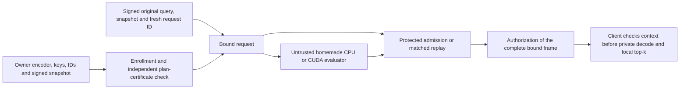

# Execution plan for an original, complete encrypted-search system

2026-10-04. Evidence baseline: `3ecef8eeb86bdc1e2c33ce568557debdea8949e9`.
This is the current execution plan. Read the
[contract-level closest comparison](closest-work-contract-matrix-20261004.md),
[Q74/Q75 return](shared-query-gates-20261004.md),
[claim cards](system-contribution-claim-cards-20261004.json), and
[progress ledger](research-contribution-progress-20261004.json).
The [planning integrity receipt](system-contribution-plan-validation-20261004.json)
preserves the reviewed planning baseline. The [Q76.1 core return](native-shared-query-core-20261004.md)
and [Q76.2 factory return](native-shared-query-auth-20261004.md)
record subsequent bounded implementation gates; the ledger controls the next step.
The [earlier derivation and plan](research-contribution-plan-20261004.md)
remains intact as a technical reference. Registrations and negative results
are preserved; this document changes priorities and clarifies acceptance.
The [paper-facing reassessment receipt](paper-contribution-review-20261004.json)
uses implementation baseline `50840499716d353c76a0052417aaea546d2b95cd`.
It rechecks existing sources and sharpens the comparisons below; it contains
no new HE experiment, timing or originality approval.

**Build one complete homemade BGV system to answer a specific research
question: when does jointly compiling evaluation, public admission, and
retained state improve the complete cost of exact encrypted search?**
The intended contribution is a certified compiler/runtime and a demonstrated
operating frontier, with known cryptography. No original main result has yet
been established. A compiler that merely renames known transformations, or a
fast evaluator with an expensive verifier, does not meet the paper gate.

There are **zero remaining preliminary gates in the selected Q74/Q75 plan**.
There are four system packages: Q76 implementation/control, Q77 evaluation,
Q78 deployment/security, and Q79 final originality/paper decision. Optional
ideas below are conditional branches inside these packages, not a new
unbounded experiment queue. Completing a prototype is distinct from obtaining
a publishable result.

## 1. What the evidence actually says

| Evidence | Result we can use | Consequence for the system |
| --- | --- | --- |
| Homemade BFV/BGV CPU, native, RNS, CUDA and compact IO | Working company assets, including significant arithmetic improvements. | Build on homemade BGV; retain Paillier, BFV, SEAL sanity controls and all earlier optimizations. |
| Retained 32,768 x 512 matched local panel | Median BGV 117.298 ms, BFV 892.813 ms, Paillier lookup CUDA 2,599.103 ms, lookup hybrid 1,418.960 ms; permitted retained cache 4.384 ms. | These experimental profiles exclude complete protected admission/network and retain setup-swap qualifications. They select an HE foundation, not a secure-service speedup. |
| Q74 small encrypted gate | 64 complete relations, 320 source mutations and 192 output-component mutations; full-ring, actual-limb, frame, score and coverage checks pass. | The packed-query/feature-major graph is a sound reference within the recorded small scope. Native/source-scale/controller assurance is unfinished. |
| Q74 source-profile public bounds | Owner canonical Q120 passes. Public-key-index canonical Q120 and both derived Q120 modes fail. One Q180 rescue passes its algebra screens. | Start owner canonical Q120. Do not silently substitute an input law, approve parameters from successful decryptions, or use the Q120 parser for three primes. |
| Q75 finite resource screen | 60 cards, nine exact finite frontiers, zero compiler-cap failures; known composition has identical algebra/resources. | New expansion/gadget/asymptotic claims are closed. Models are sufficient schedules, not measured time, peaks or lower bounds. |
| Q180 derived versus owner canonical Q120, one full group | Witness body 90.703125 versus 120.468750 MiB; modeled pointwise work about 2.81x, keys 2.25x, query/index about 1.5x. | Preserve the tradeoff, but select no larger-Q variant from bytes alone. Client response bodies remain 102,400 bytes/group. |
| Current Q76 work | Q76.1 passes 16 retained native cases/304 faults/58 normal-UBSan tests. Q76.2 passes authenticated seeded flow on the same 16 cases/176 faults/68 tests. Q76.3a adds local durable lifecycle: 71 unit cases and a retained 16-case/112-request cohort pass. No fresh HE keys, private HE work or timing. | Next Q76.3b supplies bounded independent GMP/source-scale correctness. Private release, real attestation and the completed service remain unfinished. |

The final Q74/Q75 regression invocation passed 157 cases; that is not 157
independent encrypted experiments. Neither those tests nor the large earlier
measurement panel establishes equal-security parameters. Current model cards
and the qualified raw measurements remain separate tables.

The earlier public-index BGV panel uses a different circuit with its own
recorded guard. Q74's public-index failure concerns the new shared-query
graph, whose expanded-query noise is multiplied by the index noise.

The evidence also points to a useful reversal: reducing client replies can
move the bottleneck to **server-to-verifier** traffic. In the selected full-group
model the latter is approximately 120 MiB while the client coefficient reply
is 100 KiB. They are different links and cannot be added to one ambiguous
"response reduction" number.

### Research decision from the accumulated experiments

The selected direction is **exact BGV search with certified verification
placement and explicitly managed retained state**. It builds on the useful
homemade CPU/RNS/CUDA assets. Its publication case must come from a specific
result about complete execution, rather than another isolated arithmetic ratio.

| Research question | Distinctive result to attempt | Required discriminator | Decision if it fails |
| --- | --- | --- | --- |
| C1: Can the same compiler certify arithmetic, exact decoding and authorized release across representation boundaries? | A small specification/checker connects owner-origin coefficients, common-Q digits, both actual limbs, conservative phase bounds, complete terminal frame and state transitions. Optimizer output is independently checked. | Formal obligations below; native and lifecycle counterexamples; comparison against PEEV/CirC and corrected maintenance-proof methods. | Keep the checker as company assurance. A collection of signatures and NTT checks alone is insufficient as a new research result. |
| C2: Can choosing verification placement change the best complete execution plan? | A reproducible rule selects evaluation, checking/replay and preparation lifetimes under declared link/memory/update budgets, and explains the measured crossover. | Equally optimized fixed choices, a conversion-aware generic planner with duplicated representations, and the evaluator-only ablation on held-out blocks. | Do not claim a new planner from a renamed objective or ordinary Pareto search. Report the measured frontier or stop the main systems claim. |
| C3: Does the resulting system earn outsourcing's cost in a real owner deployment? | A useful region survives setup, device acquisition, updates, admission and release, with precise trust and leakage. | Prepared protected replay, delegated-product checking, allowed cache including acquisition/prefetch, and real attested deployment. | If cache/replay dominates all justified regimes, retain the implementation and consider a scoped negative result only after its own originality review. |

These are three obligations for one system, not three established original
papers. Prior work contains the component transformations. The possible new
result is their contract-specific, independently assured implementation and
an experimentally defensible design finding. External review must determine
whether that remaining distinction is substantial enough.

The promising scientific tension is concrete: smaller Internet replies may
require large admission witnesses; avoiding those witnesses may require more
protected recomputation or retained state. Fresh-device and update costs can
reverse a steady-state winner again. The paper should explain and exploit
those reversals if they occur, including regimes where outsourcing loses.

## 2. Exact contract and the claim worth pursuing

One honest owner controls the plaintext binary index, encoding, HE keys and
queries. The owner is allowed to retain any plaintext. The untrusted server
may alter computation, reorder or omit records, substitute inputs, replay old
responses, and observe public admission outcomes. It may deny service.

The primary result is every exact Hamming distance, with complete ordered
record IDs and stable local top-k. Approximate retrieval, encrypted top-k-only
selection, content fetching and multi-owner/private-server-data protocols are
different contracts. Their implementations are preserved but are not quietly
substituted into this comparison.

The protected verifier has public ciphertext inputs and authentication keys;
it has **no HE decryption secret**. Owner origin and public bounds are necessary
assumptions. An owner signature binds bytes; it does not prove valid binary
encoding, sampler support or an RLWE parameter estimate. The trusted owner
encoder supplies those origin facts in the first implementation. A malicious
owner or arbitrary third-party encrypted index requires a separate validity
protocol.

The primary claim to attempt is:

> A compiler for exact encrypted search can select and certify a complete
> evaluation/admission plan, including representation boundaries and state
> lifetimes, that gives a useful paid resource advantage over the best
> compatible fixed-policy protected execution.

This is a **systems hypothesis**, not a new gadget, DP algorithm, TEE primitive
or asymptotic source-count result. Its distinctive artifact would include:

1. A small, independently checkable certificate connecting original owner
   inputs, common-Q integers, both actual prime limbs, all output coordinates,
   noise/terminal conditions and the authorized response frame.
2. An executable choice among full replay, complete public relation checking,
   and protected-prefix/product/suffix placement, with the same compatible
   optimizations and charged conversions for every choice.
3. A real operating-region result: latency, trusted state or update/acquisition
   cost improves under explicitly fixed budgets, and the failure/tie regions
   are explained and reproduced.

Ablating to an evaluator-only cost objective must change a choice and harm the
complete cost on held-out instances. This alone does not establish priority:
if the strongest applicable prior compiler reproduces the same design result,
the algorithmic claim is contained. A systems contribution then needs an
independently defensible artifact, finding and closest-system distinction.

## 3. Architecture and certificate



The first selected graph expands one pre-normalized signed query once,
contracts it with the owner's encrypted feature-major index, and accumulates
three tensor components before one relinearization per record group. It uses
ordinary negacyclic products; no full scalar-SIMD batching premise is assumed.

The source profile remains N=16,384, d=D=512, t=1031, eta=21, actual ordered
primes `1152921504606748673,1152921504606683137`, Q their product, P=33,548,413,
canonical radix30 and owner-origin index. These are experimental, unapproved
cryptographic parameters. Change them only through an explicit paid profile
revision and security review.

Each certificate must include these independently checked obligations:

| Obligation | Implementation rule | Failure that must be rejected |
| --- | --- | --- |
| Input and plan authority | Copy/authenticate profile, actual primes, index/key schedule, IDs, count, epoch and code/plan digest; compile the graph internally. | Correct digest accompanying a weakened peer-supplied graph; foreign key/index; changed source ordering. |
| Common integer | Parse canonical whole-Q coefficients before any transform; derive the same radix digits for both actual limbs. | Independent per-prime digit membership or a noncanonical late coefficient. |
| Complete arithmetic | Check every source recomposition and both tensor cross terms, using every physical coordinate in both prime NTTs. | A scalar evaluation, sampled coefficient, unconstrained expanded query or unchecked branch. |
| Correct plaintext semantics | Prove signed feature/query encoding, zero padding, coefficient coverage and the public phase induction for every admitted source. | Honest-run noise samples being used to accept arbitrary witnesses. |
| Terminal and response | Bind both full terminal-Q components and independently reconstruct all rounded P coefficients and headers. | A correct prefix/top-three answer with a changed unused tail, wrong IDs/count or different compact frame. |
| Release and lifetime | Bind original query, fresh request identity, snapshot and complete frame; authorize before private work. | Stale snapshot, cross-request frame, replay, duplicate callback or hidden retry after a failure. |

The certificate is compilation evidence, not a succinct proof sent to the
client and not hardware attestation. Its checker must be separate from the
optimizer and producer. A native implementation is not correct merely because
two code paths share the same bug.

Represent these obligations as explicit effects on each graph value:
origin/key namespace, integer representation and range, ciphertext key basis,
phase bound, covered record coordinates, authority/snapshot and state lifetime.
Every rewrite must preserve the effects or supply a checked transition. In
particular, an RNS value does not automatically carry common-integer evidence,
and a valid modular relation does not automatically carry exact-decoding or
fresh-release evidence. This is a proposed specification, not an implemented
new type system or a claim that effect typing is novel.

Current owner-seeded query/index wire formats should be retained. The public
native interface consumes expanded two-component buffers: preparing them is a
paid step, not a reason to double query uploads or label expanded resident
state as the compact wire size. Every byte category is measured at its actual
interface.

The online client needs authenticated compact snapshot/query/ID context and
its private context, rather than the complete HE enrollment. Q76.5 must specify
how the owner provisions that context or signs a compact descriptor, and Q78
must bind the release receipt to it. Account for this acquisition explicitly;
the current local factory is not yet that client-release protocol.

## 4. Q76: finish one authoritative native prototype

The existing [registration](native-shared-query-registration-20261004.json)
caps source-scale correctness at one fresh key context and six searches.
No timing panel or CUDA port precedes this gate.

| Milestone | Concrete next work | Completion evidence |
| --- | --- | --- |
| Q76.1: public native core — complete bounded gate | Reviewed C++ core, bounded ctypes adapter and frozen isolated build/source/dependencies. Reused the 16 retained owner-canonical N16/N32 cases. | Exact GMP tapes/frames, both whole-limb schoolbook vectors, 208 source/96 output faults and 58 boundary cases on normal/UBSan builds. No source-scale or service approval. |
| Q76.2: enrollment/request authority — complete bounded gate | Owner-authenticated immutable factory, original seeded query, strict complete packet grammar and internal native graph. | Sixteen retained flows, 176 cohort faults and 68 unit cases pass; signed byte origin is trusted, not a plaintext/noise proof. No lifecycle or private authority. |
| Q76.3a: local lifecycle — complete bounded gate | Trusted non-rollback SQLite controller consumes signed original requests before preparation and callback claims before dispatch. | 71 lifecycle unit cases and 16 retained cases/112 protocol requests pass; 80 bad replies rejected, 32 public hooks, replay/restart/process-exit gates. Final combined 197 includes 126 existing native/auth cases; overlapping first runs not added. No remote release or source-scale assurance. |
| Q76.3b: source scale | Supply the bounded independent GMP producer, then run the registered N16k d512 counts 8,224/16,384/32,768 with two queries. | At most six large searches, exact independent GMP source/output/frame equality, every distance/tail/stable tie checked privately only after public acceptance. No secret key serialized. |
| Q76.4: matched controls | Build prepared replay and checked-product/trusted-prefix/suffix in the same native backend, plus the permitted authenticated cache. Grant layout, expansion, lazy relinearization, Karatsuba, fusion, preparation and streaming equally. | Same source/terminal/snapshot contract and full correctness gates. Count protected work, duplicate work and transfers in both directions, not just the control's return packet. |
| Q76.5: certificate and handoff | Validate the high-level certificate independently, publish owned/resident/scratch accounting and source/codec commands, and audit the boundary. | No free input or approval-by-oracle path; full test/mutation/lifecycle report, honest limitations, ledger return selecting or stopping Q77. |

The [independent GMP preflight](native-shared-query-gmp-preflight-20261004.md)
now passes 59 producer tests and two public fixture tests, with no fresh HE key.
**Next executable task is Q76.3b's registered source-scale cohort.** Source belongs in
`experiments/bfv_search_lab/_shared_query/`; Python adapter/tests beside the
other research implementations; reproducible runners in `benchmarks/`.
Keep isolated libraries and outer evidence. Migrate a reviewed selected
interface into `src/cuhepy/` only later. Main/staging and delivered libraries
remain preservation baselines.

Local lifecycle semantics are **at-most-once authorization/callback**, with
possible lost delivery after a crash. A failed attempt consumes its request
identity before admission. This is not an exactly-once delivery claim.
SQLite durability is a prototype control under trusted non-rollback storage;
it does not resist an adversarial host restoring a snapshot. Q78 must supply
real freshness/revocation and protected-release assumptions, including
owner-side request/snapshot binding. Actual attestation remains unimplemented
for this selected service.

Each remaining Q76 milestone has a bounded handoff:

1. **Lifecycle — bounded local gate complete:** the
   [state model](native-shared-query-lifecycle-model-20261004.md),
   [registration](native-shared-query-lifecycle-registration-20261004.json) and
   [return](native-shared-query-lifecycle-20261004.md) preserve the executed scope.
   Use existing
   retained public cases; atomically consume the owner-bound request before
   admission, recheck the current snapshot before authorization, and consume
   failed attempts. Test independent processes as well as threads, crashes,
   restart, fork, epoch replacement and callback failure. Persist UInt64 epochs
   without truncation to SQLite's signed integer range. No HE private callback
   is needed to test this controller.
2. **Source scale:** provide a bounded independent GMP producer before the
   one new key is generated. The existing small reference rejects N>64; raising
   that guard alone does not constitute independent large correctness. Freeze
   source/build/dependencies and execute only the registered six searches.
3. **Controls:** implement the same native prepared replay and protected
   prefix/product/suffix contract; write the randomized-delegation comparison
   card below before choosing its assurance scope. Credit cached and streamed
   inputs, shared expansion and paired Karatsuba to every compatible control.
4. **Certificate:** separately validate graph/effect transitions and high-level
   resources, document the native assurance boundary, and return a pass/stop
   receipt to the ledger. Q77 becomes eligible only after this handoff.

Do not change the selected key/search budgets to obtain a more attractive
result. A failed source gate returns here for a documented correction before
another cohort is authorized by a revised registration.

## 5. Q77: decisive complete-cost evaluation

Freeze methods, actual deployment budgets and the primary success metric
before measurement. Use the existing three sizes and one selected profile,
two independent key contexts, and three fresh process blocks **per key and
size**. Each block has one excluded warmup, eight measured queries and one
separate post-32-row-update correctness check per distinct implementation.
Thus there are 18 matched blocks and 144 measured queries per implementation;
these are dependent within a key/corpus and are not 144 independent setups.
Identical candidate/known-composition code is an alias, not another experiment.

Primary protected-contract controls are complete deterministic admission,
equally prepared replay and checked-product/trusted-suffix. Also report the
allowed retained and newly acquired cache. A protected plaintext-search
control is relevant when the owner accepts secret/plaintext custody inside
the TEE; label that extra trust separately. Paillier/BFV and bare BGV CUDA
remain engineering context, with their actual profiles and assurance scope.

**Resolve the strongest randomized control before a broad performance claim.**
[vFHE Appendix D](https://arxiv.org/html/2301.07041v2#A4) already checks delegated
tensor products with private polynomial challenges. Our deterministic
checked-product control does not reproduce its statistical optimization.
Within Q76.4, write one adaptation card for the exact aggregate tensor that
our lazy-relinearization graph needs. Bind all operands/results first; use
fresh hidden verifier challenges, every actual limb/full ring, protected
maintenance/terminal processing and the same lifecycle. Prove the lifetime
soundness budget before implementing or measuring that control. This does not
reopen failed private-adjoint reuse proposals.

For orientation only, if a committed erroneous aggregate has a nonzero
degree-at-most-two challenge polynomial in an actual prime field, one fresh
round has error at most `2/p`. With independent fresh rounds and at most B
adaptive attempts, the prospective bound is `B*(2/min(p0,p1))^r`.
At B<=2^32 and r=3, the selected approximately 60-bit primes give an error
bound below 2^-128 **under those obligations**. All rounds, randomness,
maintenance, witness/commitment handling and retained state must be paid.
This is a proposed comparator argument, not a completed protocol reduction
or an approved HE security level. Do not multiply limb failure probabilities
for an error supported in only one limb. Do not compare a roughly 60-bit
single-round control as if it had the stronger lifetime target.
The attempt budget must cover the relevant key lifetime across verifier
instances. Enforce it through the actual authority or state it as an explicit
deployment assumption; a rollbackable per-process counter is insufficient.

If a correct applicable randomized adapter is unfinished, explicitly narrow
the result to the implemented deterministic class; do not declare the prior
approach defeated. Same-backend adaptation is distinct from reproducing an
author artifact, which is still a separate stated scope.

Q77 initially measures native prototype roles under the declared local
storage/authority assumptions. It must label that placement as a prototype,
not measured enclave or secure remote-service latency. Q78's real protected
deployment must rerun the relevant frozen comparison before a deployed
performance claim. Attestation and transport overhead cannot be inferred from
an ordinary-process microbenchmark.

For each method measure the full elapsed path and its dependency graph:
owner preparation, encryption, expansion, evaluation, source extraction,
serialization, transport, parsing, checking/replay, terminal, authorization,
client checks/decode/selection. Do not sum medians of overlapped stages.
Separate startup/setup, tenant reuse, per-device acquisition, all network
links, peak CPU/GPU/trusted memory, retained state, 32-row updates and actual
invalidation. Distinguish structural word/transform counts from latency.

Use a declared idle window, paired/alternating order and recorded activity,
clocks, thermal state, swap and synchronization. Preserve slow/contaminated
runs with their preregistered qualification. Never delete observations to
improve a ratio. The old swap-qualified panel is retained, not promoted to a
clean secure-service baseline by this review.

Separate lifetimes explicitly:

```text
amortized cost = tenant setup / tenant queries
              + device acquisition / device queries
              + update frequency * paid update
              + complete query critical-path cost
```

For actual overlap, use the measured scheduling DAG rather than this
sequential illustration. Derive device lifetimes 1/8/128 from the same paid
stages. A returning device's allowed plaintext cache pays no invented download.
A new device may acquire an owner-authenticated compact encrypted vector
backup; it must not be forced to download the HE index.

Also give the permitted cache a **background acquisition policy**: it may
answer an initial query remotely while acquiring the compact backup, then use
local search once ready. Charge actual overlap, duplicated work and update
invalidation. Grant the generic control the same declared horizon/budget
knowledge as our selector; our candidate cannot win by knowing future query
counts that its competitor is denied. This is a stronger ordinary control,
not a new prefetch contribution. Returning devices keep their zero-download
baseline. Cache and private-context custody inside a TEE remain distinct
trust choices.

Transfer-only accounting on the **old** 32k public-index measurements puts one
2,359,388-byte cache acquisition at about 5.23 exchanges of 450,761 bytes.
That is an illustration, not a new selected-profile break-even result: it
excludes setup, private-key delivery, checking, CPU work and actual transport.
It motivates measuring cold-device and returning-device regimes fairly.

Before the main cohort, freeze actual prototype memory/link/update budgets and
the project's 20% amortized complete-cost improvement threshold against the
best compatible remote control. Report cache wins, reversals and ties. The
threshold is a project decision, not a conference acceptance criterion.

Required ablations isolate evaluator-only selection, verified-cost selection,
the known combined versus old layout, canonical admission versus replay,
compatible fusion/streaming, and each expensive representation boundary.
Held-out queries and fresh process blocks must reproduce the selected rule.
An unknown prior artifact cost is not a defeated competitor. Public-proof
systems with different trust/leakage contracts belong in separate comparable
scope rows, not misleading cross-paper speed ratios.

## 6. Creative extensions, with finite triggers

| Direction | What would make it interesting | Trigger and bounded first action | Stop rule |
| --- | --- | --- | --- |
| Mixed verification placement | A certified split avoids more trusted canonicalization than it adds in witness/transfer/state costs; the optimizer-only and complete-cost choices differ. | Q77 identifies normalization or the witness link as decisive. Add at most one mixed prefix/suffix placement to the same backend and grammar, using existing keys/fixtures. | Generic specialized replay/checking gets the identical paid frontier, or no useful operating region survives. This is not a new min-cut/DP claim. |
| Noise/state/communication selection | An all-witness-safe representation is selected for a genuine link/memory constraint rather than its small tape alone. | Only a measured source-witness bottleneck justifies reopening retained Q180 derived, with its larger keys/moduli/state and separate assurance charged. | Added producer/verification/setup costs remove the advantage. No new radix or ring-size grid. |
| GPU execution of the complete public relation | Offloading the actual admission bottleneck may make the protected path competitive while keeping complete common-integer and terminal checks. | CPU-native gate passes and Q77 identifies a substantial parallel public-check bottleneck. Port that bounded kernel; charge both transfer directions and the protected checker. | A fast GPU checker is accepted as its own untrusted evidence, or complete cost fails to improve. GPU attestation is a separately implemented/reviewed path. |
| Smaller trusted state through streaming | A compilation certificate remains valid with less trusted memory at an acceptable complete cost. | Native measured state exceeds a declared budget. Compare one existing cached and one streamed schedule with the same replay choices. | Saving modeled arrays only hides preparation, wire buffers or scratch, or controls obtain the same advantage with no distinct system result. |
| Proof backend for the same public relation | Removing a trusted verifier without losing source/common-Q/noise/frame binding would be a meaningful later system extension. | Main native contract stabilizes; an actual ring-proof adapter or corrected blind-proof contract passes the comparison gate. Start with one small complete relation, not a free microbenchmark. | Missing range/oracle commitment/input/release binding, unmatched feedback assumptions, or no paid advantage. Do not call the TEE tape a cryptographic proof. |

Ordinary private randomized adjoints/Freivalds/Slalom are controls, not a new
contribution. A randomized implementation remains conditional on a proved
adaptive soundness/challenge-lifetime budget and charged preprocessing; it
does not enter Q76 by default. Earlier E101/E110/Q57/H1/Q59/H2 containment,
failed mask/reuse laws and Fourier/root/selection screens remain closed unless
a precise changed premise supplies a new bounded question.

## 7. Q78: proof and actual security closure

Start the semantic/certificate and public-bound proofs during Q76. Develop
the threat/state model alongside Q77, then close the argument for the actual
selected deployment in Q78. Do not wait for a promising timing result to
check whether the design's assumptions are valid.

Prove in layers, keeping assumptions separate from tests:

| Proof obligation | Planned argument | What cannot stand in for it |
| --- | --- | --- |
| Graph semantics | Induct through signed query expansion, feature contraction and delayed relinearization; prove all coefficients, padding, IDs and stable score decoding. | Top-three agreement alone. |
| Compiler/admission correctness | Exact common-Q recomposition and actual-prime NTT invertibility imply the intended full-ring relations. Canonical sources determine the canonical graph; relaxed variants require their own every-witness bounds. | Sampled/scalar residuals or a supplied graph with the correct hash. |
| No-wrap and terminal correctness | Derive phases from actual origin/sampler supports, then prove Q and Q-to-P conditions for every accepted input/witness, including all unused coordinates. | Empirical noise, ideal independent errors, or syntax equality without a noise proof. |
| Stateful authorization | Model signed original request, snapshot, epoch, response hash, client acceptance, crash/race/replay and the actual freshness authority. | A PID check, mutex or rollbackable local journal. |
| Confidentiality composition | Couple authorized private outputs to ideal exact search; simulate public admission from public ciphertext data. Then reduce to the correctly stated augmented-HE/key, authentication and protected-execution assumptions. | Claiming plain IND-CPA implies raw BGV CCA security. |
| Implementation/deployment | Review actual samplers/seed expansion, concrete parameters, constant-time private operations, attestation/channel policy, private error feedback and measured release code. | Successful decryptions, code hashes, fake attestations or tests alone. |

A prospective game-hopping bound separates augmented-HE advantage,
signature/hash failure, origin failure, admission soundness, correctness
failure, freshness failure, TEE failure and permitted/private leakage.
It is an **unproved agenda**, not a finished reduction with numerical security.
For the exact deterministic relation, modeled algebraic checking has no
statistical equality error; implementation bugs and the other assumptions
do not disappear. Related-secret evaluation keys require the appropriate
explicit HE/KDM/circular assumptions or a reviewed alternative construction.

The proof deliverables are concrete and can proceed alongside implementation:

1. **Admission lemma:** canonical bounded sources and complete zero residuals
   in both actual prime NTTs imply every relation in the internally compiled
   whole-Q graph. State prime/NTT invertibility and source-recomposition
   premises; cover every physical coordinate, not just decoded scores.
2. **Exact-output theorem:** the graph, honest owner encoding/sampler support
   and public phase induction imply the complete Q-to-P frame decrypts to
   every exact distance, with zero tails and the declared stable ID/tie rule.
   This theorem concerns the selected origin/profile, not arbitrary ciphertexts.
3. **Authorization invariant:** model reserve, reject, authorize, callback and
   snapshot replacement; prove at-most-once release and snapshot/request/frame
   binding under durable non-rollback storage, with crash-lost delivery allowed.
4. **Conditional confidentiality theorem:** simulate observable admission from
   public authenticated ciphertext data, and couple every authorized private
   output to ideal exact search. State evaluation-key assumptions, permitted
   application leakage and the actual trusted authorization boundary separately.

These are planned instantiations of established verification/composition ideas.
Neither the lemma list nor a simulator sketch establishes a novel theorem.
For a CSF-oriented result, mechanized semantics/state and a reviewed composition
argument should be central; for a systems-oriented result, they support the
measured design finding. Choose that framing after the evidence rather than
inventing a new primitive to fit a venue.

The allowed leakage must list dimensions/counts, lengths, request/update
timing and public admission outcomes. Private decode errors or result-dependent
client behavior must not become an unmodeled server oracle. Keeping the HE
secret out of the TEE reduces secret custody; it does not prove confidentiality
against a compromised verifier that authorizes malicious ciphertexts.

For the first 32-row update, re-encrypt affected owner feature groups and
re-certify the new snapshot under the original fresh-origin law. Charge the
refresh and invalidated preparation. An encrypted delta changes phase/noise
supports after repeated updates; use it only with a revised certificate and
explicit lifetime/refresh bound. A faster affine update alone does not reopen
the earlier contained update claim.

Mechanize the certificate/semantic and state-machine core if tractable; use
existing formal-methods ideas and do not claim the first verified HE compiler
or accelerator. Native NTT/CRT/packing code needs a clearly stated assurance
boundary. An AWS/NVIDIA deployment is a separate tested artifact, with real
attestation/freshness and the same complete cost measurements.

## 8. Q79: paper selection, not an automatic publication promise

A main system paper needs all of the following:

1. A precise result left after the strongest compatible known constructions
   and compiler controls are specialized, with prior-separated claim cards.
2. A complete artifact and independently checked invariant from owner inputs
   to authorized private output, including updates and stated trust/leakage.
3. A useful complete-cost region and held-out ablations explaining why it
   exists, alongside cache/control wins and limits.
4. Correct profile/security scope, reproducible source/build/data receipts
   and external cryptographic/systems review.

If only a faster implementation of known methods remains, keep it for the
company and present it honestly as engineering/supporting evidence. If a
rigorous negative finding survives, consider a scoped measurement/security
paper with its own originality review. Do not disguise either as a new
cryptographic primitive or keep expanding experiments to avoid a decision.

The paper outline follows the result: exact contract and motivation; closest
systems and threat models; compilation/certificate and design rule; native/CUDA
runtime; conditional proofs; paid evaluation/ablations; limits and artifact.
CSF/FHE.org or another venue is chosen after this evidence, not used to invent
a claim or promise acceptance.

## 9. Execution discipline and handoff

Complete or stop one milestone, record exact units/source/build/registration,
write limitations and return to the ledger. Preserve failed attempts, negative
controls and changed registrations. Do not add overlapping test counts or
silently relabel models as measurements. Freeze a revised registration before
new keys, timing cohorts or protocol changes.

Q76.1's isolated build/retained-fixture recipe is preserved in its receipt.
Q76.3a's local state-machine registration and retained lifecycle gate are complete.
Q76.3b's bounded independent GMP preflight passes; the registered six searches follow.
Use `.venv/bin/python -m pytest` and lint new experimental files with
`ruff --no-force-exclude`. The public-native/lifecycle gates precede new large keys.
The registry retains primary PDFs/text/version/hash/scope outside Git; no
author artifact is executed merely to download or review it.

Keep the original plan/unvalidated-draft checkpoint separate from successful gates.
Preserve the 54 production source files, 12 delivered libraries, main/staging
refs and earlier evidence archives. Approval of an original main, secure
parameters or production deployment is never inferred from a checkpoint.

The Q76.2 authenticated factory is now preserved at commit
`50840499716d353c76a0052417aaea546d2b95cd` and tag
`checkpoint/native-shared-query-auth-2026-10-04`, with a verified incremental
bundle and all 59 evidence/66 company archive members checked. The core gate
has its preceding independent checkpoint. This reassessment changes planning
and comparison obligations only. The later Q76.3a execution is separately
recorded in its [lifecycle return](native-shared-query-lifecycle-return-20261004.json).
Next is Q76.3b independent GMP/source scale; Q76 as a whole is still incomplete.
