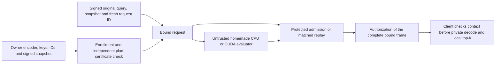

# Execution plan for an original, complete encrypted-search system

2026-10-04. Evidence baseline: `3ecef8eeb86bdc1e2c33ce568557debdea8949e9`.
This is the current execution plan. Read the
[contract-level closest comparison](closest-work-contract-matrix-20261004.md),
[Q74/Q75 return](shared-query-gates-20261004.md),
[claim cards](system-contribution-claim-cards-20261004.json), and
[progress ledger](research-contribution-progress-20261004.json).
The [planning integrity receipt](system-contribution-plan-validation-20261004.json)
preserves the reviewed planning baseline. The [Q76.1 core return](native-shared-query-core-20261004.md)
and [Q76.2 factory return](native-shared-query-auth-20261004.md)
record subsequent bounded implementation gates; the ledger controls the next step.
The [short system roadmap](paper-system-roadmap-20261004.md) gives the current
verified checkpoint, concrete build components, three remaining packages and
conditional creative branches. The [latest plan refresh](paper-system-plan-review-20261004.json)
adds adjacent search controls and rechecks retained results without new timing.
The [earlier derivation and plan](research-contribution-plan-20261004.md)
remains intact as a technical reference. Registrations and negative results
are preserved; this document changes priorities and clarifies acceptance.
The [paper-facing reassessment receipt](paper-contribution-review-20261004.json)
uses implementation baseline `50840499716d353c76a0052417aaea546d2b95cd`.
It rechecks existing sources and sharpens the comparisons below; it contains
no new HE experiment, timing or originality approval.
The [source-scale reassessment](paper-system-reassessment-20261004.json) uses
implementation checkpoint `9ccf11a5dda656b68a1664301093c891c49e0743`.
It incorporates the completed six-search correctness gate, three additional
primary references and an explicit research decision sequence. It changes
the living plan only; earlier registrations, readings and results are retained.
The [matched prepared replay return](native-shared-query-replay-20261004.md)
subsequently completes Q76.4a using retained public data: 16 small plus six large
complete frames, zero new HE work, 309 selected tests including 51 new cases.
This is a known-method control, with no new timing or originality approval.
The [exact aggregate return](native-shared-query-aggregate-20261004.md)
subsequently completes Q76.4b: 22 retained cases, 394,944 aggregate coefficient
comparisons, 5,568 small coefficient/isolated-NTT faults rejected and 360 selected tests
including 51 new cases. No fresh HE, private operation, timing or randomized
protocol is added. At that point the next task was the permitted authenticated
cache control; the later completed cache/certificate handoffs are linked below.

The later [publication design and finite build decision](publication-system-design-20261004.md)
uses preserved checkpoint `155d69f180f6e11a9a87734fdb6249699e9f0549`.
It adds ILA, Argos and FlowCert to the closest-work counterconstruction, moves
an early novelty discriminator into Q76.5, and specifies the paper/artifact and
conditional query-only protected variant. The [review receipt](publication-system-design-review-20261004.json)
separates this planning work from the preceding aggregate gate. No new timing,
HE experiment, formal proof or positive originality decision follows from it.
The later [strongest reference construction and paper decision](paper-contribution-discriminator-20261004.md)
uses planning checkpoint `8bfe630dbe49b064abbd601784fb4689ddde634f`. It
specifies the prior composition and theorem interfaces, independently rechecks
saved counts/medians and closes the exact aggregate witness-size rationale for
an arithmetic speedup over matched replay. This is a planning return with no
new timing, runtime build, HE experiment or positive originality decision.
That reanalysis also resolves an output-contract ambiguity: source-scale HE
uses `(distance, original row ordinal)` and returns the corresponding ordered
ID; the older cache helper sorts by numeric ID. SB01 IDs equaled positions, so
its results are unaffected. The next cache/certificate gates must use the
source rule and test reversed/nonmonotonic IDs through updates. Old APIs and
historical contracts remain intact; see the decision guide's diagnostic.

**Build one complete homemade BGV system to answer a specific research
question: when does jointly compiling evaluation, public admission, and
retained state improve the complete cost of exact encrypted search?**
The intended contribution is a certified compiler/runtime and a demonstrated
operating frontier, with known cryptography. No original main result has yet
been established. ILA already supplies functional correctness through quantitative
typing; Argos supplies integrity-only attested HE and application input binding.
The proposed distinction must survive their compatible specialization. A compiler that merely renames known transformations, or a
fast evaluator with an expensive verifier, does not meet the paper gate.

The latest [decision guide](paper-contribution-discriminator-20261004.md)
prioritizes one concrete boundary: untrusted common-Q source construction
versus protected native construction, with complete admission and the same
terminal frame. The [claim mapping](closest-work-contract-matrix-20261004.md)
marks supporting interfaces inherited/adapted. No substantive new theorem or
paid execution result has yet survived the comparison. The
[build-handoff receipt](paper-build-handoff-review-20261004.json) separates
this planning work from executed correctness gates.

There are **zero remaining preliminary gates in the selected Q74/Q75 plan**.
There are four system packages: Q76 implementation/control, Q77 evaluation,
Q78 deployment/security, and Q79 final originality/paper decision. The bounded
Q76 local prototype and static handoff now pass; the latter three packages
remain. Optional
ideas below are conditional branches inside these packages, not a new
unbounded experiment queue. Completing a prototype is distinct from obtaining
a publishable result.

## 1. What the evidence actually says

| Evidence | Result we can use | Consequence for the system |
| --- | --- | --- |
| Homemade BFV/BGV CPU, native, RNS, CUDA and compact IO | Working company assets, including significant arithmetic improvements. | Build on homemade BGV; retain Paillier, BFV, SEAL sanity controls and all earlier optimizations. |
| Retained 32,768 x 512 matched local panel | Median BGV 117.298 ms, BFV 892.813 ms, Paillier lookup CUDA 2,599.103 ms, lookup hybrid 1,418.960 ms; permitted retained cache 4.384 ms. | These experimental profiles exclude complete protected admission/network and retain setup-swap qualifications. They select an HE foundation, not a secure-service speedup. |
| Q74 small encrypted gate | 64 complete relations, 320 source mutations and 192 output-component mutations; full-ring, actual-limb, frame, score and coverage checks pass. | The packed-query/feature-major graph is a sound reference within the recorded small scope. Native/source-scale/controller assurance is unfinished. |
| Q74 source-profile public bounds | Owner canonical Q120 passes. Public-key-index canonical Q120 and both derived Q120 modes fail. One Q180 rescue passes its algebra screens. | Start owner canonical Q120. Do not silently substitute an input law, approve parameters from successful decryptions, or use the Q120 parser for three primes. |
| Q75 finite resource screen | 60 cards, nine exact finite frontiers, zero compiler-cap failures; known composition has identical algebra/resources. | New expansion/gadget/asymptotic claims are closed. Models are sufficient schedules, not measured time, peaks or lower bounds. |
| Q180 derived versus owner canonical Q120, one full group | Witness body 90.703125 versus 120.468750 MiB; modeled pointwise work about 2.81x, keys 2.25x, query/index about 1.5x. | Preserve the tradeoff, but select no larger-Q variant from bytes alone. Client response bodies remain 102,400 bytes/group. |
| Current Q76 work | Public core/factory/local lifecycle and the one-key/six-search source gates pass. Replay, exact aggregate and cache controls also pass. Q76.5 adds 252 standalone tests, 247 distinct metadata/context faults, 66 retained static case/mode checks and twelve scoped Lean theorems; no new HE or timing. | The selected bounded local prototype/control/static handoff is complete. The cache separately records 93 new unit cases and 28 searches/229,980 distances. Q77 needs a separate registration; complete-cost timings, actual private release, real attestation and security/originality assurance remain unfinished. |

The final Q74/Q75 regression invocation passed 157 cases; that is not 157
independent encrypted experiments. Neither those tests nor the large earlier
measurement panel establishes equal-security parameters. Current model cards
and the qualified raw measurements remain separate tables.

The earlier public-index BGV panel uses a different circuit with its own
recorded guard. Q74's public-index failure concerns the new shared-query
graph, whose expanded-query noise is multiplied by the index noise.

The evidence also points to a useful reversal: reducing client replies can
move the bottleneck to **server-to-verifier** traffic. In the selected full-group
model the latter is approximately 120 MiB while the client coefficient reply
is 100 KiB. They are different links and cannot be added to one ambiguous
"response reduction" number.

### Research decision from the accumulated experiments

The selected direction is **exact BGV search with certified verification
placement and explicitly managed retained state**. It builds on the useful
homemade CPU/RNS/CUDA assets. Its publication case must come from a specific
result about complete execution, rather than another isolated arithmetic ratio.

| Research question | Distinctive result to attempt | Required discriminator | Decision if it fails |
| --- | --- | --- | --- |
| C1: Can the same compiler certify arithmetic, exact decoding and authorized release across representation boundaries? | A small specification/checker connects owner-origin coefficients, common-Q digits, both actual limbs, conservative phase bounds, complete terminal frame and state transitions. Optimizer output is independently checked. | Formal obligations below; native and lifecycle counterexamples; comparison against PEEV/CirC and corrected maintenance-proof methods. | Keep the checker as company assurance. A collection of signatures and NTT checks alone is insufficient as a new research result. |
| C2: Can choosing verification placement change the best complete execution plan? | A reproducible rule selects evaluation, checking/replay and preparation lifetimes under declared link/memory/update budgets, and explains the measured crossover. | Equally optimized fixed choices, a conversion-aware generic planner with duplicated representations, and the evaluator-only ablation on held-out blocks. The exact generic selector should reproduce the same finite frontier. | Claim a specific execution/assurance finding if established. Do not claim a new generic optimizer from agreement, a renamed objective or ordinary Pareto search. |
| C3: Does the resulting system earn outsourcing's cost in a real owner deployment? | A useful region survives setup, device acquisition, updates, admission and release, with precise trust and leakage. | Prepared protected replay, delegated-product checking, allowed cache including acquisition/prefetch, and real attested deployment. | If cache/replay dominates all justified regimes, retain the implementation and consider a scoped negative result only after its own originality review. |

These are three obligations for one system, not three established original
papers. Prior work contains the component transformations. The possible new
result is their contract-specific, independently assured implementation and
an experimentally defensible design finding. External review must determine
whether that remaining distinction is substantial enough.
One main contribution is sufficient: for the default systems framing,
complete supporting assurance can use established techniques while the
execution finding must be prior-separated. A formal/security framing instead
requires a substantive assurance result beyond a routine composition. The
[decision guide](paper-contribution-discriminator-20261004.md) defines both
branches and the strongest compatible counterconstruction. Do not keep seeking
a separate novelty claim for every module or promise one from their combination.

The promising scientific tension is concrete: smaller Internet replies may
require large admission witnesses; avoiding those witnesses may require more
protected recomputation or retained state. Fresh-device and update costs can
reverse a steady-state winner again. The paper should explain and exploit
those reversals if they occur, including regimes where outsourcing loses.

### Focused hypotheses for the paper build

The work now has one primary systems question and three finite hypotheses.
They reuse Q76/Q77's selected profile and controls; they do not reopen an
unbounded preliminary search. A successful hypothesis is useful evidence,
but priority still requires the closest-system review in Q79.

| Hypothesis | Why the existing results motivate it | Decisive evidence and falsifier |
| --- | --- | --- |
| H1: Verification placement changes the paid winner. | Sharing query expansion saves evaluator work but exposes 511 canonical expansion sources. The resulting large internal witness may outweigh compact client IO. | Complete native/deployed paths choose a different placement from evaluator-only selection on preregistered held-out blocks. Test the existing 20% project threshold against frozen compatible policies over a declared workload, charging selection/repreparation. Report the best-per-instance oracle separately. If equally prepared replay always dominates, close the delegated-admission performance claim. |
| H2: Representation and retained-state constraints explain the crossover. | Whole-Q digits, both-prime NTTs, exact terminal conversion and prepared index rows have different computation, traffic and lifetime costs. | Independent certificates admit each compared plan; charged boundary/streaming ablations explain an observed choice reversal. The same legal choices are available to the generic selector. If ordinary prior specialization already gives the same demonstrated result, narrow or close the new design claim. |
| H3: Outsourcing has a useful owner deployment region after cache acquisition. | Returning cache queries are already much faster in the retained local panel. A new device pays compact backup acquisition; updates and query horizon change that cost. | Measured cold/returning device and update paths, including cache prefetch and real link/placement costs. State the useful region and its limits. If no realistic region survives, retain the company implementation and stop the positive outsourcing headline. |

For the frozen graph, with `g=ceil(records/N)` and whole-Q width15, structural
accounting gives `W=(511+3*g)*N*15` witness bytes and
`R=2*g*N*25/8` compact ciphertext coefficient bytes. The source cohort
confirms W; R excludes frame/authentication headers and separately provisioned
ordered-ID context. These are byte counts, not timing, transport or security
estimates. The [reassessment receipt](paper-system-reassessment-20261004.json)
pins the calculation and its inputs.

| Records | Whole-trace witness body | Client coefficient body | Implemented exact aggregate body | Packed owner vectors |
| ---: | ---: | ---: | ---: | ---: |
| 8,224 | 126,320,640 B | 102,400 B | 737,280 B | 526,336 B |
| 16,384 | 126,320,640 B | 102,400 B | 737,280 B | 1,048,576 B |
| 32,768 | 127,057,920 B | 204,800 B | 1,474,560 B | 2,097,152 B |

The aggregate column is the implemented exact **internal** control body, before its
packet and paid protected prefix/suffix. Its roughly 86-fold byte reduction
at 32k does not imply a speedup. Prepared replay sends zero source-witness
bytes, and cache sizes here exclude IDs, authentication and private-context
acquisition. In this scope the 511 expansion-source polynomials dominate W;
this is the structural reason to test placement before further kernel tuning.

## 2. Exact contract and the claim worth pursuing

One honest owner controls the plaintext binary index, encoding, HE keys and
queries. The owner is allowed to retain any plaintext. The untrusted server
may alter computation, reorder or omit records, substitute inputs, replay old
responses, and observe public admission outcomes. It may deny service.

The primary result is every exact Hamming distance, with complete ordered
record IDs and stable local top-k. Approximate retrieval, encrypted top-k-only
selection, content fetching and multi-owner/private-server-data protocols are
different contracts. Their implementations are preserved but are not quietly
substituted into this comparison.

The protected verifier has public ciphertext inputs and authentication keys;
it has **no HE decryption secret**. Owner origin and public bounds are necessary
assumptions. An owner signature binds bytes; it does not prove valid binary
encoding, sampler support or an RLWE parameter estimate. The trusted owner
encoder supplies those origin facts in the first implementation. A malicious
owner or arbitrary third-party encrypted index requires a separate validity
protocol.

The primary claim to attempt is:

> A compiler for exact encrypted search can select and certify a complete
> evaluation/admission plan, including representation boundaries and state
> lifetimes, that gives a useful paid resource advantage over the best
> compatible fixed-policy protected execution.

This is a **systems hypothesis**, not a new gadget, DP algorithm, TEE primitive
or asymptotic source-count result. Its distinctive artifact would include:

1. A small, independently checkable certificate connecting original owner
   inputs, common-Q integers, both actual prime limbs, all output coordinates,
   noise/terminal conditions and the authorized response frame.
2. An executable choice among full replay, complete public relation checking,
   and protected-prefix/product/suffix placement, with the same compatible
   optimizations and charged conversions for every choice.
3. A real operating-region result: latency, trusted state or update/acquisition
   cost improves under explicitly fixed budgets, and the failure/tie regions
   are explained and reproduced.

Ablating to an evaluator-only cost objective must change a choice and harm the
complete cost on held-out instances. This alone does not establish priority:
if the strongest applicable prior compiler reproduces the same design result,
the algorithmic claim is contained. With identical legal plans and costs, an
exact generic solver is expected to reproduce our finite optimum: this is a
cross-check, not a competitor that must be made slower. A systems contribution needs an
independently defensible artifact, finding and closest-system distinction.

## 3. Architecture and certificate



The first selected graph expands one pre-normalized signed query once,
contracts it with the owner's encrypted feature-major index, and accumulates
three tensor components before one relinearization per record group. It uses
ordinary negacyclic products; no full scalar-SIMD batching premise is assumed.

The source profile remains N=16,384, d=D=512, t=1031, eta=21, actual ordered
primes `1152921504606748673,1152921504606683137`, Q their product, P=33,548,413,
canonical radix30 and owner-origin index. These are experimental, unapproved
cryptographic parameters. Change them only through an explicit paid profile
revision and security review.

Each certificate must include these independently checked obligations:

| Obligation | Implementation rule | Failure that must be rejected |
| --- | --- | --- |
| Input and plan authority | Copy/authenticate profile, actual primes, index/key schedule, IDs, count, epoch and code/plan digest; compile the graph internally. | Correct digest accompanying a weakened peer-supplied graph; foreign key/index; changed source ordering. |
| Common integer | Parse canonical whole-Q coefficients before any transform; derive the same radix digits for both actual limbs. | Independent per-prime digit membership or a noncanonical late coefficient. |
| Complete arithmetic | Check every source recomposition and both tensor cross terms, using every physical coordinate in both prime NTTs. | A scalar evaluation, sampled coefficient, unconstrained expanded query or unchecked branch. |
| Correct plaintext semantics | Prove signed feature/query encoding, zero padding, coefficient coverage and the public phase induction for every admitted source. | Honest-run noise samples being used to accept arbitrary witnesses. |
| Terminal and response | Bind both full terminal-Q components and independently reconstruct all rounded P coefficients and headers. | A correct prefix/top-three answer with a changed unused tail, wrong IDs/count or different compact frame. |
| Release and lifetime | Bind original query, fresh request identity, snapshot and complete frame; authorize before private work. | Stale snapshot, cross-request frame, replay, duplicate callback or hidden retry after a failure. |

The certificate is compilation evidence, not a succinct proof sent to the
client and not hardware attestation. Its checker must be separate from the
optimizer and producer. A native implementation is not correct merely because
two code paths share the same bug.

Represent these obligations as explicit effects on each graph value:
origin/key namespace, integer representation and range, ciphertext key basis,
phase bound, covered record coordinates, authority/snapshot and state lifetime.
Every rewrite must preserve the effects or supply a checked transition. In
particular, an RNS value does not automatically carry common-integer evidence,
and a valid modular relation does not automatically carry exact-decoding or
fresh-release evidence. This is a proposed specification, not an implemented
new type system or a claim that effect typing is novel.

Current owner-seeded query/index wire formats should be retained. The public
native interface consumes expanded two-component buffers: preparing them is a
paid step, not a reason to double query uploads or label expanded resident
state as the compact wire size. Every byte category is measured at its actual
interface.

The online client needs authenticated compact snapshot/query/ID context and
its private context, rather than the complete HE enrollment. Q76.5 must specify
how the owner provisions that context or signs a compact descriptor, and Q78
must bind the release receipt to it. Account for this acquisition explicitly;
the current local factory is not yet that client-release protocol.

## 4. Q76: finish one authoritative native prototype

The existing [registration](native-shared-query-registration-20261004.json)
caps source-scale correctness at one fresh key context and six searches.
No timing panel or CUDA port precedes this gate.

| Milestone | Concrete next work | Completion evidence |
| --- | --- | --- |
| Q76.1: public native core — complete bounded gate | Reviewed C++ core, bounded ctypes adapter and frozen isolated build/source/dependencies. Reused the 16 retained owner-canonical N16/N32 cases. | Exact GMP tapes/frames, both whole-limb schoolbook vectors, 208 source/96 output faults and 58 boundary cases on normal/UBSan builds. No source-scale or service approval. |
| Q76.2: enrollment/request authority — complete bounded gate | Owner-authenticated immutable factory, original seeded query, strict complete packet grammar and internal native graph. | Sixteen retained flows, 176 cohort faults and 68 unit cases pass; signed byte origin is trusted, not a plaintext/noise proof. No lifecycle or private authority. |
| Q76.3a: local lifecycle — complete bounded gate | Trusted non-rollback SQLite controller consumes signed original requests before preparation and callback claims before dispatch. | 71 lifecycle unit cases and 16 retained cases/112 protocol requests pass; 80 bad replies rejected, 32 public hooks, replay/restart/process-exit gates. Final combined 197 includes 126 existing native/auth cases; overlapping first runs not added. No remote release or source-scale assurance. |
| Q76.3b: source scale — complete registered correctness gate | Bounded independent GMP preflight, then the registered N16k d512 counts 8,224/16,384/32,768 with two queries. | One fresh key/six searches pass: all 50,626,560 source/output coefficients and full frames match; 114,752 distances and all Q/P phase positions/tails/stable ties checked after public acceptance and callback claim. No secret serialized, no timing or security approval. |
| Q76.4: matched controls | Build prepared replay and checked-product/trusted-prefix/suffix in the same native backend, plus the permitted authenticated cache. Grant layout, expansion, lazy relinearization, Karatsuba, fusion, preparation and streaming equally. | Same source/terminal/snapshot contract and full correctness gates. Count protected work, duplicate work and transfers in both directions, not just the control's return packet. |
| Q76.5: certificate and handoff — bounded static gate complete | Independent fixed-reference checker, compact public client descriptor, component/lifetime ledger, scoped Lean model and early claim-to-prior/security cards. | [Return](native-shared-query-certificate-return-20261004.json): 252 tests, 247 faults, 66 retained static case/modes, twelve scoped theorems. Actual BGV/native/NTT/security/deployment refinement remains explicit. Q77 local prototype eligibility requires a separate registration; no private authority or original main approval. |

The bounded controls were developed in the following order; preserve their
completed handoffs. Every completion returns to the ledger; these are Q76 subtasks, not extra
HE parameter experiments.

| Order | Artifact and implementation boundary | Bounded gate before proceeding |
| --- | --- | --- |
| Q76.4a: prepared replay - bounded gate complete | Isolated native entry point/adapter uses the same canonical expansion, paired products and terminal codec, but returns the full frame without serializing unused source witnesses. The trusted factory pins mode/code/profile; replies cannot select executables or a graph. Reuse the local lifecycle. | Register 16 retained small cases plus six saved large public transcripts before implementation. Compare complete frames to independently validated retained outputs; zero new HE keys/private decryptions/timing. Test strict packet/mode/context/epoch/full-tail grammar, ownership and direct C ABI bounds. Preserve the original ABI 1202 build. |
| Q76.4b: aggregate seam - bounded gate complete | Same-backend untrusted producer emits three canonical common-Q pre-relinearization aggregates. Protected prefix derives the genuine query; exact aggregate admission and protected suffix complete the frame. | Test both actual prime vectors, all coordinates, one-limb and component-cancellation faults, original-query/ID/snapshot binding and the existing lifecycle. Choose the exact three-product control first. Randomized control requires its separate reviewed adaptive budget/challenge argument; an unimplemented adapter stays unknown. |
| Q76.4c: permitted cache — bounded gate complete | Owner-authenticated compact binary backup and ordered-ID descriptor, returning search and bounded 32-row updates. Late-download/currentness correctness passes; actual prefetch overlap stays unmeasured until Q77. No HE index download is imposed on the cache. | [Cache return](native-shared-query-cache-return-20261004.json): 93 new normal/UBSan cases, 16 compatibility cases, 28 searches/229,980 complete distances, three 32-row updates and ordinal ties with reversed/nonmonotonic IDs. Actual snapshot/patch bytes and canonical retained-body accounting pass. Charge preparation, private context, mutable updates and prefetch later; no artificial cache prohibition. |
| Q76.5: certificate/resource handoff — bounded gate complete | The checker reconstructs every static obligation independently. The client binds complete IDs and all three modes to an exact trusted owner pin; its descriptor is 263,206 B at 32k. Resource accounting exposes unmeasured allocator/stage peaks and private/deployment premises. | [Handoff](native-shared-query-certificate-20261004.md) and [security card](native-shared-query-security-feasibility-20261004.md) separate model hypotheses, native correctness evidence and public metadata from private authority. Freeze the Q77 methods/workload/key budgets next; no timing, secure service or substantive originality is established here. |

The replay files now exist alongside the experimental core:
`_shared_query/shared_query_replay.cpp`, `replay_shared_query.py` and their
tests/benchmark runner. The registered 22 retained frames and local lifecycle
gate pass. The protected original-request-only entry point performs one genuine
evaluation; it requires no untrusted producer or source witness. Compare this
stronger control without charging it an unnecessary second evaluation. Reuse existing homemade native primitives;
keep a new isolated binary/source receipt and preserve earlier successful
builds. No production migration follows merely from passing these gates.
The next [aggregate registration](native-shared-query-aggregate-registration-20261004.json)
permits the equivalent direct coefficient comparison with paired Karatsuba:
the control gets the same optimization and pays three protected products.
The registered correctness gate now passes; its complete latency is unmeasured.
This control may expose replay dominance; it is not a promised performance improvement. Its large reference can use the saved GMP full
outputs/C2 and independent GMP key switching, with no new private HE work.
Source inspection now confirms that this exact aggregate checker recomputes
the complete protected aggregate and adds canonical claim parsing, six prime
forward NTTs per group and full comparisons. Under an identical schedule it
removes no protected prefix/product/suffix work. Close the arithmetic-speedup
claim based solely on reduced witness bytes; keep the complete measured control
and separately scoped randomized/other-placement hypotheses.

The [independent GMP preflight](native-shared-query-gmp-preflight-20261004.md)
passes 59 producer tests and two public fixture tests; the later
[source return](native-shared-query-source-20261004.md) records the separate
fresh-key/six-search gate and private diagnostics. The later
[cache gate](native-shared-query-cache-20261004.md) also passes.
The [Q76.5 handoff](native-shared-query-certificate-20261004.md) now completes
the bounded native prototype package, including the local early claim mapping.
**Next executable task is Q77's separate local complete-cost registration,
with a genuine calibration/held-out split.** Source belongs in
`experiments/bfv_search_lab/_shared_query/`; Python adapter/tests beside the
other research implementations; reproducible runners in `benchmarks/`.
Keep isolated libraries and outer evidence. Migrate a reviewed selected
interface into `src/cuhepy/` only later. Main/staging and delivered libraries
remain preservation baselines.

Local lifecycle semantics are **at-most-once authorization/callback**, with
possible lost delivery after a crash. A failed attempt consumes its request
identity before admission. This is not an exactly-once delivery claim.
SQLite durability is a prototype control under trusted non-rollback storage;
it does not resist an adversarial host restoring a snapshot. Q78 must supply
real freshness/revocation and protected-release assumptions, including
owner-side request/snapshot binding. Actual attestation remains unimplemented
for this selected service.

Each Q76 milestone has a bounded handoff:

1. **Lifecycle — bounded local gate complete:** the
   [state model](native-shared-query-lifecycle-model-20261004.md),
   [registration](native-shared-query-lifecycle-registration-20261004.json) and
   [return](native-shared-query-lifecycle-20261004.md) preserve the executed scope.
   Use existing
   retained public cases; atomically consume the owner-bound request before
   admission, recheck the current snapshot before authorization, and consume
   failed attempts. Test independent processes as well as threads, crashes,
   restart, fork, epoch replacement and callback failure. Persist UInt64 epochs
   without truncation to SQLite's signed integer range. No HE private callback
   is needed to test this controller.
2. **Source scale — registered correctness gate complete:** the
   [source return](native-shared-query-source-return-20261004.json) preserves
   the exact one-key/six-search scope. Provide a bounded independent GMP producer before the
   one new key is generated. The existing small reference rejects N>64; raising
   that guard alone does not constitute independent large correctness. Freeze
   source/build/dependencies and execute only the registered six searches.
3. **Controls — prepared replay, exact aggregate and permitted cache gates
   complete:** preserve their bounded receipts. The protected prefix/product/suffix
   contract passes its registered gate; the randomized-delegation comparison card
   preserves the prospective assurance scope. Credit cached and streamed
   inputs, shared expansion and paired Karatsuba to every compatible control.
4. **Certificate — bounded static handoff complete:** separately validate
   graph/effect transitions and resource components, expose unclosed native/
   semantic/deployment premises, and return the local prototype pass to the
   ledger. Q77 is now eligible for its own registration.

   Q76.5 is now [registered](native-shared-query-certificate-registration-20261004.json).
   Its [reference specification](native-shared-query-certificate-spec-20261004.md)
   and official workspace-local Lean 4.34.1 toolchain are frozen before
   implementation. The [preparation return](native-shared-query-certificate-preparation-return-20261004.json)
   records the historical preparation component only: at that point no checker,
   client adapter or model existed, and no proof/test/HE/timing gate ran.
   The later [completed handoff](native-shared-query-certificate-return-20261004.json)
   supplies 252 tests, 247 faults, 66 retained static checks and twelve scoped
   theorems. [Resources](native-shared-query-resource-ledger-20261004.md) and
   [security/prior feasibility](native-shared-query-security-feasibility-20261004.md)
   are published. The immediate Q76 queue is empty. Q77 remains unregistered
   and unexecuted; secure deployment/private release and originality remain open.

Do not change the selected key/search budgets to obtain a more attractive
result. A failed source gate returns here for a documented correction before
another cohort is authorized by a revised registration.

## 5. Q77: decisive complete-cost evaluation

Freeze methods, actual deployment budgets and the primary success metric
before measurement. Use the existing three sizes and one selected profile,
two independent key contexts, and three fresh process blocks **per key and
size**. Each block has one excluded warmup, eight measured queries and one
separate post-32-row-update correctness check per distinct implementation.
Thus there are 18 matched blocks and 144 measured queries per implementation;
these are dependent within a key/corpus and are not 144 independent setups.
Identical candidate/known-composition code is an alias, not another experiment.

### Freeze a metric and a genuine held-out split

Use **client-visible completion delay** as the primary latency metric:
`mean_j(completion_j - arrival_j)` over a declared query/device/update trace.
Completion means the client has authenticated, admitted and decoded complete
distances and produced ordinal top-k with bound IDs. Local prototype latency
is explicitly labelled; deployed protected latency requires Q78. Freeze
arrivals, horizons, update placement, trace weights, hardware roles and initial
state before the held-out stage. Report failures/timeouts, rather than silently
removing them from a successful subset.

Report first-answer delay, makespan, tail delay, server/client/protected CPU
work, both link directions and owned/resident/scratch memory separately. Do not
add bytes, milliseconds and memory into an adjustable scalar. Setup/acquisition/
updates enter the measured scheduling graph; background work is not zero-cost
because it lies outside one answer's critical path. Give all policies equal
permitted observations and charge selection/repreparation. Show cold, warm and
update results separately, alongside any preregistered aggregate.

Within the **existing** 18-block/144-query cap, use the first fresh-process
block per key/size for calibration: 6 blocks and 48 observations. Then freeze
and hash policies, cost data, legal choices and the generic-selector control.
The remaining two blocks per key/size are held out: 12 blocks and 96
observations. All 18 excluded warmups and separate update checks keep their
own units. This is a future registration, not a relabelling of old runs. Do not
call all 144 observations held out, add hidden calibration cohorts or change
policies after viewing held-out performance. Observations remain correlated
within key/corpus; two keys do not support population-wide hardware/security
claims. Preserve every block, its pairing and resource qualifications.

The 20% project gate compares latency selection against the best compatible
frozen **remote** policy under the declared trace. Passing it does not establish
a win against cache or a publishable contribution. The paper utility gate
separately requires a useful region after the strongest permitted cache/
acquisition/prefetch control and a meaningful prior-system distinction. A
same-information exact generic selector is a validation control; a retrospective
per-instance minimum is an oracle lower bound. Neither is a fixed policy that
mere switching can claim to beat.

Q76.5 must provide a security-feasibility card before freezing this profile for
paper evaluation: actual secret/error/seed laws, evaluation-key basis and
related-secret assumptions, public correctness bounds, parameter-estimation
scope and unresolved private side channels. A failed parameter/origin premise
returns to a revised registration before more keys or timing. Final independent
cryptographic/deployment approval remains Q78; successful timings/correctness
alone cannot supply it.

Primary protected-contract controls are complete deterministic admission,
equally prepared replay and checked-product/trusted-suffix. Also report the
allowed retained and newly acquired cache. A protected plaintext-search
control is relevant when the owner accepts secret/plaintext custody inside
the TEE; label that extra trust separately. Paillier/BFV and bare BGV CUDA
remain engineering context, with their actual profiles and assurance scope.

**Resolve the strongest randomized control before a broad performance claim.**
[vFHE Appendix D](https://arxiv.org/html/2301.07041v2#A4) already checks delegated
tensor products with private polynomial challenges. Our deterministic
checked-product control does not reproduce its statistical optimization.
The [aggregate-product adaptation card](native-shared-query-product-control-card-20261004.md)
now specifies the exact tensor, whole-vector actual-prime checks and paid
prefix/suffix. The exact control is implemented; its complete cost is unmeasured. The randomized
adapter remains unimplemented. Bind all operands/results first; use
fresh hidden verifier challenges, every actual limb/full ring, protected
maintenance/terminal processing and the same lifecycle. Prove the lifetime
soundness budget before implementing or measuring that control. This does not
reopen failed private-adjoint reuse proposals.

For orientation only, if a committed erroneous aggregate has a nonzero
degree-at-most-two challenge polynomial in an actual prime field, one fresh
round has error at most `2/p`. With independent fresh rounds and at most B
adaptive attempts, the prospective bound is `B*(2/min(p0,p1))^r`.
At B<=2^32 and r=3, the selected approximately 60-bit primes give an error
bound below 2^-128 **under those obligations**. All rounds, randomness,
maintenance, witness/commitment handling and retained state must be paid.
This is a proposed comparator argument, not a completed protocol reduction
or an approved HE security level. Do not multiply limb failure probabilities
for an error supported in only one limb. Do not compare a roughly 60-bit
single-round control as if it had the stronger lifetime target.
The attempt budget must cover the relevant key lifetime across verifier
instances. Enforce it through the actual authority or state it as an explicit
deployment assumption; a rollbackable per-process counter is insufficient.

For this degree-two aggregate, three distinct points `0,1,-1` instead force
exact coefficient equality by interpolation; two is a unit in both actual
primes. That known control costs three protected products per feature, as
does matched paired Karatsuba. Three independent amplification rounds can
therefore remove the one-point product-count advantage. Full latency remains
unmeasured, and a correctly labeled lower-assurance control is still valid.
Prepared replay must be allowed to omit witness serialization it does not
need, while still doing genuine internal canonicalization. The adaptation
card records these obligations without claiming a new primitive or defeating
the author implementation.

If a correct applicable randomized adapter is unfinished, explicitly narrow
the result to the implemented deterministic class; do not declare the prior
approach defeated. Same-backend adaptation is distinct from reproducing an
author artifact, which is still a separate stated scope.

Q77 initially measures native prototype roles under the declared local
storage/authority assumptions. It must label that placement as a prototype,
not measured enclave or secure remote-service latency. Q78's real protected
deployment must rerun the relevant frozen comparison before a deployed
performance claim. Attestation and transport overhead cannot be inferred from
an ordinary-process microbenchmark.

For each method measure the full elapsed path and its dependency graph:
owner preparation, encryption, expansion, evaluation, source extraction,
serialization, transport, parsing, checking/replay, terminal, authorization,
client checks/decode/selection. Do not sum medians of overlapped stages.
Separate startup/setup, tenant reuse, per-device acquisition, all network
links, peak CPU/GPU/trusted memory, retained state, 32-row updates and actual
invalidation. Distinguish structural word/transform counts from latency.

Use a declared idle window, paired/alternating order and recorded activity,
clocks, thermal state, swap and synchronization. Preserve slow/contaminated
runs with their preregistered qualification. Never delete observations to
improve a ratio. The old swap-qualified panel is retained, not promoted to a
clean secure-service baseline by this review.

Separate lifetimes explicitly:

```text
amortized cost = tenant setup / tenant queries
              + device acquisition / device queries
              + update frequency * paid update
              + complete query critical-path cost
```

For actual overlap, use the measured scheduling DAG rather than this
sequential illustration. Derive device lifetimes 1/8/128 from the same paid
stages. A returning device's allowed plaintext cache pays no invented download.
A new device may acquire an owner-authenticated compact encrypted vector
backup; it must not be forced to download the HE index.

Also give the permitted cache a **background acquisition policy**: it may
answer an initial query remotely while acquiring the compact backup, then use
local search once ready. Charge actual overlap, duplicated work and update
invalidation. Grant the generic control the same declared horizon/budget
knowledge as our selector; our candidate cannot win by knowing future query
counts that its competitor is denied. This is a stronger ordinary control,
not a new prefetch contribution. Returning devices keep their zero-download
baseline. Cache and private-context custody inside a TEE remain distinct
trust choices.

Transfer-only accounting on the **old** 32k public-index measurements puts one
2,359,388-byte cache acquisition at about 5.23 exchanges of 450,761 bytes.
That is an illustration, not a new selected-profile break-even result: it
excludes setup, private-key delivery, checking, CPU work and actual transport.
It motivates measuring cold-device and returning-device regimes fairly.

Before the main cohort, freeze actual prototype memory/link/update budgets and
the project's 20% amortized complete-cost improvement threshold against the
best compatible frozen remote policy over a declared held-out workload.
Freeze baseline policies, calibration/selection inputs and workload weights
before the held-out cohort. Every selector receives the same information;
charge its overhead and all preparation changes. A per-instance oracle that
chooses the cheapest compared method after measurement is a separate lower
bound, not a fixed baseline to claim that mere switching beats. If our
candidate only selects among those same methods, it cannot improve on that
oracle or on an exact generic selector with identical legal choices and costs.
Any additional system advantage must identify its actually distinct certified
execution plan; any selection benefit must be labelled as a policy finding.
Do not tune the workload after seeing which mixture benefits switching.
Report cache wins, reversals and ties. The
threshold is a project decision, not a conference acceptance criterion.

Required ablations isolate evaluator-only selection, verified-cost selection,
the known combined versus old layout, canonical admission versus replay,
compatible fusion/streaming, and each expensive representation boundary.
Held-out queries and fresh process blocks must reproduce the selected rule.
An unknown prior artifact cost is not a defeated competitor. Public-proof
systems with different trust/leakage contracts belong in separate comparable
scope rows, not misleading cross-paper speed ratios.

## 6. Creative extensions, with finite triggers

| Direction | What would make it interesting | Trigger and bounded first action | Stop rule |
| --- | --- | --- | --- |
| Mixed verification placement | A certified split avoids more trusted canonicalization than it adds in witness/transfer/state costs; the optimizer-only and complete-cost choices differ. | Q77 identifies normalization or the witness link as decisive. Add at most one mixed prefix/suffix placement to the same backend and grammar, using existing keys/fixtures. | Generic specialized replay/checking gets the identical paid frontier, or no useful operating region survives. This is not a new min-cut/DP claim. |
| Noise/state/communication selection | An all-witness-safe representation is selected for a genuine link/memory constraint rather than its small tape alone. | Only a measured source-witness bottleneck justifies reopening retained Q180 derived, with its larger keys/moduli/state and separate assurance charged. | Added producer/verification/setup costs remove the advantage. No new radix or ring-size grid. |
| GPU execution of the complete public relation | Offloading the actual admission bottleneck may make the protected path competitive while keeping complete common-integer and terminal checks. | CPU-native gate passes and Q77 identifies a substantial parallel public-check bottleneck. Port that bounded kernel; charge both transfer directions and the protected checker. | A fast GPU checker is accepted as its own untrusted evidence, or complete cost fails to improve. GPU attestation is a separately implemented/reviewed path. |
| Smaller trusted state through streaming | A compilation certificate remains valid with less trusted memory at an acceptable complete cost. | Native measured state exceeds a declared budget. Compare one existing cached and one streamed schedule with the same replay choices. | Saving modeled arrays only hides preparation, wire buffers or scratch, or controls obtain the same advantage with no distinct system result. |
| Shared query across an authenticated multi-object snapshot | One genuinely derived query prefix feeds streamed record groups while the certificate binds complete global coverage, snapshot versions and release. A different admission boundary may make bounded trusted memory viable at scale. | Only Q77 showing a paid prefix/state bottleneck and a justified larger deployment motivates one separately registered scale extension. First prove per-group phase bounds are independent of group count and test saved public shards; declare new caps before fresh keys/timing. The current two-group cap is not bypassed. | Compatible replay receives the same prefix reuse/streaming. Stop a new sharing claim if known expansion/layout methods contain it; stop a system advantage if realistic permitted cache/acquisition dominates. |
| Query-only confidential protected evaluation, separate contract | With only query bits in a confidential TEE, binary Hamming search can use plaintext-weighted encrypted index sums, avoiding encrypted-query expansion/tensor products. Slalom/EMVP and ordinary linear HE are credited controls. | Only a decisive paid query-prefix/product bottleneck plus a real accepted query-custody deployment justifies one preregistered feasibility task. Prove masking/delegation, freshness, all-coordinate/phase and CPU-secret leakage obligations first. See the publication design memo. | A known compatible construction contains the mechanism; masked query leaks, terminal bounds fail, or paid protected/preparation costs remove the region. It is not the primary no-HE-secret/public-admission contract or a revival of failed reusable adjoints. |
| Proof backend for the same public relation | Removing a trusted verifier without losing source/common-Q/noise/frame binding would be a meaningful later system extension. | Main native contract stabilizes; an actual ring-proof adapter or corrected blind-proof contract passes the comparison gate. Start with one small complete relation, not a free microbenchmark. | Missing range/oracle commitment/input/release binding, unmatched feedback assumptions, or no paid advantage. Do not call the TEE tape a cryptographic proof. |

Ordinary private randomized adjoints/Freivalds/Slalom are controls, not a new
contribution. A randomized implementation remains conditional on a proved
adaptive soundness/challenge-lifetime budget and charged preprocessing; it
does not enter Q76 by default. Earlier E101/E110/Q57/H1/Q59/H2 containment,
failed mask/reuse laws and Fourier/root/selection screens remain closed unless
a precise changed premise supplies a new bounded question.

The multi-object extension follows the source-count formula rather than a new
ring-size grid. Its prospective certificate must bind an ordered object/group
manifest, the same HE key and encoding, every physical tail, duplicate/omitted
group rejection, snapshot replacement and one final authorized result.
Private work cannot be released from an unbound partial group. Shared
expansion, authenticated manifests and streaming are known; any originality
must be the demonstrated contract-specific assurance or execution finding.
The current corpus is at most 2 MiB of packed vectors, so an invented tiny
client memory budget cannot justify a large-dataset or cache-defeat claim.

The [publication design memo](publication-system-design-20261004.md) adds a
conditional query-only protected variant, not a newly authorized experiment
queue. It changes query confidentiality custody and therefore cannot inherit
Argos's no-secret-in-CPU argument. Keep its results, if later registered,
in a separate trust-contract row. Current caps and the remaining Q77/Q78/Q79
packages remain unchanged.

The later [adjacent search comparison](closest-work-contract-matrix-20261004.md#adjacent-full-search-systems-added-after-the-q76-handoff)
also constrains a confidential-query or graph-search extension. Credit its
compatible protected/search/storage techniques before registering that branch;
approximate retrieval and private plaintext custody cannot silently replace
the selected exact public-admission contract. No additional experiment is
selected by this reading.

## 7. Q78: proof and actual security closure

Start the semantic/certificate and public-bound proofs during Q76. Use ILA's
valid-model/functional-correctness framework as a strongest prior control;
state our actual canonical expansion, common-Q/RNS, terminal and response-authority
adapter rather than claiming the first noise-aware type system. Credit Argos's
input-validity/database-commitment and verify-before-decrypt constructions.
Do not describe a formal reference-model theorem as verification of the complete
native binary or deployment. The publication memo gives the initial Lean4
model target and separately scoped native refinement obligations.

Develop the threat/state model alongside Q77, then close the argument for the actual
selected deployment in Q78. Do not wait for a promising timing result to
check whether the design's assumptions are valid.

Prove in layers, keeping assumptions separate from tests:

| Proof obligation | Planned argument | What cannot stand in for it |
| --- | --- | --- |
| Graph semantics | Induct through signed query expansion, feature contraction and delayed relinearization; prove all coefficients, padding, IDs and stable score decoding. | Top-three agreement alone. |
| Compiler/admission correctness | Exact common-Q recomposition and actual-prime NTT invertibility imply the intended full-ring relations. Canonical sources determine the canonical graph; relaxed variants require their own every-witness bounds. | Sampled/scalar residuals or a supplied graph with the correct hash. |
| No-wrap and terminal correctness | Derive phases from actual origin/sampler supports, then prove Q and Q-to-P conditions for every accepted input/witness, including all unused coordinates. | Empirical noise, ideal independent errors, or syntax equality without a noise proof. |
| Stateful authorization | Model signed original request, snapshot, epoch, response hash, client acceptance, crash/race/replay and the actual freshness authority. | A PID check, mutex or rollbackable local journal. |
| Confidentiality composition | Couple authorized private outputs to ideal exact search; simulate public admission from public ciphertext data. Then reduce to the correctly stated augmented-HE/key, authentication and protected-execution assumptions. | Claiming plain IND-CPA implies raw BGV CCA security. |
| Implementation/deployment | Review actual samplers/seed expansion, concrete parameters, constant-time private operations, attestation/channel policy, private error feedback and measured release code. | Successful decryptions, code hashes, fake attestations or tests alone. |

A prospective game-hopping bound separates augmented-HE advantage,
signature/hash failure, origin failure, admission soundness, correctness
failure, freshness failure, TEE failure and permitted/private leakage.
It is an **unproved agenda**, not a finished reduction with numerical security.
For the exact deterministic relation, modeled algebraic checking has no
statistical equality error; implementation bugs and the other assumptions
do not disappear. Related-secret evaluation keys require the appropriate
explicit HE/KDM/circular assumptions or a reviewed alternative construction.

The proof deliverables are concrete and can proceed alongside implementation:

1. **Admission lemma:** canonical bounded sources and complete zero residuals
   in both actual prime NTTs imply every relation in the internally compiled
   whole-Q graph. State prime/NTT invertibility and source-recomposition
   premises; cover every physical coordinate, not just decoded scores.
2. **Exact-output theorem:** the graph, honest owner encoding/sampler support
   and public phase induction imply the complete Q-to-P frame decrypts to
   every exact distance, with zero tails, top-k by `(distance, original row
   ordinal)` and the corresponding bound IDs.
   This theorem concerns the selected origin/profile, not arbitrary ciphertexts.
3. **Authorization invariant:** model reserve, reject, authorize, callback and
   snapshot replacement; prove at-most-once release and snapshot/request/frame
   binding under durable non-rollback storage, with crash-lost delivery allowed.
4. **Conditional confidentiality theorem:** simulate observable admission from
   public authenticated ciphertext data, and couple every authorized private
   output to ideal exact search. State evaluation-key assumptions, permitted
   application leakage and the actual trusted authorization boundary separately.

These are planned instantiations of established verification/composition ideas.
Neither the lemma list nor a simulator sketch establishes a novel theorem.
For a CSF-oriented result, mechanized semantics/state and a reviewed composition
argument should be central; for a systems-oriented result, they support the
measured design finding. Choose that framing after the evidence rather than
inventing a new primitive to fit a venue.

The allowed leakage must list dimensions/counts, lengths, request/update
timing and public admission outcomes. Private decode errors or result-dependent
client behavior must not become an unmodeled server oracle. Keeping the HE
secret out of the TEE reduces secret custody; it does not prove confidentiality
against a compromised verifier that authorizes malicious ciphertexts.

In the proof, define the ideal functionality before naming a security game:
the honest owner obtains the complete exact distances for an authenticated
snapshot/query, or no result if availability fails. Public admission depends
only on public authenticated inputs; actual application actions/content fetch
need their own declared leakage. Prove that every authorized deterministic
frame equals the honest canonical graph's frame, and then use owner-origin
phase bounds to couple its private decode to that ideal output. Reduction
assumptions include related-secret evaluation keys and the actual sampler,
encoding, authority/freshness and protected-execution boundary. For randomized
admission add the reviewed lifetime soundness term. This is an instantiation
agenda, not a new security definition or a completed reduction.

The [later vFHE framework](https://cknabs.github.io/assets/pdf/vfhe.pdf) and
[VERITAS preprint](https://arxiv.org/pdf/2207.14071v4) are now explicit
comparison obligations. A private post-decryption verification bit is distinct
from our public pre-decryption predicate; no first reaction-oracle defense,
verified HE pipeline or TEE-plus-HE claim follows from that distinction.

For the first 32-row update, re-encrypt affected owner feature groups and
re-certify the new snapshot under the original fresh-origin law. Charge the
refresh and invalidated preparation. An encrypted delta changes phase/noise
supports after repeated updates; use it only with a revised certificate and
explicit lifetime/refresh bound. A faster affine update alone does not reopen
the earlier contained update claim.

Mechanize the certificate/semantic and state-machine core if tractable; use
existing formal-methods ideas and do not claim the first verified HE compiler
or accelerator. Native NTT/CRT/packing code needs a clearly stated assurance
boundary. An AWS/NVIDIA deployment is a separate tested artifact, with real
attestation/freshness and the same complete cost measurements.

## 8. Q79: paper selection, not an automatic publication promise

A main system paper needs all of the following:

1. A precise result left after the strongest compatible known constructions
   and compiler controls are specialized, with prior-separated claim cards.
2. A complete artifact and independently checked invariant from owner inputs
   to authorized private output, including updates and stated trust/leakage.
3. A useful complete-cost region and held-out ablations explaining why it
   exists, alongside cache/control wins and limits.
4. Correct profile/security scope, reproducible source/build/data receipts
   and external cryptographic/systems review.

For this default systems paper, item 1 is one concrete prior-separated
execution/assurance finding; item 2 is necessary supporting correctness and
security, not a requirement to invent a new general type system. If that
systems result closes, a formal/security framing may proceed only with its own
substantive reviewed theorem/invariant beyond the reference composition and a
demonstrating artifact. The 20% systems project threshold is not a definition
of formal originality. A negative-result framing also requires a distinct
rigorous contribution; the current exact recomputation observation alone is
insufficient. These are decisions inside Q79, not three extra experiment queues.

If only a faster implementation of known methods remains, keep it for the
company and present it honestly as engineering/supporting evidence. If a
rigorous negative finding survives, consider a scoped measurement/security
paper with its own originality review. Do not disguise either as a new
cryptographic primitive or keep expanding experiments to avoid a decision.

The paper outline follows the result: exact contract and motivation; closest
systems and threat models; compilation/certificate and design rule; native/CUDA
runtime; conditional proofs; paid evaluation/ablations; limits and artifact.
CSF/FHE.org or another venue is chosen after this evidence, not used to invent
a claim or promise acceptance.

## 9. Execution discipline and handoff

Complete or stop one milestone, record exact units/source/build/registration,
write limitations and return to the ledger. Preserve failed attempts, negative
controls and changed registrations. Do not add overlapping test counts or
silently relabel models as measurements. Freeze a revised registration before
new keys, timing cohorts or protocol changes.

Q76.1's isolated build/retained-fixture recipe is preserved in its receipt.
Q76.3a's local state-machine registration and retained lifecycle gate are complete.
Q76.3b's independent GMP and registered six-search correctness gates pass.
Use `.venv/bin/python -m pytest` and lint new experimental files with
`ruff --no-force-exclude`. The public-native/lifecycle gates precede new large keys.
The registry retains primary PDFs/text/version/hash/scope outside Git; no
author artifact is executed merely to download or review it.

Keep the original plan/unvalidated-draft checkpoint separate from successful gates.
Preserve the 54 production source files, 12 delivered libraries, main/staging
refs and earlier evidence archives. Approval of an original main, secure
parameters or production deployment is never inferred from a checkpoint.

The Q76.2 authenticated factory is now preserved at commit
`50840499716d353c76a0052417aaea546d2b95cd` and tag
`checkpoint/native-shared-query-auth-2026-10-04`, with a verified incremental
bundle and all 59 evidence/66 company archive members checked. The core gate
has its preceding independent checkpoint. This reassessment changes planning
and comparison obligations only. The later Q76.3a execution is separately
recorded in its [lifecycle return](native-shared-query-lifecycle-return-20261004.json).
The later [Q76.3b source return](native-shared-query-source-return-20261004.json)
records its fresh-key/private-diagnostic scope separately. Later prepared
replay, exact aggregate and permitted authenticated mutable-cache gates also
pass. The later Q76.5 static/resource/client/model handoff completes the bounded
local prototype package. Next is Q77's separate registration; real Q78 deployment/
security and Q79 originality/paper remain required.
The source-scale implementation is additionally preserved by tag
`checkpoint/native-shared-query-source-2026-10-04`, with verified incremental
bundle, 54 evidence members and 66 preserved company members. The later
source-scale reassessment changes research/comparison priorities and appends
three literature records; it runs no new HE, native, timing or author-artifact
cohort. That planning return pointed to the source checkpoint. The current
ledger preserves the later verified aggregate checkpoint, and the publication
design review sharpens the prior counterconstruction and finite queue.
