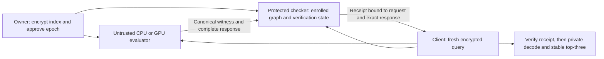

# Research blueprint: complete verification for a reusable encrypted index

2026-10-03. Planning revision based on checkpoint
`checkpoint/system-selection-2026-10-03`, commit
`2a973550d4a23d4aaf6708d7e2d281c77ccb5a87`.
The [closest-work comparison](closest-work-system-blueprint-20261003.md),
[task ledger](system-research-blueprint-20261003.json) and
[accumulated-results review](research-evidence-review-20261003.md) accompany this
document. **This revision runs no new HE experiment or benchmark.** Older
reports, failed attempts, code, parameters and raw measurements retain their
original scope. The [last selection return](system-selection-return-20261003.md)
remains the authoritative record of what was actually executed.

## 1. Decision and prospective contribution

Build on the homemade native/CUDA BGV evaluator. Investigate whether the repeated
operators in its complete evaluation graph admit a compact verification program
that keeps canonical integer conversions explicit, shares verification work
across tiles, and can be updated with the encrypted index. Start implementing
the complete native reference while testing this representation; a new noise
theorem is **not** a prerequisite for useful system construction.

The proposed paper question is:

> Can a compiler for native encrypted computation choose what to recompute,
> what to witness, and what to precompute so that complete response verification
> is inexpensive across queries and owner updates, without hiding cost in a
> trusted replica, a large trace, or unchecked ciphertext maintenance?

This is a **candidate systems/algorithm contribution**, not an established new
cryptographic primitive. A publishable outcome need not invent a new FHE scheme.
It does need a specific, prior-separated algorithm or representation, a sound
end-to-end construction, and convincing measurements against strong controls.
Our earlier functional-key experiment E110 is closed: the proposed new work
changes the *verification program and its cut points*, not the index into another
generic gadget-encrypted external product.

E101 already considered canonical-cut elimination and factored protected
checks. Its literal shared-cut recipe was contained by the generic control on
its E73 graph. H1 is **not a newly discovered idea or a reversal of that result**.
The remaining work is the previously open complete rotated native graph and a
specific non-additive planning problem: shared operator state and the state
invalidated by an owner update. Q57 must show that this distinction matters
before Q58 starts. Repeating E101 with larger numbers does not qualify.

The leading hypotheses follow. The labels H1/H2 are local to this blueprint;
they do not reactivate older H1–H3 construction packets or change their outcomes.

| Candidate | Concrete question | Evidence motivating it | What would defeat it |
|---|---|---|---|
| **H1: shared operators and selected canonical boundaries** | Can a compact family of adjoint operators verify all native BGV stages, with fewer retained words and less complete cost than equally batched local checks? | Repeated switching keys and butterfly stages; E106/E108 expose the exact relation; E117 and E126 establish known complete controls. | Distinct operator words or witness traffic grow as fast as the naive trace, or the strongest generic checker obtains the same gain. |
| **H2: verification state that changes locally with the index** | Can the same representation update its authenticated evaluator and checker state using the changed tiles, with an explicit state-consistency invariant? | The matched public-index BGV update spends about 7.15 of 7.28 seconds rebuilding resident state. | State refresh still requires a full pass; a mutable generic checker/cache matches it; or state reuse lacks a valid adaptive argument. |
| **Supporting engineering** | Can complete native replay, product checking plus continuation, and a full streaming checker expose their real tradeoffs? | Working tiny reference and existing native arithmetic. | A cost can be measured as bad and still be a useful control. This work does not itself establish novelty. |

Shared Freivalds challenges, adjoints, batching, standard compiler search,
incremental linear updates and attestation are known. Naming them together is
insufficient. H1 must produce an additional exact rewrite, compact sufficient
state, or verifiable scheduling algorithm whose consequence survives the
specialized control. H2 strengthens a surviving system; fast tile replacement
alone is ordinary engineering. No conference acceptance is promised.

## 2. Contract and architecture

Keep the [exact-search contract](exact-search-contract.md): one owner/client
owns both the records and queries and may retain any or all plaintext. The
default service returns **all exact Hamming distances**, with stable IDs and
stable top-three computed by the client. The server may deviate arbitrarily and
observe acceptance, failure, retries and application traffic. The owner approves
the index, public/evaluation keys, parameters, graph and each snapshot epoch.

The principal mode keeps the HE secret and plaintext outside the server and
checker. A TEE protects verification coins, preprocessed checking state and a
receipt key. It does not hold the HE decryption key. Metadata leakage includes
the declared dimensions, count, schedule, packet lengths and update locations;
query-result-dependent application leakage must be declared separately.

An attested verifier may sit in a different machine/process from the GPU; all
traffic across that boundary is paid. This is not permission to assume a GPU is
inside an AWS Nitro enclave. Confidential-GPU attestation is a separate future
deployment mode. The current RTX3080 establishes no such mode.

The checker must consume immutable bytes or authenticate each streamed chunk
against a committed tape. It never signs a host-reported success flag. Bind the
graph/build version, parameter profile, key identities, ordered index snapshot,
original query, request ID, epoch, output positions and **every final response
byte**, including unused coordinates. Context creation, parsing and registration
must not accidentally scan the full index on every query without being charged.

Other modes remain separate comparison rows: honest-only HE evaluation;
plaintext search inside a TEE; client raw/compressed/mutable cache; public proofs;
exact-top-three-only; approximate retrieval; and protocols with additional
noncolluding parties. A smaller output contract cannot silently replace exact
all-score search. No artificial client cache prohibition is introduced.

## 3. Known complete reference comes first

Use `experiments/bfv_search_lab/complete_checked_bgv.py` as the Python/GMP
reference. It checks product tiles and computes the remaining rotations and
terminal conversion itself. It currently admits only the disclosed tiny public
geometry. Its 89 retained tests are not evidence of large native or TEE execution.
The native work must preserve that separation between admission and an external
expected-output comparator.

Implement two native modes on the same enrolled instance:

1. **Prepared full replay:** a secretless trusted evaluator computes the complete
   response using native arithmetic. Include enrollment, pretransforms and state.
2. **Checked products with trusted continuation:** accept checked product tiles,
   then perform every remaining stage in the checker. At the existing 8k model,
   this moves a 128 MiB coefficient body and leaves 511 trusted rotations. It is
   not a free route from an 83 ms unverified server stage to a secure service.

Add the stronger full streaming, batched-linear-check control below before
attributing a speedup to H1. Give all controls the same immutable registration
cache, canonical encoding, packing, fused scans, adjoints and shared-operator
batching where applicable. Compare the method of
[vFHE, Section 5.2 and Appendix D](https://arxiv.org/html/2301.07041v2), not only a
slow reimplementation of Slalom. That work already outsources FHE tensor products
to untrusted hardware using randomized equality checks. Its full application
scope and our canonical conversion path must be aligned explicitly.

## 4. H1: exact representation and first mathematical discriminator

Let `Q = product(p_l)` and `R_l = F_(p_l)[X]/(X^N+1)`. Fix an owner-approved
native graph, index and switching keys. Query bytes are public ciphertext inputs
to the checker. The first implementation retains the current full-Q canonical
gadget convention and terminal format; it does not lower a modulus or assume
independent noise.

### 4.1 Keep nonlinear conversion boundaries explicit

At each required cut the producer supplies a polynomial of **canonical integers
in [0,Q)**. The checker derives all RNS limbs and all gadget digits from the same
integers. It never accepts independently chosen digits or unrelated limb tapes.
Range checks, digit width, polynomial length and ordering are part of admission.

Between these cuts, the fixed-index evaluation can be represented by affine
maps of the public query, witnessed cut values and their deterministically
derived digits. Multiplication by a fixed encrypted-index component is linear in
the query coefficients; multiplication by a fixed switching-key polynomial is
linear in digit coefficients. Products of two freely witnessed values would
not be covered by this representation and must be rejected by the compiler or
handled by a separately proved product check.

For each native prime, collect the polynomial residuals of the affine equations
into a coefficient matrix `E_l` with `K` rows and `N` columns. Include input and
output constraints, repeated-use consistency and every terminal polynomial.
The checker performs the small final full-Q lift and rounding itself initially.
If the graph is acyclic and every residual is zero, induction through the cuts
must imply equality to the enrolled deterministic evaluator and its complete
wire packet. **This completeness statement is a deliverable, not yet a proof
for a new compiled graph.**

### 4.2 Known shared-challenge control

One control samples independent uniform vectors `u in F_p^K`, `v in F_p^N`
and checks `u^T E v = 0`. For a fixed nonzero matrix of rank `r`, the false-zero
probability is `p^-r + (1-p^-r)/p`, at most `2/p - 1/p^2`. With `tau`
independent pairs the bound is at most `(2/p - 1/p^2)^tau`. This is a standard
bilinear fingerprint argument, **not our proposed theorem**. It also cannot be
applied to an arbitrary scalar evaluation of a polynomial quotient ring: the
check is over the whole coefficient-vector relation.

It is enough for a false full-Q relation to be nonzero in one prime. Use the
worst prime bound; do not multiply the success probabilities of honest limbs.
If challenges are fresh, fix the candidate bytes before sampling and never
reveal the challenges. If challenges or adjoints are reused, prove the
first-false-accept bound under a model in which no checking-state information is
released except the verdict. The old E117 argument is a starting point, not
automatic authorization for the new graph, state transitions or implementation.

For affine terms `L_a(x)`, compute `<v,L_a(x)> = <L_a^T(v),x>`.
When many constraints use the same operator, retain one adjoint vector per
distinct operator and combine the instance weights. Even without a new compiler,
the strongest generic control gets this optimization. Its working/state budget
is based on distinct operators, not deliberately independent per-edge matrices.
Finite-field sampling or PRF expansion assumptions, setup scans and stored
seeds/vectors are all charged.

### 4.3 Where the research could be

Removing a witness cut saves bytes but composes the surrounding operators.
Composing operators can create many distinct adjoints and destroy sharing.
Keeping every cut avoids that growth but sends a large tape. The research target
is the **interaction** between canonical cut placement, repeated ring operators,
protected memory, update dependencies and actual transport.

Start with a typed symbolic DAG whose operator alphabet contains fixed
negacyclic convolutions, automorphisms, monomial shifts and sums. Use exact
identities, for example

`sigma_a M_k = M_(sigma_a(k)) sigma_a`,
`sigma_a sigma_b = sigma_(ab)` and `M_k M_h = M_(k*h)`.

These identities are known. Normalize operator words, track their coefficient
dependencies and count distinct adjoint materializations. A shared transform
must correspond to an identical operator, not a matching label or shape. Do
not move a map through a canonical digit extraction or terminal rounding unless
there is a separately proved identity. Earlier carry counterexamples remain
mandatory negative cases.

The proposed planner state contains the set of live normalized operator words
and their index-dependency sets. Its cost is a **set-union** cost: two cuts may
share one stored adjoint, while eliminating either cut can introduce a different
composed word. An update can invalidate that shared word for many consumers.
Thus per-edge byte or operation weights need not describe the cost. Q57 should
produce either a minimal actual-graph example where this changes the best plan,
or evidence that ordinary batching/elimination already collapses the objective.
The potential algorithmic result is a compact sufficient planning state for a
restricted butterfly family, with a proved recurrence and a measured consequence.
All of that remains unproved; generic memoization and exhaustive search remain
controls rather than claimed inventions.

The first candidate search is deliberately small: compare every-local-cut,
product-only, maximal-affine-elimination, and one sharing-aware cut rule on the
frozen butterfly family. Tiny exhaustive cut enumeration is the oracle, not the
claimed scalable algorithm. A useful new rule must specify its sufficient state
and either an optimality result for a stated restricted family or an explicit
approximation/heuristic scope with held-out regret. Standard dynamic programming
or a weighted DAG checksum by itself is not the novelty.

Record for each cut program:

`(GPU work, checker work, protected bytes, witness bytes, enrollment cost,
update dependency set, worst-case admission error, final client bytes)`.

A potential structural result is that verification material depends on a small
operator family rather than the number of tiles. **No such bound is established
for this graph.** Operator words, index-specific convolutions and query-side
preparation may eliminate it. The two source geometries must count these terms
exactly before a claimed asymptotic or an ambitious kernel implementation.

Illustrative traffic warning only: one 120-bit canonical source polynomial per
switch at `N=16384` costs 245,760 bytes. Counting 767/2,046 switches gives
179.765625/479.53125 MiB at the modeled 8k/32k geometries. These products are
not an implemented complete trace size or a lower bound: extra cuts, product
outputs, framing and terminal values can add bytes; a proved elimination can
remove some. Compare them with the 128 MiB product-only body, not with only the
client's compact reply. Count actual transport after the schema is implemented.

## 5. H2: index updates and verification state

First implement the ordinary strong control: replace only affected encrypted
tiles and their prepared GPU buffers. The current immutable-workspace rebuild
is a weakness of that API, not an inherent BGV update cost. A mutable cache and
a specialized generic checker get the same local-update opportunity.

For a fixed graph shape, separate verification state into key/graph-dependent
and index-dependent terms. If a term is exactly `h(I) = A(I)^T r` and `A` is
linear in the index, derive and check

`h(I + delta) = h(I) + A(delta)^T r`.

The challenge is identifying precisely which compiled terms satisfy this
identity and the size of the dependency closure after H1's cut elimination.
Do not call every update rank one or assume all composed maps stay linear.
Compare the derived closure with ordinary incremental computation and a freshly
rebuilt checker for each edit.

Each owner-authorized update produces a new immutable snapshot identity.
Publish the evaluator state and checker state atomically; a query binds exactly
one old or new epoch. Tests must reject mixtures, stale receipts, duplicate
updates, rollback and an interrupted publish. Initially use fresh checking coins
per epoch. Reusing coins across epochs is a separate conditional optimization
requiring a proof under adaptive updates and a durable global attempt budget.

Fresh coins generally invalidate the precomputed adjoints: that rebuild must be
charged to the fresh-epoch control. The delta formula with fixed `r` only gives
the proposed cheap update after the reusable-state argument succeeds. Q59 begins
with this dependency; it cannot claim both free local state updates and fresh
independent coins without paying their preparation.

The possible research result is a joint graph/state algorithm giving a new
query-versus-update tradeoff with complete admission. Incremental authentication
and linear update formulas already have strong prior art, including
[Rogue](https://eprint.iacr.org/2026/1890) and
[authenticated incremental PIR](https://eprint.iacr.org/2026/1077).

## 6. Six bounded packages, then the full system

Each package ends by updating the machine ledger with immutable evidence,
result class, strongest control, pass/stop decision and next task. The caps
limit the number of competing hypotheses and cohorts; they do not permit
skipping correctness work. A failed assumption stops dependent claims instead
of silently launching another scan. Q0–Q55 retain their old statuses.

| Package | Deliverable and finite scope | Acceptance / return |
|---|---|---|
| **Q56 / B1: complete native control** | One explicit relation/schema; prepared native replay and checked-product/trusted-suffix modes; frozen tiny oracle plus one source geometry and held-out queries. Reuse native public arithmetic; no HE-secret admission API. | All final bytes match independently; malformed limbs/digits/tails/context and incomplete coverage reject. Return an honest complete cost ledger even if slow. |
| **Q57 / B2: operator-sharing discriminator** | One symbolic census for the current 8k and 32k graphs; derive the exact operator dictionary, dependency closure, and strongest bilinear/adjoint control. One targeted prior-art pass on the proposed identity. | Identify a specific remaining transformation with a feasible state/traffic budget, or stop H1 before adding a compiler. No timing inferred from counts. |
| **Q58 / B3: canonical-cut prototype** | At most the four cut policies above; exact tiny enumeration and adversarial oracle, then one native implementation of the selected rule. Hold out a partial group and a second geometry. | Prove complete relation preservation; show a resource tradeoff that the equally specialized control does not already get. If identical, classify as known engineering. |
| **Q59 / B4: update discriminator** | One authenticated tile-update design; single row, single tile, dispersed 32-row and full-snapshot edits. Fresh rebuild and mutable generic/cache controls. | State equals fresh enrollment; quantify touched state and all costs; reject epoch mixing. A secondary result must survive the strong incremental control. |
| **Q60 / B5: complete measured pilot** | One preregistered paired panel at 8k and 32k, five independent process/key blocks per size, fixed queries and update scripts. Include B1, strongest streaming control, candidate, unverified BGV and cache; retain matched BFV/Paillier comparisons separately. | Complete local/protected-boundary cost, state and traffic; resource-qualified blocks retained and sensitivity shown. No declaration from a tiny GPU-stage difference. |
| **Q61 / B6: system and claim selection** | One decision card and claim-to-evidence table; choose H1, H1+H2, an independently supported H2, or no original survivor. | Exact difference from closest work plus a useful measured frontier. Then freeze architecture and build; do not demand completion of every historical optional experiment. |

Q59 can use the known control even if H1 stops, but H2 must then independently
earn its originality claim. Q60 does not run four losing variants indefinitely:
carry the strongest control and at most one candidate forward after the exact
screens. If no candidate survives, Q61 records that outcome without a speculative
benchmark campaign. The six packages are a finite **selection/build pilot**,
not six more proofs that must all be novel.

After a survivor is selected:

- **Q62 / B7, protected service and assurance:** integrate enrollment, immutable
  snapshots, requests, complete checker, admission receipts, private finish,
  update publication, concurrent sessions and durable global attempt accounting.
  Use the existing BFV/BGV attestation code as a baseline, then test on the actual
  selected TEE and transport. Run fault/replay/rollback tests and a separate
  constant-time/parameter review. Native simulation is an explicitly labeled
  intermediate artifact, not a deployment result.
- **Q63 / B8, evaluation and paper:** broaden only to the selected deployment
  regimes, independently approved comparable profiles and held-out workloads;
  produce reproducible artifacts, ablations, reductions, limitations and the
  closest-work claim table. Record venue requirements when choosing submission;
  do not optimize the research claim around an assumed deadline.

The next executable task is **Q56**, with Q57's static derivation as independent
design work. No new task is reported as executed in this planning revision.
Before a benchmark, freeze its exact input/profile/build/seed/timed-boundary
manifest in a new directory; do not change old raw evidence to fit this plan.

## 7. Evaluation: a complete cost and usefulness test

Measure the service objective as

`initial acquisition + enrollment + sum(query costs) + sum(update costs)
 + recovery/refresh costs`,

with each party and link separately visible. Report the Pareto frontier in
latency, throughput, persistent/peak state and transferred bytes. Weights for
query frequency, updates and links are declared deployment scenarios; a model
is not an actual WAN measurement.

Required boundaries include owner encryption, verifier preprocessing, GPU
preparation, fresh-client acquisition, client encryption, GPU evaluation,
witness generation, host-to-checker transfer, verification, entropy, signature,
client packet transfer, receipt verification and private decode. Report hash,
copy and parsing time. Charge the same cache/preparation to controls. Memory
includes owner/client, host, GPU and protected state; intermediate traces cannot
disappear from the ledger because the final client reply is small.

The 32k S1 result is a useful anchor, not this pilot: BGV local median 117.30 ms,
reply 204,895 bytes, setup stage sum 145.47 s; the strongest measured Paillier
hybrid median 1,418.96 ms; raw cache median 4.38 ms. The panel has setup swap,
one process/key block, unequal experimental profiles, and no complete protected
admission or real network. Do not call its ratios a secure-service speedup.
The separate 8k BFV/Paillier study favored the hybrid in local latency. The
separate owner-index BGV result is not a paired public-index observation.

Use the current owner-index/radix E16 variants as distinct strong HE controls
after documenting their different origin/parameter premises. Keep SEAL as an
external arithmetic/control implementation; the deliverable remains homemade.
Public-proof costs require matching the complete original-query/full-output
relation. The old tiny Spartan result is one scalar adapter, not a lower bound
on ring or binary proofs. No competitor is marked slow because an adaptation
is unavailable.

Predeclare these **project decision thresholds**, not conference criteria:

- At least 20% lower complete amortized cost in one stated nontrivial regime,
  with independent-block uncertainty and all regressions disclosed; **or**
- At least 2x reduction in a demonstrated binding state/transfer/update cost,
  with no more than 10% query-latency or per-query-traffic regression, and a
  credible deployment where that resource is binding.

An isolated 1% GPU effect, a comparison only against Python, or a speedup
created by excluding owner/helper work does not pass. The retained client cache
may win every tested small-data regime. That would narrow the system's useful
deployment range; it does not justify forbidding caching. Actual constrained
devices must be measured if a device-capacity claim is later made.

## 8. Security argument to develop with the implementation

First state a narrow target: no unauthorized ciphertext reaches private decode
except with a bounded failure probability. Establish graph equivalence and
canonical relation completeness independently of HE hardness. Then prove
randomized admission soundness for the implemented challenge law, all limbs,
adaptive requests and declared lifetime.

A prospective accounting form is

`Pr[false admission] <= epsilon_TEE + epsilon_receipt + epsilon_binding
                       + epsilon_state + epsilon_challenge
                       + J * epsilon_check`.

This is an **obligation list**, not an established reduction or independent-event
assumption. Define every term and the global `J` across failed checks, processes,
forks, restarts, cloned state and epochs. The first-false-accept proof must couple
to an ideal execution whose transcript before that event is independent of the
hidden check coins; simply claiming that coins stay uniformly distributed after
arbitrary observed rejections is wrong. Reject parsing/context failures before
using secret-dependent code or consuming an incorrectly scoped attempt budget.

Separately prove honest-evaluation decryption correctness, with actual seeded
samplers, reused evaluation-key dependencies and a bounded input/query lifetime.
Existing conservative guards remain in force. Q49's unenforced input budget and
the unproved stronger Fourier bound cannot be silently discharged by a benchmark.
Privacy needs the concrete HE assumption, auxiliary/evaluation-key premise,
admissible owner inputs, allowable output leakage, correctness failure treatment
and an appropriate malicious-server/reaction-oracle game. Use
[vCCA](https://eprint.iacr.org/2024/202) and
[Fherret](https://eprint.iacr.org/2025/700) as direct controls; IND-CPA plus a
signature is not by itself a completed argument.

Keeping the HE key out of the TEE is useful separation, but does **not** make
privacy survive a compromised checker: a forged admission receipt can restore
the malicious-server decryption/reaction oracle. Protect verification state
confidentiality as well as execution integrity. Client private arithmetic,
checker side channels, attestation verification, rollback resistance and
concrete lattice estimates remain separate assurance tasks. No production claim
follows from the 89 tiny admission tests or the earlier large test suite.

## 9. Repository implementation map and paper handoff

Preserve `src/cuhepy/bfv`, `src/cuhepy/paillier` and existing public/client APIs.
Begin under `experiments/bfv_search_lab/` with a typed graph/certificate module,
native checker in its existing `_native/` build structure, and separate tests.
Suggested **new, not yet implemented** paths are `verification_graph.py`,
`verification_cut_plan.py`, `_native/complete_admission.h`, and
`benchmarks/verified_bgv_system.py`. Use existing `native_boundary_oracle.py`,
`native_opening_constraints.py`, `checked_product_bgv.py`, `native_check_bgv.py`,
`complete_checked_bgv.py` and `_native/trace_server.h` as references. Do not
replace the company fallback just to simplify an experiment.

A selected system should deliver four linked artifacts: an exact executable
relation; the new graph/state algorithm and its scoped theorem; a complete
malicious-server admission protocol; and an evaluation of its full lifecycle.
A plausible paper title is *Compiling Complete Verification for Reusable
Encrypted Search*. It is a working description, not a novelty assertion.

The main claim ledger must distinguish:

1. **Already supported engineering:** homemade HE/CUDA arithmetic, compact
   replies, validated exact search, and scoped complete checking controls.
2. **Candidate originality:** H1's specific compiler/representation and possibly
   H2's dependency-aware authenticated update algorithm, only if they survive.
3. **Required assurance:** matching conditional soundness/privacy arguments,
   parameters, complete transport, private side-channel and deployment evidence.
4. **Negative findings:** local cache wins, generic methods absorb a proposed
   optimization, or state/transport costs outweigh arithmetic savings.

If the complete system is useful but H1/H2 reduce to known techniques, retain it
for the company and consider an engineering/evaluation paper with correspondingly
modest claims. If neither usefulness nor an original mechanism survives, stop
this paper direction and write the negative result. Both outcomes are preferable
to indefinite preliminary toy experiments or an unsupported novelty claim.
