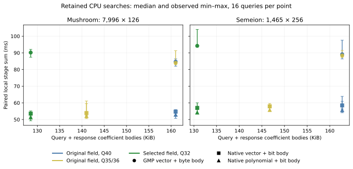
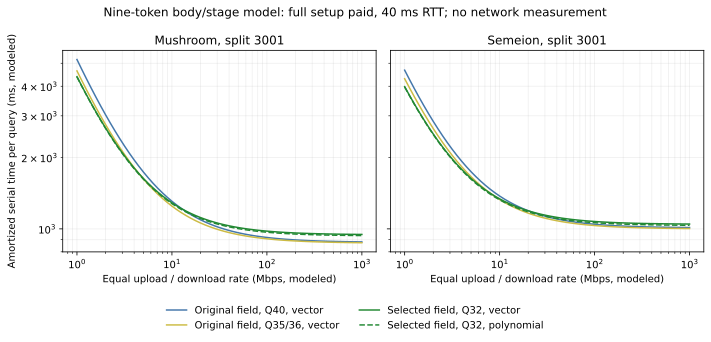

# Complete verification, exact precision and search-summary limits

2026-09-30, E36–E40 on `experiment/creative-search-algebra`. The code is
homemade Python/GMP and C++, with the old references preserved. No SEAL or
GPU arithmetic is imported by these experiments. Production clients, their
authorization paths and the company Paillier/BFV baseline are unchanged.

The [system/paper synthesis](research-synthesis-and-system-roadmap.md) puts
these results alongside E01–E35 and specifies the remaining research gates.

## Main result and comparison scope

Complete checking was a major CPU bottleneck. A native implementation of the
**existing exact challenge family** makes that stage 3.31–4.61× faster.
A separate known polynomial-fingerprint family is 1.24–1.34× faster than
that native control at verification, a much smaller additional gain.
Lossless bit bodies also reduce packing/parsing work. Together, native
polynomial checking and bit bodies give 1.58–1.76× lower local stage totals
than the paired old GMP-check/byte-body path.

The four retained runs use full N=16,384, eta=21, disjoint pinned public
indices/queries and two split seeds. Mushroom has 7,996 rows at 126 bits;
Semeion has 1,465 rows at 256 bits. Each of three profiles has one warmup
and eight measured adaptive queries, selected after enrollment and the entire
nine-answer pool. All 108 full encrypted searches match every distance and
stable top three. The native public evaluator equals GMP coefficient for
coefficient, both codecs equal their independent GMP references, and both new
native checks equal their independent references.

All four private gates verify **the same output before one secret decryption**.
The deployment variants below are paired sums of shared measured stages,
not separately elapsed requests. Verification order rotates; native/GMP
server order alternates. References and complete unreduced-phase diagnostics
are outside online timings. Tables show the range of the two split medians,
not confidence intervals. Body counts exclude authentication/transport framing.

| Dataset / profile | Q bits | Old GMP vector + byte body, ms | Same vector in C++ + bit body, ms | Native polynomial + bit body, ms | Response body, byte → bit |
|---|---:|---:|---:|---:|---:|
| Mushroom, t=1153 baseline | 40 | 83.19–86.04 | 53.42–55.65 | 51.62–53.77 | 163,840 → 163,840 B |
| Mushroom, same field / narrower Q | 35 | 83.88–84.05 | 53.79–54.01 | 52.08–52.19 | 163,840 → 143,360 B |
| Mushroom, t=193 selected field | 32 | 88.71–91.65 | 52.79–54.45 | 50.61–52.06 | 131,072 → 131,072 B |
| Semeion, t=1153 baseline | 40 | 86.55–92.21 | 56.90–60.76 | 54.50–58.23 | 163,840 → 163,840 B |
| Semeion, same field / narrower Q | 36 | 87.62–89.07 | 57.32–58.91 | 55.23–56.04 | 163,840 → 147,456 B |
| Semeion, t=257 selected field | 32 | 94.09–94.51 | 56.91–56.96 | 54.12–54.52 | 131,072 → 131,072 B |



The figure pools sixteen measured queries per point. Bars are observed
min–max, not uncertainty estimates. [PDF](figures/verification-frontier-local-20260930.pdf).

The old GMP verification takes 35.18–45.10 ms across cases. The native control
takes 8.94–12.20 ms; native polynomial checking takes 6.97–9.42 ms. Most of
the improvement is native arithmetic, not a newly invented hash algorithm.
The q32 extra-round penalty from E35 is now much smaller. This does not show
that these CPU paths beat the earlier GPU circuit: that circuit used different
dimensions, data, preprocessing, parameter and verification contracts.

## E36: a uniform correction-image bound, and its obstruction

For public correction generator `A`, investigate the maximum centered norm
`max_delta sum_i |center_t((A*delta)_i)|`. This is maximum Lee weight of a
linear image. Nonzero individual forms are uniform under uniform delta even
when forms are dependent. For odd prime t, `b=(t-1)/2` and Z nonzero forms,
the mean is `Z*b*(b+1)/t`; its ceiling is a rigorous lower bound on the maximum.
Constructive coordinate-ascent witnesses can strengthen that lower bound.
Grouping proportional rows gives a rigorous upper bound; exhaustive small
images independently check it. Shared column inputs require a global
expectation bound, not the sum of separately attainable column maxima.

A tiny `(a,b,a+b)` image has maximum norm t, better than the cube bound 3b.
That potential benefit survives exhaustive tests, but real correction images
give only 0–2.06% upper-bound improvements here. Every one of 10,540,800
generator coefficients is compared with the established CRT correction API.

| Dataset / field | Proved upper improvement over cube | Minimum analytic Q bits, old → image bound |
|---|---:|---:|
| Mushroom, 1153 | 0–0.64% | 35 → 35 |
| Mushroom, 193 | 0–1.96% | 30 → 30 |
| Semeion, 1153 | 0–1.86% | 36 → 36 |
| Semeion, 257 | 0–2.06% | 31 → 31 |

The implementation still requires at least 32 Q bits. Lower witnesses rule
out certifying q32 in the original t=1153 layouts **using this particular
maximum-L1 times per-source-phase method**. This is not a lower bound on
actual HE noise, all possible proofs or all search algorithms. No key gate is
relaxed. Classical Lee-weight context is identified in the synthesis report.

## E37: two complete checkers, distinct integrity arguments

`NativeVectorCheck` reproduces the exact old SHAKE rejection stream and every
field challenge. It preserves the ideal-field `B/Q^r` bound and the existing
seeded-challenge PRG hybrid. It is a strong implementation control, not a new
protocol. The C++ dot product reduces after at most 64 products; even at its
56-bit word limit the accumulator stays below 2^118. A maximum-length test
checks the overflow boundary.

`PolynomialCheck` instead samples a hidden uniform monic irreducible f of
degree d over the **same F_Q** and hashes the entire canonical coefficient
vector as a formal polynomial in Z modulo f. Z is not a plaintext-ring root.
The existing adjoint oracle prepares all complete negacyclic-shift digests;
no Q carry or wrap term is omitted. GMP division/Horner/power references and
independent tiny irreducibility/enumeration tests accompany the C++ recurrence.

For a fixed nonzero error polynomial of degree at most L−1, collision requires
f to divide it. Among `I_Q(d)` monic irreducibles, at most `floor((L-1)/d)`
can divide it. The conditional bounded-attempt first-false-accept upper bound
is therefore `min(1, B*floor((L-1)/d)/I_Q(d))`, with exact integer/Fraction
rounding. This selects degree 4 for Q40 and degree 5 for Q32/35/36 at L=32,768,
B=1,024 and the 128-bit target. These are formal collision targets, not claims
of 128-bit production security for the HE system.

This is the classical random-polynomial family. We read the introductory,
sampling, recurrence and collision sections of
[Rabin, TR-15-81 (OCR mirror)](https://www.scribd.com/document/811485055/RABIN-ALGORITHM-BYUSING-RANDOM-POLYNOMIAL).
That report treats binary polynomials; the odd-prime recurrence/count argument
here is explicitly derived and independently tested. The abstract/metadata of
[Krawczyk's LFSR hashing paper](https://link.springer.com/chapter/10.1007/3-540-48658-5_15)
is additional context, not a claim to reproduce its authentication protocol.
Neither hashing family is a novelty claim.

The key and all expected digests stay private. Both variants inherit trusted
index/answer premises, pinned request/context, canonical response checks,
absolute phase checks, one-use token state and a global attempt budget.
The check precedes HE decryption. Publicizing f admits an explicit constructed
nonzero collision; reusing scalar batch weights incorrectly gives probability
`1/Q+(1-1/Q)/Q^2`, larger than `1/Q^2`. Those failures are retained tests.

Polynomial keys use a modeled 20–25 bytes versus 128–160 seed bytes, but the
old checker already stores seeds, not dense challenge vectors. Its private
epoch fingerprints are roughly 20–35 KB and can grow when d exceeds r.
This is not a large total-state saving. Batching 256 full q32 replies requires
degree 6 in the same soundness model; one small degree cannot be reused for
arbitrary lengths without reevaluating the bound.

Private timing, authenticated/malicious preprocessing, durable lifecycle,
complete adaptive privacy and HE parameter assurance remain unresolved.
Sanitizers test memory/undefined behavior, not those properties. These new
research gates do not authorize remote ciphertext decryption in production.

## Exact precision and all four IO categories

The narrower original-field profiles use the existing absolute phase gate;
Q35/Q36 is enough for these circuits. Whole-byte serialization hid the gain.
The isolated public codec packs every coefficient in exactly Q.bit_length()
bits. It rejects wrong count/width, nonzero padding and noncanonical residues.
There is **no rounding, discarded precision or probabilistic correctness**.
This is a local coefficient-body codec, not a new authenticated wire format.

| Profile | Query body | Response bit body | Seeded index packet | Fresh seeded answer packet |
|---|---:|---:|---:|---:|
| Mushroom, Q40 | 1,046 / 1,192 B | 163,840 B | 2,624,832 B | 82,026 B |
| Mushroom, Q35 | 1,046 / 1,192 B | 143,360 B | 2,297,152 B | 71,786 B |
| Mushroom, selected Q32 | 523 / 596 B | 131,072 B | 2,100,544 B | 65,642 B |
| Semeion, Q40 | 2,802 B | 163,840 B | 1,886,598 B | 82,026 B |
| Semeion, Q36 | 2,802 B | 147,456 B | 1,698,182 B | 73,834 B |
| Semeion, selected Q32 | 2,802 B | 131,072 B | 1,509,766 B | 65,642 B |

Query + response is the sum of the first two body columns. Index packets and
answer packets are actual existing seeded encodings, which already bit-pack
c0. Expanded object/native index storage is a different category: the CSV
retains whole-byte coefficient and native-word models separately. Q35/Q36
bit-packing should not be misreported as automatically shrinking native
64-bit arrays. One-use answers are offline traffic and must still be charged.
HE keys do not change under the codec; narrower Q produces new research keys
under the existing generator, with parameter review still required. Secret
checker keys are not BFV/BGV setup keys and are never sent to the server.

## E38/E39: schema, summary and contract controls

A validated 22-attribute one-hot schema has Hamming diameter 44, not 126.
This supports a score field as small as 47 algebraically, but t=47 supplies
only one dyadic CRT root slot. The smallest field supporting our 32-slot
geometry is still 193. Raw scalar columns at t=47 have a modeled 16,515,072-byte
q32 index, versus the selected local representation's 4,194,304-byte expanded
body. No small-field affine API or encryption profile is implemented.
Unrestricted/non-one-hot queries can wrap and are explicitly rejected by the
toy schema gate; an index-only range fact is not a query-range certificate.

Distance arrays `(0,3,3)` and `(1,1,4)` have identical count, sum and sum of
squares but different minima. Query zero and rows `(1<<distance)-1` embed
them as valid binary Hamming instances. Classical Thue–Morse partitions give
larger equal-moment examples; the source is credited through
[Wright's Prouhet–Lehmer theorem, Section 2](https://www.cambridge.org/core/services/aop-cambridge-core/content/view/977D369B61ECE0FBDFC216CC4822F047/S0013091500002698a.pdf/equal_sums_of_like_powers.pdf).
Even a complete distance histogram loses stable IDs under row permutation.
These refute the tested distance-only summaries, not ID-aware summaries,
secure comparisons, trusted selection or interactive protocols generally.

An independent tiny enumeration checks the exact omitted-row lower-bound test,
including stable ties. The contract planner rejects changed disclosure, absent
trusted preprocessing, forbidden plaintext coordinates and private-state
budget violations. All current candidates fail its default production contract;
research planning explicitly admits unreviewed candidates. It charges all nine
tokens and refuses silently projecting an unlimited epoch from that pool.

The online-only objective usually prefers selected q32/native polynomial at
1/10/100 Mbps. Once nine-token setup is amortized, original-field narrow Q
with the native vector check often wins at 10/100/1,000 Mbps, because it
avoids a fifth epoch-preparation round. These are observed recorded-stage
**models**, not a universal policy. Tiny timing differences need repetitions.



[PDF](figures/verification-frontier-amortized-20260930.pdf). The curves use split
3001, equal directional links, 40 ms RTT, all setup and all nine tokens. They
exclude provisioning/framing/journaling/pipelining and are not network timings.

## E40: smaller rings and reply fragmentation

The additional count experiment keeps each selected-field grouping/map fixed
and reallocates final CRT capacity afresh for seven ring degrees. It retains
22 valid plaintext/body/phase models and six rejected undersized-leaf cases.
Tiny exhaustive queries check CRT output round trips, exact scores and every
stable ID at several degrees. No new HE key or lower-degree timing is claimed.

| Dataset | N | Replies | Response body model |
|---|---:|---:|---:|
| Mushroom, both splits | 2,048 | 7 | 114,688 B |
| Mushroom, both splits | 4,096 | 4 | 131,072 B |
| Mushroom, both splits | 8,192 | 2 | 131,072 B |
| Mushroom, both splits | 16,384 | 1 | 131,072 B |
| Semeion, both splits | 2,048 | 1 | 16,384 B |
| Semeion, both splits | 4,096 | 1 | 32,768 B |
| Semeion, both splits | 16,384 | 1 | 131,072 B |

Halving N does not automatically halve bytes: unequal occupancy forces more
Mushroom replies. Conversely, the small Semeion index leaves most of the
full ring unused, so a smaller ring could save substantial space **if a new
parameter profile and complete encrypted measurement are justified**.
N=1,024 models are also retained, with 13/14 Mushroom replies; they are not
asserted to meet a security target. Semeion's large private affine-map state
remains a separate failure control against a full-data cache. Capacity alone
does not settle which system should be deployed.

## Artifacts, reproduction and checkpoint

Source commits: E36 `01a7375`; E37/E38 `9f7cbd8`; E39 `a8aff07`;
E40 `c210d0b`. The retained E37 runs all record `a8aff07`; E40 records its
separate source commit. Earlier checkpoints remain ancestors.

| Entry point | Purpose |
|---|---|
| [`correction_image_bounds.py`](../../experiments/bfv_search_lab/correction_image_bounds.py), [`correction_image_lab.py`](../../benchmarks/correction_image_lab.py) | Uniform norm upper/lower oracles and full correction generators |
| [`polynomial_fingerprint.py`](../../experiments/bfv_search_lab/polynomial_fingerprint.py), [`native_linear_check.py`](../../experiments/bfv_search_lab/native_linear_check.py), [`_fingerprint/bindings.cpp`](../../experiments/bfv_search_lab/_fingerprint/bindings.cpp) | Homemade known-family GMP/native checks and exact native control |
| [`coefficient_body.py`](../../experiments/bfv_search_lab/coefficient_body.py) | Public exact coefficient codec with GMP reference |
| [`schema_metric_oracles.py`](../../experiments/bfv_search_lab/schema_metric_oracles.py), [`answer_summary_limits.py`](../../experiments/bfv_search_lab/answer_summary_limits.py) | Schema range and moment/coverage controls |
| [`portfolio_costs.py`](../../experiments/bfv_search_lab/portfolio_costs.py), [`ring_capacity_frontier.py`](../../experiments/bfv_search_lab/ring_capacity_frontier.py) | Contract/pool planner and changed-ring capacity models |
| [`verification_frontier_lab.py`](../../benchmarks/verification_frontier_lab.py), [`verification_frontier_summary.py`](../../benchmarks/verification_frontier_summary.py), [`verification_frontier_plot.py`](../../benchmarks/verification_frontier_plot.py) | Frozen paired experiments, retained-data audit, CSVs and standalone figures |

```bash
make -C experiments/bfv_search_lab/_fingerprint PYTHON=../../../.venv/bin/python
.venv/bin/python benchmarks/verification_frontier_lab.py \
  --cache-dir /path/to/pinned/uci/files --dataset mushroom --seed 3001 \
  --repeats 8 --json-out /tmp/verification-mushroom.json
.venv/bin/python benchmarks/ring_capacity_frontier_lab.py \
  --cache-dir /path/to/pinned/uci/files --json-out /tmp/ring-models.json
.venv/bin/python benchmarks/verification_frontier_summary.py
```

Run all four retained dataset/seed commands serially, with source/binaries
frozen and without concurrent builds/tests. The excluded one-sample pilot and
an initial pair that briefly overlapped are saved separately in the checkpoint;
neither supplies retained timings. Four clean retained runs replace that pair.

The selected research regression group passes **478 tests**. Focused native
tests also pass ASan and UBSan/bounds (30 each). The retained-data audit checks
whole-ciphertext agreement, both native hash references, both codecs, adaptive
query paths, identical score digests, all 1,769,472 unreduced phase coefficients,
body counts, soundness inequalities and source/binary hashes. See
[validation](../../benchmarks/results/verification_frontier_validation_20260930.md)
and the [manifest](../../benchmarks/results/verification_frontier_manifest_20260930.json).
The public native binary is unchanged. New release/sanitized binaries and
excluded runs are preserved beside the verified Git bundle described there.

The next work is driven by the synthesis: reviewed transcript/lifecycle and
correlation generation, compatible CPU/GPU/full-cache comparisons, and a
stronger representation/update algorithm. Hashing, exact bit packing, classic
counterexamples and faster C++ alone do not establish an original paper claim.
